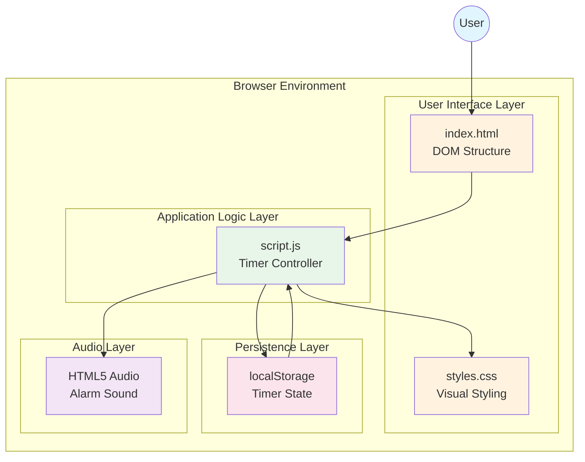
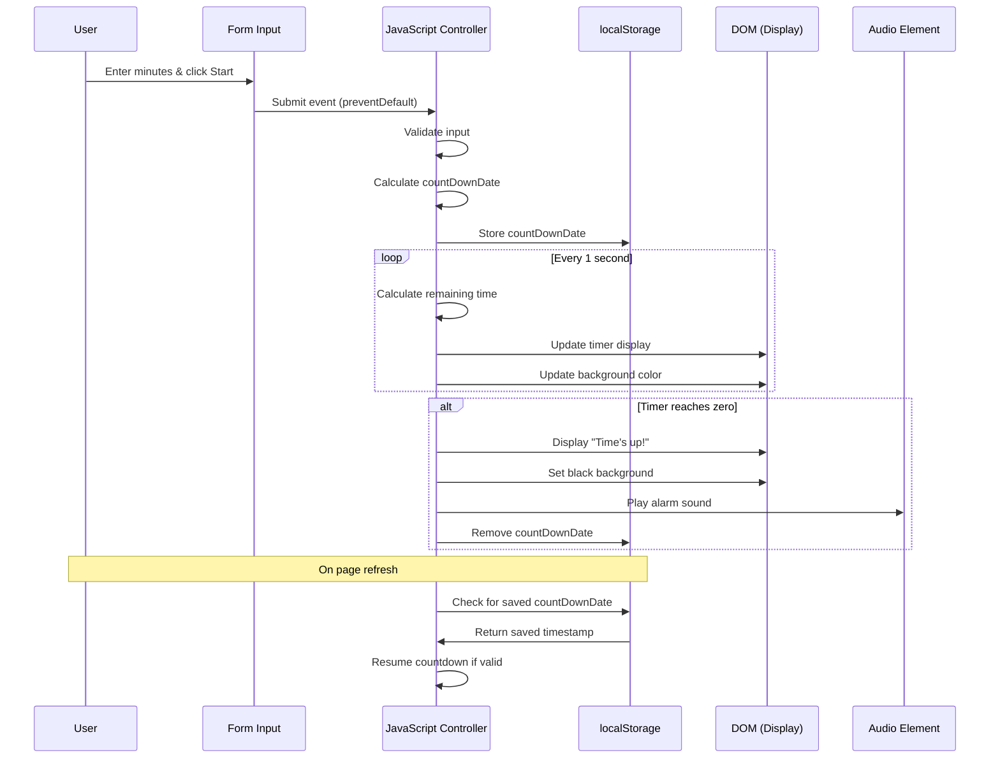
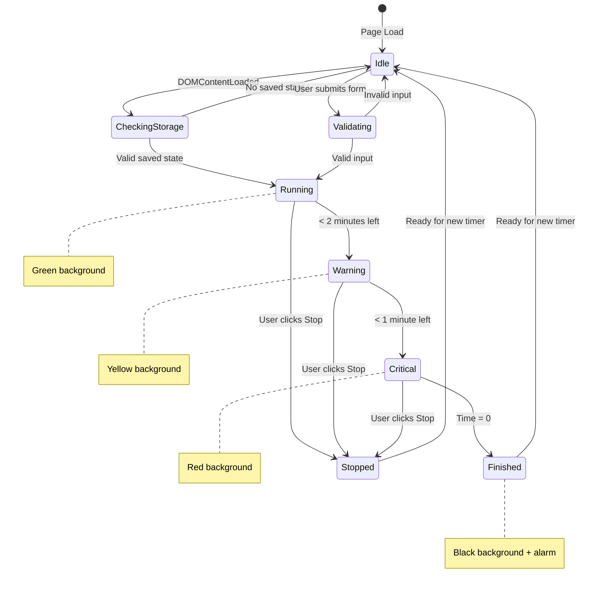

# Architecture Overview

## System Architecture Diagram

## Data Flow Diagram

## State Management Diagram

## Architecture Overview

### Design Philosophy

I designed Limitimer with simplicity and reliability as the primary goals. The architecture follows these principles:

1. **Zero Dependencies**: I chose to build this without any frameworks or libraries. For a single-purpose countdown timer, introducing React, Vue, or even jQuery would add unnecessary complexity and bundle size. Vanilla JavaScript handles all requirements efficiently.

2. **Client-Side Only**: There is no backend server. Everything runs in the browser, which means:
   - Zero hosting costs (can be served from GitHub Pages)
   - No authentication or user management complexity
   - No security vulnerabilities from server-side code
   - Works offline after initial load

3. **Separation of Concerns**: Despite being a small project, I maintained clean separation:
   - `index.html` - Structure only, no inline styles or scripts
   - `styles.css` - All visual presentation
   - `script.js` - All behavior and logic

### Key Architectural Decisions

#### Decision 1: localStorage for Persistence

**The Problem**: Users might accidentally refresh the page during an important countdown.

**My Solution**: I store the target end timestamp (not the remaining time) in localStorage. This approach has several advantages:
- Automatically handles time drift - if the browser tab is inactive, the countdown still reflects real elapsed time
- Simple to implement - just one value to store and retrieve
- No race conditions - comparing against absolute timestamps is deterministic

#### Decision 2: Absolute Timestamps vs. Remaining Time

I store `countDownDate` as a Unix timestamp representing when the timer should end, rather than storing "minutes remaining." This means:
- The timer is accurate even if the JavaScript thread is blocked
- Page refreshes maintain perfect accuracy
- No complex state synchronization needed

#### Decision 3: Visual Feedback Through Background Colors

Rather than using small indicators or icons, I made the entire page background change color based on urgency. This decision was driven by the use case - a presentation timer that speakers can glance at from across a room. The color-coded states are:
- **Green** (> 2 min): Plenty of time
- **Yellow** (1-2 min): Wrap up soon
- **Red** (< 1 min): Urgent
- **Black** (0): Time expired

#### Decision 4: Optional Audio Alert

I made the alarm sound optional with a checkbox because:
- Some contexts require silence (recording, sensitive environments)
- Browser autoplay policies may block unexpected audio
- User control builds trust

### Limitations I Acknowledge

1. **No Multi-Timer Support**: This is intentionally a single-timer application. Adding multiple timers would complicate the UI for the primary use case.

2. **No Timer Templates**: Users cannot save preset durations. I considered this but decided it would clutter the interface for minimal gain.

3. **Browser-Dependent**: localStorage persistence only works within the same browser. There is no cross-device sync.

4. **No Background Tab Reliability**: While the countdown calculation is accurate, some browsers throttle JavaScript timers in background tabs. The visual update may lag, but the final time will be correct.
