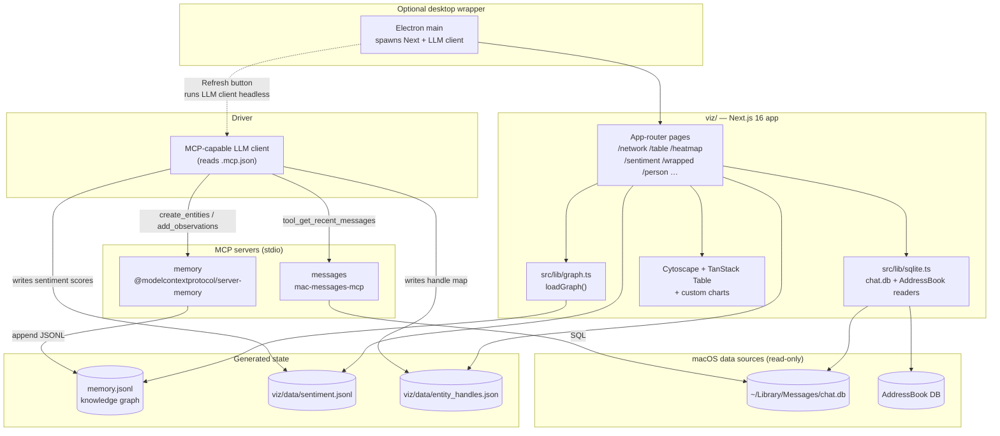

# Architecture Overview

## System Diagram

## Component Descriptions

### MCP layer (`.mcp.json`)
- **Purpose**: Expose iMessage and the knowledge graph as tools that an MCP-capable LLM client can call directly.
- **Location**: `/.mcp.json` (project scope, auto-loaded by the LLM client when started in this directory).
- **Key responsibilities**: Declares two stdio MCP servers — `messages` (via `uvx mac-messages-mcp`) and `memory` (via `npx @modelcontextprotocol/server-memory`). No env vars or secrets.

### Prompt-driven workflow (`prompts/`)
- **Purpose**: Encode the multi-phase workflows for seeding, updating, scoring sentiment, and querying — to be pasted into the LLM client.
- **Location**: `/prompts/{bootstrap,update,sentiment,query}.md`.
- **Key responsibilities**: Enforce the tagged-observation convention so the graph stays parseable. Phase-gate each run so the user can confirm/correct before writes.

### Memory server data file
- **Purpose**: Persistent store for the knowledge graph (entities + relations).
- **Location**: `~/.npm/_npx/<hash>/node_modules/@modelcontextprotocol/server-memory/dist/memory.jsonl` (resolved in `viz/src/lib/graph.ts:7-10`).
- **Format**: Newline-delimited JSON. Each line is either `{type:"entity", name, entityType, observations[]}` or `{type:"relation", from, to, relationType}`.
- **Why JSONL**: Append-friendly for the MCP server's incremental writes, easy to grep, no schema migrations.

### Graph loader (`viz/src/lib/graph.ts`)
- **Purpose**: Parse `memory.jsonl` into typed nodes/edges and decorate with Louvain community IDs.
- **Key responsibilities**: Tag parsing (`[freq]`, `[topic]`, `[tone]`, `[bio]`, `[sent]`), community detection via `graphology-communities-louvain`, color assignment. Memoized per request by Next.js.

### SQLite readers (`viz/src/lib/sqlite.ts`)
- **Purpose**: Read iMessage `chat.db` and macOS AddressBook directly via `better-sqlite3` (readonly).
- **Key responsibilities**: Lazy DB open with caching, phone-number normalization. Used by pages that need raw message bodies, attachments, or contact-name fallback (e.g., `/person/[name]`, `/gallery`, `/wrapped`).

### Frontend pages (`viz/src/app/*`)
- **Purpose**: Each route is a focused lens onto the graph.
- **Key responsibilities**: `/network` renders Cytoscape; `/table`, `/groups`, `/sentiment`, `/hygiene`, `/responsiveness`, `/ghosts`, `/initiation` are sortable tables; `/heatmap`, `/calendar`, `/activity`, `/onthisday` are time-based views; `/wrapped` is a slideshow; `/person/[name]` is the per-contact deep dive.

### Design substrate (`viz/src/lib/theme/` + `viz/src/components/ui/`)
- **Purpose**: Give every route one visual language and interaction model instead of per-page styling.
- **Key responsibilities**: A token set (colors, spacing, accent glow) resolved to CSS custom properties plus a theme resolver in `src/lib/theme/`; a library of presentational primitives in `src/components/ui/` (page mastheads, filter bars, sortable column headers, stat grids, aside blocks, the node selection panel, sparklines). Pages compose these primitives, so a visual change is a token edit rather than an N-page sweep.

### Electron wrapper (`viz/electron/`)
- **Purpose**: Optional native window plus an IPC endpoint that runs `prompts/update.md` and `prompts/sentiment.md` headlessly via the local LLM client.
- **Key responsibilities**: Starts Next.js dev or built server on port 3737, waits for the URL to respond, opens a `BrowserWindow`. The preload script exposes a Refresh button that triggers the backend prompts without leaving the app.

## Data Flow

1. **Seed (one-time)** — User pastes `prompts/bootstrap.md` into the LLM client. The agent calls `tool_get_chats` and `tool_get_recent_messages` against the `messages` MCP server, computes per-contact stats locally, and writes Person entities + relations to the `memory` MCP server. Memory appends to `memory.jsonl`.
2. **Update (periodic)** — `prompts/update.md` re-runs the extraction for new messages since the last `last_contacted`, then uses `delete_observations` + `add_observations` to replace tagged lines (not append duplicates).
3. **Sentiment (weekly)** — `prompts/sentiment.md` scores each top contact per month, appends a JSONL row to `viz/data/sentiment.jsonl`, and writes a `[sent]` observation to the Person entity.
4. **View** — User runs `npm run dev` (or `npm run app`). Each route calls `loadGraph()` (memoized per request) plus any SQLite reads it needs. Cytoscape renders the network; tables sort client-side; charts compute over the loaded graph.
5. **Refresh from the app** — In Electron, clicking the Refresh button IPC-calls `main.js`, which runs the LLM client headlessly with the contents of `update.md` and `sentiment.md` piped in, then waits for completion.

## External Integrations

| Service | Purpose | Documentation |
|---------|---------|---------------|
| `mac-messages-mcp` | MCP server exposing iMessage read tools | [pypi.org/project/mac-messages-mcp](https://pypi.org/project/mac-messages-mcp) |
| `@modelcontextprotocol/server-memory` | MCP server providing the knowledge-graph store | [npm/server-memory](https://www.npmjs.com/package/@modelcontextprotocol/server-memory) |
| macOS Messages (`chat.db`) | Source-of-truth for message history | Apple-internal SQLite schema |
| macOS AddressBook | Contact-name resolution for unknown handles | Apple-internal SQLite schema |
| Local MCP-capable LLM client | Runs the prompts; called headlessly by the Electron Refresh button | Any agent that loads `.mcp.json` |

## Key Architectural Decisions

### Two MCP servers instead of one custom integration
- **Context**: Both iMessage reads and the knowledge graph already had off-the-shelf MCP servers.
- **Decision**: Wire `mac-messages-mcp` and `@modelcontextprotocol/server-memory` via `.mcp.json` and write project-specific logic as Markdown prompts.
- **Rationale**: Keeps the repo focused on the *schema convention* and *visualization*; no custom server code to maintain. The prompts encode the workflow, the conventions encode the schema.

### JSONL knowledge graph, not a database
- **Context**: Needed a persistent store the memory MCP server already writes to, and that the frontend can re-read.
- **Decision**: Use the memory server's native `memory.jsonl` file directly from the Next.js loader.
- **Rationale**: Zero schema migrations, easy to inspect by hand, append-only writes match the incremental update flow. Trade-off: full re-parse on every request (acceptable for personal-scale data).

### Tagged observations with replace-the-whole-line semantics
- **Context**: Updates needed to refresh stats without endlessly appending duplicate observations.
- **Decision**: Each Person entity carries exactly one `[freq] …`, one `[topic] …`, one `[tone] …`, one `[bio] …`, and optionally one `[sent] …` line. Updates `delete_observations` for the tag and `add_observations` the new value.
- **Rationale**: Predictable parsing in `graph.ts` (just `.find(o => o.startsWith("[topic]"))`); idempotent updates; human-readable in the JSONL.

### Read SQLite directly from the frontend
- **Context**: Some views (gallery thumbnails, per-person message body, attachment IDs) need raw message data the MCP server doesn't expose.
- **Decision**: Open `chat.db` and AddressBook DBs read-only with `better-sqlite3` in server components.
- **Rationale**: Direct path avoids tunneling everything through the MCP layer. Marked `server-only` so it never ships to the browser. Trade-off: tightly couples the app to macOS file paths.

### Shared design substrate over per-page styling
- **Context**: ~18 routes each combine charts, tables, and filters; styling them independently drifts quickly and is hard to keep consistent.
- **Decision**: Centralize a token-based theme (`src/lib/theme/`) and a primitives library (`src/components/ui/`); each route is a thin composition of primitives, with interactivity (sorting, network filters, selection) isolated in small `"use client"` wrappers while data loading stays in server components.
- **Rationale**: One palette and one set of interaction patterns across every page; a restyle is a token edit, not a sweep across pages. Keeping interaction in dedicated client wrappers lets the data-loading pages remain server components that read SQLite directly and pass already-rendered content (e.g. an aside) down as props, so the client bundle stays small.

### Electron wrapper as opt-in, not the default
- **Context**: A native window is nicer for a personal daily-driver, but adds a heavy dependency.
- **Decision**: Keep `electron` in `devDependencies`; `npm run app` is opt-in. The browser flow (`npm run dev`) remains the canonical path.
- **Rationale**: Lets contributors run the app without installing Electron; the wrapper exists mainly so the Refresh button can shell out to the LLM client from a single UI surface.
