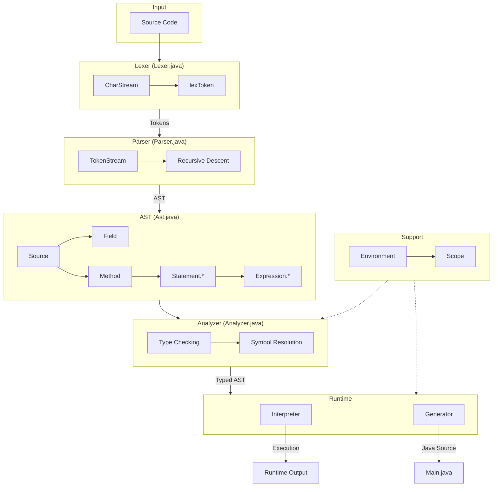

# Architecture Overview

## System Diagram

## Component Descriptions

### Lexer
- **Purpose**: Tokenizes source code into a stream of tokens
- **Location**: `src/main/java/plc/project/Lexer.java`
- **Key responsibilities**:
  - Recognizes IDENTIFIER, INTEGER, DECIMAL, CHARACTER, STRING, and OPERATOR tokens
  - Handles escape sequences in strings and characters
  - Skips whitespace between tokens
  - Uses `peek`/`match` pattern for lookahead

### Parser
- **Purpose**: Builds an Abstract Syntax Tree from tokens
- **Location**: `src/main/java/plc/project/Parser.java`
- **Key responsibilities**:
  - Implements recursive descent parsing
  - Handles operator precedence (logical → equality → additive → multiplicative)
  - Parses declarations, control flow, and expressions
  - Produces untyped AST nodes

### AST
- **Purpose**: Defines the structure of the program representation
- **Location**: `src/main/java/plc/project/Ast.java`
- **Key responsibilities**:
  - `Source` - Root node containing fields and methods
  - `Field` - Global variable declarations
  - `Method` - Function definitions with parameters and body
  - `Statement.*` - Declaration, Assignment, If, For, While, Return
  - `Expression.*` - Literal, Group, Binary, Access, Function

### Analyzer
- **Purpose**: Performs semantic analysis on the AST
- **Location**: `src/main/java/plc/project/Analyzer.java`
- **Key responsibilities**:
  - Type checking and inference
  - Symbol resolution (linking names to Variable/Function objects)
  - Validates type compatibility with `requireAssignable`
  - Ensures `main()` function exists with Integer return type

### Interpreter
- **Purpose**: Directly executes the AST
- **Location**: `src/main/java/plc/project/Interpreter.java`
- **Key responsibilities**:
  - Evaluates expressions and executes statements
  - Manages runtime scope for variable lookups
  - Implements operator semantics (arithmetic, comparison, logical)
  - Uses exception-based control flow for `return` statements

### Generator
- **Purpose**: Compiles AST to Java source code
- **Location**: `src/main/java/plc/project/Generator.java`
- **Key responsibilities**:
  - Outputs syntactically correct Java code
  - Maps PLC types to Java types (Integer→int, Decimal→double, etc.)
  - Handles indentation and formatting
  - Wraps output in a `Main` class with entry point

### Environment
- **Purpose**: Defines the type system and runtime objects
- **Location**: `src/main/java/plc/project/Environment.java`
- **Key responsibilities**:
  - Defines primitive types (ANY, NIL, BOOLEAN, INTEGER, DECIMAL, CHARACTER, STRING)
  - `PlcObject` - Runtime value wrapper
  - `Variable` - Named typed storage
  - `Function` - Callable with parameter/return types

### Scope
- **Purpose**: Implements lexical scoping
- **Location**: `src/main/java/plc/project/Scope.java`
- **Key responsibilities**:
  - Parent-chained scope lookup
  - Variable and function definition/lookup
  - Creates child scopes for blocks and functions

## Data Flow

1. **Lexing**: Source string → `CharStream` processes characters → `Token` list emitted
2. **Parsing**: Tokens → `TokenStream` with `peek`/`match` → `Ast.Source` tree constructed
3. **Analysis**: AST traversed via Visitor → Types inferred/checked → Symbols linked to AST nodes
4. **Execution Path A (Interpreter)**: Typed AST → Direct evaluation → Runtime output
5. **Execution Path B (Generator)**: Typed AST → Java source emitted → Compilable `Main.java`

## Key Architectural Decisions

### Visitor Pattern for AST Traversal
- **Context**: Need multiple operations (analysis, interpretation, generation) over the same AST
- **Decision**: Implement `Ast.Visitor<T>` interface with visit methods for each node type
- **Rationale**: Separates concerns; adding new operations doesn't require modifying AST classes

### Exception-Based Return Handling
- **Context**: `return` statements need to unwind the call stack in the Interpreter
- **Decision**: `Return` extends `RuntimeException`, caught at method boundaries
- **Rationale**: Clean way to propagate return values through nested statement execution

### Scope Chain for Symbol Lookup
- **Context**: Variables and functions have lexical scope (blocks, functions)
- **Decision**: `Scope` objects link to parent; lookups walk up the chain
- **Rationale**: Natural representation of nested scopes; efficient lookup with proper shadowing

### Two-Phase Name Resolution
- **Context**: Parser creates AST with string names; Analyzer needs type information
- **Decision**: Parser produces AST with placeholder fields; Analyzer links to `Environment.Variable`/`Function`
- **Rationale**: Separates syntactic parsing from semantic analysis; enables forward references
