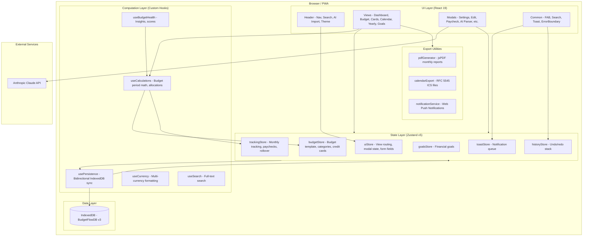
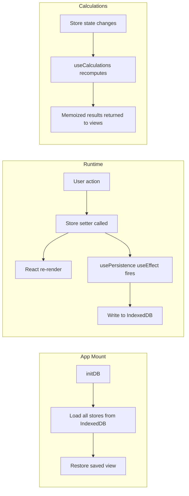

# Architecture Overview

## System Diagram

## Data Flow Diagram

## Component Descriptions

### App.jsx
- **Purpose**: Root component that hosts all views and modals
- **Location**: `src/App.jsx`
- **Key responsibilities**: Conditional view rendering based on `uiStore.view`, mounting all modal components, initializing `usePersistence` and undo keyboard shortcuts via `useUndoable`

### Header.jsx
- **Purpose**: Top navigation bar
- **Location**: `src/components/layout/Header.jsx`
- **Key responsibilities**: View switching tabs, search trigger (Cmd+K), AI import button, settings gear, theme toggle

### Dashboard (View)
- **Purpose**: Primary monthly budget view
- **Location**: `src/components/views/Dashboard/`
- **Key responsibilities**: Month navigation, available funds display, expense list with paid/skip toggles, paycheck allocation breakdown, savings section, budget health score, PDF export

### Budget (View)
- **Purpose**: Budget template editor
- **Location**: `src/components/views/Budget/`
- **Key responsibilities**: Category CRUD, expense item CRUD (name, amount, due day, frequency), deduction management, move items between categories

### Cards (View)
- **Purpose**: Payment method assignment
- **Location**: `src/components/views/Cards/`
- **Key responsibilities**: Drag-and-drop assignment of expenses to credit cards, per-card totals, savings/rollover columns

### Calendar (View)
- **Purpose**: Monthly calendar with bill visualization
- **Location**: `src/components/views/Calendar/`
- **Key responsibilities**: Calendar grid with colored bill dots, paycheck day markers, day detail panel, ICS calendar export

### Yearly (View)
- **Purpose**: Annual overview and trends
- **Location**: `src/components/views/Yearly/`
- **Key responsibilities**: Year totals, 12-month spending trends chart (Recharts), category pie chart, subscription timeline

### useCalculations Hook
- **Purpose**: Central computation engine
- **Location**: `src/hooks/useCalculations.js`
- **Key responsibilities**: Budget period logic (paycheck-centric, not calendar-centric), expense item expansion (weekly/bi-weekly occurrences), monthly totals, paycheck allocation, available funds, card totals, yearly aggregation

### usePersistence Hook
- **Purpose**: Bidirectional state-to-database sync
- **Location**: `src/hooks/usePersistence.js`
- **Key responsibilities**: Load all stores from IndexedDB on mount, reactive writes via useEffect watchers, localStorage migration

### db.js
- **Purpose**: All IndexedDB operations
- **Location**: `src/db.js`
- **Key responsibilities**: Database initialization (v3 schema, 12 object stores), CRUD for all stores, data export/import, health check, emergency export, database recovery

## External Integrations

| Service | Purpose | Documentation |
|---------|---------|---------------|
| Anthropic Claude API | AI-powered budget parsing from images | [Anthropic API Docs](https://docs.anthropic.com/) |
| Web Notifications API | Bill reminders and budget threshold alerts | [MDN Web Notifications](https://developer.mozilla.org/en-US/docs/Web/API/Notifications_API) |
| Workbox (via vite-plugin-pwa) | Service worker caching for offline support | [Workbox Docs](https://developer.chrome.com/docs/workbox/) |

## Key Architectural Decisions

### Budget Periods Instead of Calendar Months
- **Context**: Users get paid on specific dates, not the 1st of the month. A bill due on the 3rd is funded by the previous month's last paycheck.
- **Decision**: Expenses belong to the paycheck period that funds them, not the calendar month they fall in.
- **Rationale**: Reflects how people actually manage money — paycheck to paycheck. More accurate "available funds" calculations.

### IndexedDB Over localStorage
- **Context**: The app stores complex, nested data (monthly tracking maps, paychecks, credit cards, goals) that grows over time.
- **Decision**: Migrated from localStorage to IndexedDB with 12 structured object stores.
- **Rationale**: localStorage has a 5-10 MB cap and only supports string key-value pairs. IndexedDB supports structured data, indexes for efficient queries, and much larger storage limits.

### Zustand Without Persist Middleware
- **Context**: Zustand v5 has built-in `persist` middleware, but the app needed granular control over what gets saved and when.
- **Decision**: Custom `usePersistence` hook with individual `useEffect` watchers per state slice.
- **Rationale**: Avoids serializing the entire store on every change. Enables the migration path from localStorage. Allows some store actions to write directly to IndexedDB for immediate persistence (e.g., drag-and-drop).

### No React Router
- **Context**: The app is a single-page PWA that works fully offline.
- **Decision**: View routing is handled by a `view` string in `uiStore`, conditionally rendered in `App.jsx`.
- **Rationale**: URL-based routing adds complexity without benefit for an offline-first app with no shareable URLs. Keeps the app self-contained.

### Direct Browser API Calls to Claude
- **Context**: The AI budget import feature needs to send images to Claude for parsing.
- **Decision**: Call the Anthropic API directly from the browser using the user's own API key stored locally.
- **Rationale**: Eliminates the need for a backend server. The API key never leaves the user's device except to Anthropic. Uses the `anthropic-dangerous-direct-browser-access` header.

### Lazy-Loaded Views
- **Context**: The app has 6 views, but users primarily interact with the Dashboard.
- **Decision**: All views except Dashboard use `React.lazy()` with `<Suspense>` fallbacks.
- **Rationale**: Reduces initial bundle size and speeds up first load, especially important for a PWA that may be loaded on slower connections.
