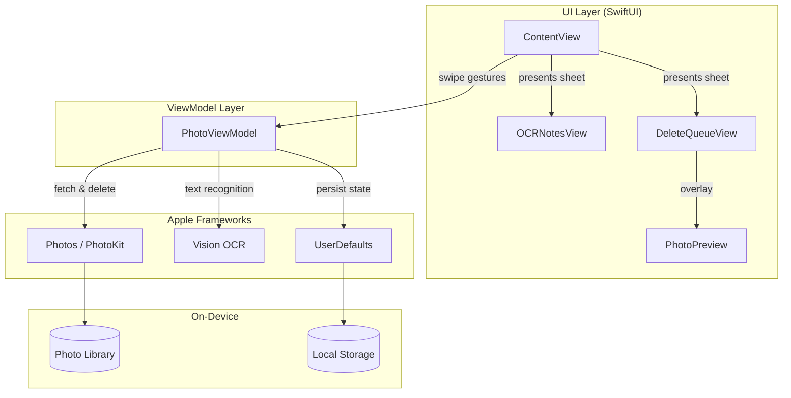

# Architecture Overview

## System Diagram

## Component Descriptions

### Photo_HelperApp
- **Purpose**: App entry point and window setup
- **Location**: `PixScan/Photo_HelperApp.swift`
- **Key responsibilities**: Creates the `WindowGroup` and instantiates the root `ContentView`

### ContentView
- **Purpose**: Main user interface and interaction handling
- **Location**: `PixScan/ContentView.swift` (1,561 lines)
- **Key responsibilities**:
  - Renders the current photo card with swipe gesture detection
  - Handles all four swipe directions plus double-tap undo
  - Displays visual indicators for swipe direction feedback
  - Manages navigation to OCRNotesView and DeleteQueueView via sheets
  - Shows permission request UI and completion state
  - Renders the instruction panel with gesture guide

### PhotoViewModel
- **Purpose**: Central state management and business logic
- **Location**: `PixScan/PhotoViewModel.swift` (434 lines)
- **Key responsibilities**:
  - Fetches photos from the photo library via PhotoKit
  - Manages the current photo index and navigation
  - Runs OCR text recognition via the Vision framework
  - Maintains the delete queue and selection state
  - Persists processed photo IDs to UserDefaults
  - Provides computed properties for UI state (badges, completion)

## Data Flow

1. **App Launch**: `PhotoViewModel` loads persisted `processedPhotoIds` from UserDefaults, fetches all photos sorted by date (newest first), and skips to the first unprocessed photo.
2. **User Swipe**: `ContentView` detects a `DragGesture`, determines swipe direction based on offset, and calls the appropriate `PhotoViewModel` method (`processCurrentPhoto`, `queuePhotoForDeletion`, `performOCR`).
3. **OCR Processing**: The view model loads the full-resolution image on a background thread, runs `VNRecognizeTextRequest`, and appends a `TextEntry` (with extracted text and timestamp) to the `recognizedTexts` array.
4. **Delete Queue**: Photos swiped left or up are added to `deleteQueue`. The user can review, select/deselect, preview, and batch-delete via `PHAssetChangeRequest.deleteAssets()`.
5. **Persistence**: After each photo is processed, its `localIdentifier` is added to a `Set<String>` and serialized to UserDefaults. On next launch, already-processed photos are automatically skipped.

## External Integrations

| Service | Purpose | Documentation |
|---------|---------|---------------|
| Apple Photos (PhotoKit) | Read/delete photos from user library | [PhotoKit Docs](https://developer.apple.com/documentation/photokit) |
| Apple Vision | On-device OCR text recognition | [Vision Docs](https://developer.apple.com/documentation/vision) |
| UserDefaults | Lightweight key-value persistence | [UserDefaults Docs](https://developer.apple.com/documentation/foundation/userdefaults) |

## Key Architectural Decisions

### MVVM with a Single ViewModel
- **Context**: The app has one primary screen with multiple interaction modes (swiping, OCR results, delete queue).
- **Decision**: A single `PhotoViewModel` manages all state, presented through sheet-based sub-views.
- **Rationale**: The app's scope is focused enough that splitting into multiple view models would add unnecessary complexity. One `ObservableObject` keeps state synchronized across all views.

### On-Device Processing Only
- **Context**: The app handles personal photos and extracted text, which are sensitive data.
- **Decision**: All OCR and image processing happens locally using Apple's native frameworks. No network calls, no cloud APIs.
- **Rationale**: Maximizes user privacy, eliminates latency, and works offline. Apple's Vision framework provides sufficient OCR accuracy.

### UserDefaults for Persistence
- **Context**: The app needs to remember which photos have already been processed across sessions.
- **Decision**: Store a `Set<String>` of processed photo `localIdentifier` values in UserDefaults.
- **Rationale**: The data is simple (just string IDs), small enough for UserDefaults, and doesn't warrant a full database like Core Data or SQLite.

### Swipe Gesture as Primary Interaction
- **Context**: Users need to quickly triage large photo libraries.
- **Decision**: Four-direction swipe gestures map to four distinct actions (keep, delete, OCR+keep, OCR+delete).
- **Rationale**: Inspired by dating app UX (Tinder-style swiping), this provides fast, one-handed operation. Users can process hundreds of photos quickly without navigating menus.
