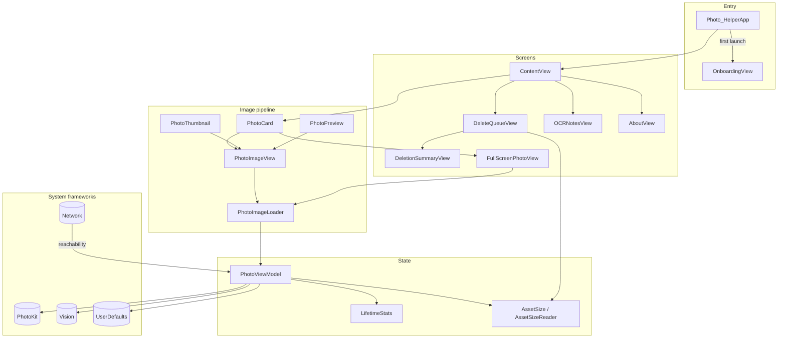

# Architecture

## System Diagram

```mermaid
flowchart TD
    subgraph Entry
        APP[Photo_HelperApp]
        OB[OnboardingView]
    end

    subgraph Screens["Screens"]
        CV[ContentView]
        DQ[DeleteQueueView]
        OCRN[OCRNotesView]
        SUM[DeletionSummaryView]
        ABOUT[AboutView]
        FSPV[FullScreenPhotoView]
    end

    subgraph Imaging["Image pipeline"]
        LOADER[PhotoImageLoader]
        PIV[PhotoImageView]
        CARD[PhotoCard]
        THUMB[PhotoThumbnail]
        PREV[PhotoPreview]
    end

    subgraph Model["State"]
        PVM[PhotoViewModel]
        STATS[LifetimeStats]
        SIZE[AssetSize / AssetSizeReader]
    end

    subgraph Platform["System frameworks"]
        PK[(PhotoKit)]
        VIS[(Vision)]
        NET[(Network)]
        UD[(UserDefaults)]
    end

    APP -->|first launch| OB
    APP --> CV
    CV --> DQ & OCRN & ABOUT & CARD
    DQ --> SUM
    CARD --> PIV & FSPV
    THUMB --> PIV
    PREV --> PIV
    PIV --> LOADER
    FSPV --> LOADER
    LOADER --> PVM
    PVM --> PK & VIS & UD
    PVM --> STATS & SIZE
    NET -->|reachability| PVM
    DQ --> SIZE
```

## Component Descriptions

### PhotoViewModel
- **Purpose**: Single source of truth for the photo deck, delete queue, extracted text and lifetime totals
- **Location**: `PixScan/PhotoViewModel.swift`
- **Key responsibilities**: Fetching and observing the photo library, issuing image requests, running text recognition, performing batch deletion, and persisting everything to `UserDefaults`

### PhotoImageLoader
- **Purpose**: Owns the request/cancel/retry lifecycle for one asset and models what PhotoKit is actually telling us
- **Location**: `PixScan/PhotoImageLoader.swift`
- **Key responsibilities**: Translating PhotoKit's result dictionary into an explicit state (`loading`, `loaded`, `partial`, `failed`), surfacing iCloud download progress, and re-requesting automatically when connectivity returns

### PhotoImageView
- **Purpose**: The one place an asset gets rendered, with placeholder, progress and failure chrome
- **Location**: `PixScan/PhotoImageView.swift`
- **Key responsibilities**: Rendering loader state at the right scale for its slot, and converting point sizes to the pixel target sizes PhotoKit expects

### AssetSizeReader
- **Purpose**: Byte sizes for photos, with an explicit measured-or-estimated flag
- **Location**: `PixScan/AssetSize.swift`
- **Key responsibilities**: Probing for a KVC-only size property through the Objective-C runtime before using it, and falling back to a pixel-count estimate when it is unavailable

### LifetimeStats
- **Purpose**: Running totals that survive resets and sessions
- **Location**: `PixScan/LifetimeStats.swift`
- **Key responsibilities**: Accumulating photos deleted, bytes freed, photos reviewed and text extractions, and decoding tolerantly so new fields cannot invalidate old records

### NetworkMonitor
- **Purpose**: Process-wide connectivity signal
- **Location**: `PixScan/NetworkMonitor.swift`
- **Key responsibilities**: Publishing reachability changes so image requests can refuse network access when offline and retry when it returns

## Data Flow

1. The user swipes a photo card, or triggers the same decision through a VoiceOver action
2. `ContentView` routes the decision to one of four handlers on `PhotoViewModel`
3. Keep and delete mark the photo as reviewed; up and down first request a full-resolution image and run `VNRecognizeTextRequest` against it
4. Deletions accumulate in a queue rather than executing, and the user confirms the batch
5. Sizes are measured before the change request runs, because afterwards the assets no longer exist
6. `PHPhotoLibrary.performChanges` performs the deletion, iOS presents its own confirmation, and totals are folded into `LifetimeStats`

## External Integrations

| Service | Purpose | Notes |
|---------|---------|-------|
| PhotoKit | Read, cache and delete photos | Deletion routed through `performChanges`, so iOS owns the confirmation and photos remain recoverable for 30 days |
| Vision | On-device text recognition | `.accurate` level with language correction; no network involved |
| Network framework | Reachability | Used to decide whether an iCloud round-trip is worth attempting |
| UserDefaults | Persistence | Small, structured records; no database dependency |

## Key Architectural Decisions

### Model PhotoKit's result dictionary instead of collapsing it to an optional
- **Context**: `requestImage` reports its outcome through an info dictionary carrying degraded, in-cloud, cancelled and error flags. Discarding it leaves an `UIImage?` that cannot distinguish "still loading" from "failed" from "cancelled".
- **Decision**: `ImageRequestResult` captures every flag, and `PhotoImageLoader` maps them to an explicit state machine including a `partial` case for "we have something usable but could not get better".
- **Rationale**: The alternative — treating any nil as failure — produces the exact bugs it looks like it avoids: a late nil overwrites a good thumbnail, and an offline device that *does* hold a cached thumbnail shows an error over a perfectly usable image.

### Count events where they happen, not by deriving them from state
- **Context**: Lifetime totals cannot be computed from the current model. The delete queue empties on success, and reviewed photos are cleared by "Start Over".
- **Decision**: Increment persisted counters at the moment of the event, and decrement the review count on undo.
- **Rationale**: Deriving from live state under-reports permanently. Decrementing on undo costs one branch and prevents re-swiping an undone photo from inflating the figure.

### Give the primary interaction a non-gesture path
- **Context**: Every decision was reachable only through `DragGesture`, and VoiceOver consumes swipes for its own navigation, so the app's primary task was impossible with it enabled.
- **Decision**: Expose the four decisions and undo as named accessibility actions that call the same handlers the gestures call.
- **Rationale**: A parallel implementation would drift. Routing both paths through one set of handlers keeps them identical by construction, and Voice Control gets addressable names for free.

### Guard a KVC-only property behind a runtime probe
- **Context**: A photo's byte size is only reachable through key-value coding on a non-public property. `value(forKey:)` raises an Objective-C exception when the key is absent, and Swift cannot catch those.
- **Decision**: Probe once with `instancesRespond(to:)` and fall back to a pixel-count estimate, surfacing estimates with a `~` prefix.
- **Rationale**: An `as?` cast handles a wrong-typed return but not a missing key, so the naive version would crash rather than degrade. The flag also stops an estimate being presented as a measurement on a screen that drives a destructive decision.

### Persist with UserDefaults rather than a database
- **Context**: The app stores a set of identifiers, a list of text entries, and a small totals record.
- **Decision**: JSON-encoded values in `UserDefaults`, with debounced writes and a hand-written decoder that tolerates missing keys.
- **Rationale**: Core Data or SwiftData would add a migration surface for data that has no relational shape. The hand-written decoder matters more than the store: Swift's synthesised one requires every key, so adding a field in a later release would fail to decode and silently discard a user's history.
