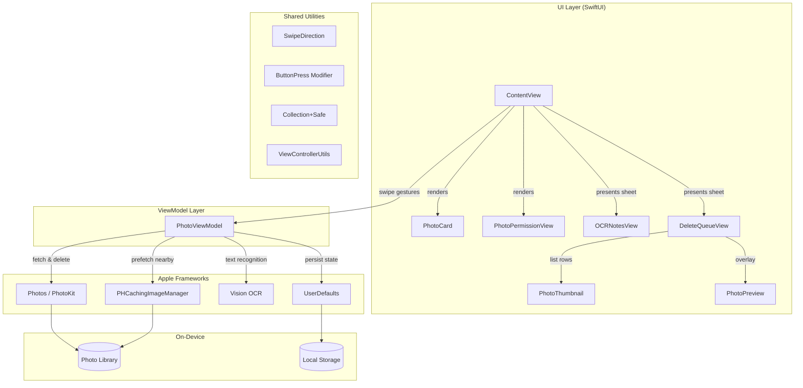

# Architecture Overview

## System Diagram

## Component Descriptions

### Photo_HelperApp
- **Purpose**: App entry point and window setup
- **Location**: `PixScan/Photo_HelperApp.swift`
- **Key responsibilities**: Creates the `WindowGroup` and instantiates the root `ContentView`

### ContentView
- **Purpose**: Main user interface and interaction handling
- **Location**: `PixScan/ContentView.swift` (694 lines)
- **Key responsibilities**:
  - Orchestrates the swipe gesture detection and direction-based actions
  - Manages navigation to OCRNotesView and DeleteQueueView via sheets
  - Triggers image prefetching via `PHCachingImageManager` on index changes
  - Shows permission request, completion state, and instruction panel

### PhotoCard
- **Purpose**: Renders the current photo as a swipeable card
- **Location**: `PixScan/PhotoCard.swift` (34 lines)

### PhotoPermissionView
- **Purpose**: Photo library permission request and denied state UI
- **Location**: `PixScan/PhotoPermissionView.swift` (45 lines)

### DeleteQueueView
- **Purpose**: Sheet for reviewing and batch-deleting queued photos
- **Location**: `PixScan/DeleteQueueView.swift` (216 lines)
- **Key responsibilities**: Displays thumbnails with metadata, actual file sizes via `PHAssetResource`, selective and full batch deletion, full-size photo preview overlay

### OCRNotesView
- **Purpose**: Sheet for viewing, searching, copying, sharing, and exporting OCR text
- **Location**: `PixScan/OCRNotesView.swift` (135 lines)

### PhotoThumbnail / PhotoPreview
- **Purpose**: Thumbnail (60x60) and full-size image loading from PHAssets
- **Locations**: `PixScan/PhotoThumbnail.swift` (41 lines), `PixScan/PhotoPreview.swift` (45 lines)

### PhotoViewModel
- **Purpose**: Central state management and business logic
- **Location**: `PixScan/PhotoViewModel.swift` (368 lines)
- **Key responsibilities**:
  - Fetches photos from the photo library via PhotoKit
  - Manages the current photo index and navigation
  - Runs OCR text recognition via the Vision framework
  - Maintains the delete queue and selection state
  - Persists processed photo IDs, recognized texts (JSON), and delete queue (localIdentifiers) to UserDefaults
  - Prefetches nearby images using `PHCachingImageManager`
  - Provides `unmarkPhotoAsProcessed()` for undo/go-back support

### Shared Utilities
- **SwipeDirection** (`SwipeDirection.swift`): Enum for gesture direction
- **ButtonPress** (`ButtonPress.swift`): Custom `ViewModifier` for press-effect buttons
- **Collection+Safe** (`Collection+Safe.swift`): Safe subscript to avoid index-out-of-bounds crashes
- **ViewControllerUtils** (`ViewControllerUtils.swift`): Shared `findTopMostViewController` function for presenting UIKit sheets

## Data Flow

1. **App Launch**: `PhotoViewModel` loads persisted `processedPhotoIds` from UserDefaults, fetches all photos sorted by date (newest first), and skips to the first unprocessed photo.
2. **User Swipe**: `ContentView` detects a `DragGesture`, determines swipe direction based on offset, and calls the appropriate `PhotoViewModel` method (`processCurrentPhoto`, `queuePhotoForDeletion`, `performOCR`). On index change, `PHCachingImageManager` prefetches the next 3 images for smoother scrolling.
3. **OCR Processing**: The view model loads the full-resolution image on a background thread, runs `VNRecognizeTextRequest`, and appends a `TextEntry` (with extracted text and timestamp) to the `recognizedTexts` array.
4. **Delete Queue**: Photos swiped left or up are added to `deleteQueue`. The user can review, select/deselect, preview, and batch-delete via `PHAssetChangeRequest.deleteAssets()`.
5. **Persistence**: After each photo is processed, its `localIdentifier` is added to a `Set<String>` and serialized to UserDefaults. Recognized OCR texts are persisted as JSON, and the delete queue is persisted via asset localIdentifiers. On next launch, already-processed photos are automatically skipped and the delete queue and OCR texts are restored.

## External Integrations

| Service | Purpose | Documentation |
|---------|---------|---------------|
| Apple Photos (PhotoKit) | Read/delete photos from user library | [PhotoKit Docs](https://developer.apple.com/documentation/photokit) |
| Apple Vision | On-device OCR text recognition | [Vision Docs](https://developer.apple.com/documentation/vision) |
| UserDefaults | Lightweight key-value persistence | [UserDefaults Docs](https://developer.apple.com/documentation/foundation/userdefaults) |

## Key Architectural Decisions

### MVVM with a Single ViewModel
- **Context**: The app has one primary screen with multiple interaction modes (swiping, OCR results, delete queue).
- **Decision**: A single `PhotoViewModel` manages all state, presented through sheet-based sub-views.
- **Rationale**: The app's scope is focused enough that splitting into multiple view models would add unnecessary complexity. One `ObservableObject` keeps state synchronized across all views.

### On-Device Processing Only
- **Context**: The app handles personal photos and extracted text, which are sensitive data.
- **Decision**: All OCR and image processing happens locally using Apple's native frameworks. No network calls, no cloud APIs.
- **Rationale**: Maximizes user privacy, eliminates latency, and works offline. Apple's Vision framework provides sufficient OCR accuracy.

### UserDefaults for Persistence
- **Context**: The app needs to remember which photos have already been processed across sessions, along with OCR texts and the delete queue.
- **Decision**: Store processed photo IDs as a serialized Set, recognized texts as JSON-encoded `Codable` structs, and delete queue as an array of asset localIdentifiers — all in UserDefaults.
- **Rationale**: The data is simple enough for UserDefaults and doesn't warrant a full database like Core Data or SQLite. JSON encoding for `TextEntry` structs keeps the data structured and portable.

### Modular File Architecture
- **Context**: The original ContentView was 1,561 lines handling UI, gestures, navigation, sheets, and utility functions.
- **Decision**: Extract 10 focused files — view components (PhotoCard, PhotoPermissionView, DeleteQueueView, OCRNotesView, PhotoThumbnail, PhotoPreview) and utilities (SwipeDirection, ButtonPress, Collection+Safe, ViewControllerUtils).
- **Rationale**: Xcode 16+ with `PBXFileSystemSynchronizedRootGroup` auto-discovers new `.swift` files, making extraction zero-friction. Each file has a single responsibility and is independently testable.

### Swipe Gesture as Primary Interaction
- **Context**: Users need to quickly triage large photo libraries.
- **Decision**: Four-direction swipe gestures map to four distinct actions (keep, delete, OCR+keep, OCR+delete).
- **Rationale**: Inspired by dating app UX (Tinder-style swiping), this provides fast, one-handed operation. Users can process hundreds of photos quickly without navigating menus.
