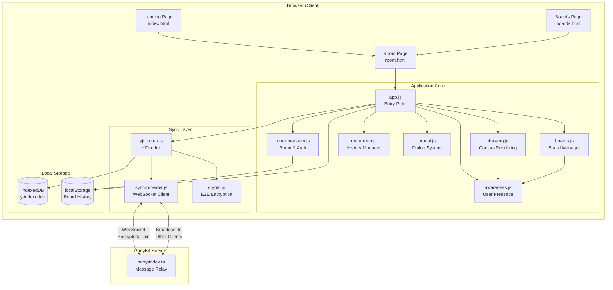
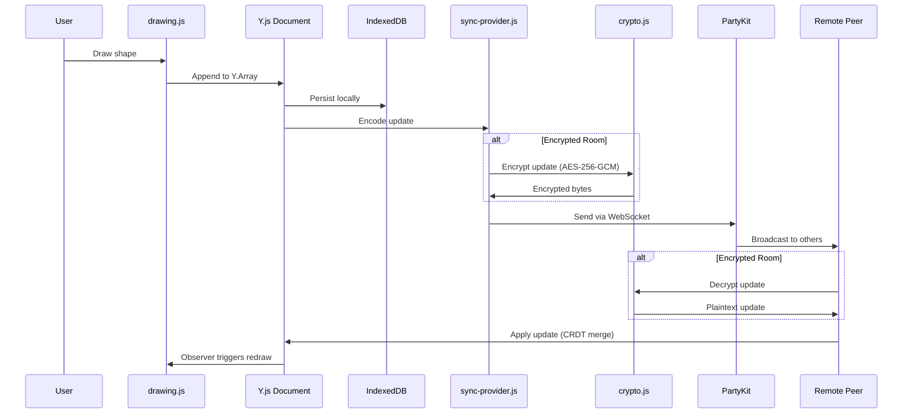

# Architecture Overview

## System Diagram

## Data Flow Diagram

## Component Descriptions

### app.js — Main Entry Point
- **Purpose**: Orchestrates initialization and wires all modules together
- **Location**: `js/app.js`
- **Key responsibilities**: Tool switching with per-tool settings persistence, keyboard shortcuts, zoom/pan controls, side panel management, canvas resizing, browser compatibility checks, global error handling

### drawing.js — Canvas Rendering Engine
- **Purpose**: Handles all HTML5 Canvas drawing, hit-testing, shape manipulation, and live drawing previews
- **Location**: `js/drawing.js`
- **Key responsibilities**: Rendering shapes from Y.Array data, mouse/touch interaction handling, shape selection (single and multi-select), move/resize operations, copy/paste/duplicate, read-only mode enforcement, remote cursor rendering

### yjs-setup.js — Y.js Initialization
- **Purpose**: Creates the Y.Doc, sets up IndexedDB persistence and the WebSocket sync provider
- **Location**: `js/yjs-setup.js`
- **Key responsibilities**: Y.Doc creation, IndexedDB provider setup, encryption key derivation (if password provided), network sync with timeout, default board creation (only after sync to prevent duplicates)

### sync-provider.js — WebSocket Sync Provider
- **Purpose**: Custom Y.js sync provider using PartyKit WebSockets with optional E2E encryption
- **Location**: `js/sync-provider.js`
- **Key responsibilities**: WebSocket connection management with auto-reconnect, Y.js sync protocol encoding/decoding, awareness protocol for user presence, optional encrypt/decrypt wrapping of all messages, periodic resync for reliability

### awareness.js — User Presence
- **Purpose**: Manages ephemeral user state (cursors, names, colors, active board, in-progress drawings)
- **Location**: `js/awareness.js`
- **Key responsibilities**: Local user state broadcasting, remote cursor rendering with labels, user list UI, live drawing preview propagation, throttled cursor updates to reduce network traffic

### boards.js — Multi-Board Manager
- **Purpose**: Manages multiple boards (whiteboards) within a single room
- **Location**: `js/boards.js`
- **Key responsibilities**: Board creation and switching, board tab UI rendering, board clearing, awareness sync of current board per user

### crypto.js — Encryption Utilities
- **Purpose**: End-to-end encryption using Web Crypto API
- **Location**: `js/crypto.js`
- **Key responsibilities**: PBKDF2 key derivation (100K iterations, SHA-256), AES-256-GCM authenticated encryption, random IV per message, password verification

### room-manager.js — Room & Access Control
- **Purpose**: Handles room URLs, password tokens, and permission levels
- **Location**: `js/room-manager.js`
- **Key responsibilities**: Room ID extraction from URL, access token encoding/decoding with signature verification, shareable link generation, read-only mode detection, clipboard operations

### undo-redo.js — History Manager
- **Purpose**: CRDT-aware undo/redo using Y.js UndoManager
- **Location**: `js/undo-redo.js`
- **Key responsibilities**: Only tracks local user's changes (never undoes other users' work), 500ms grouping window for rapid changes, stack state notifications for UI updates

### modal.js — Dialog System
- **Purpose**: Custom modal system replacing native browser dialogs
- **Location**: `js/modal.js`
- **Key responsibilities**: Prompt, confirm, alert dialogs, invite modal, password modal, keyboard shortcuts help, text extraction modal

### board-history.js — Board History Manager
- **Purpose**: Persists room visit history in localStorage
- **Location**: `js/board-history.js`
- **Key responsibilities**: Save/load board history, role tracking (owner/collaborator/viewer) with owner preservation, access counting, relative time formatting

### config.js — Configuration Constants
- **Purpose**: Centralizes all magic numbers and configurable values
- **Location**: `js/config.js`
- **Key responsibilities**: Zoom limits, timing intervals, crypto parameters, drawing defaults, user color palette

### party/index.ts — PartyKit Server
- **Purpose**: Minimal WebSocket message relay
- **Location**: `party/index.ts`
- **Key responsibilities**: Accept WebSocket connections, broadcast messages to all other clients in the room (never echoes back to sender). Only 35 lines — all logic lives client-side.

## External Integrations

| Service | Purpose | Documentation |
|---------|---------|---------------|
| PartyKit | WebSocket message relay for real-time sync | [partykit.io](https://partykit.io/) |
| Vercel | Static site hosting with URL rewrites | [vercel.com](https://vercel.com/) |
| Google Fonts | Inter typeface for UI | [fonts.google.com](https://fonts.google.com/) |

## Key Architectural Decisions

### CRDTs over Operational Transform
- **Context**: Needed conflict-free real-time collaboration without a central authority
- **Decision**: Y.js CRDT library
- **Rationale**: CRDTs guarantee eventual consistency without a server. Unlike OT (used by Google Docs), CRDTs work offline and don't need a central server to resolve conflicts. Y.js is the most mature CRDT implementation for JavaScript.

### PartyKit over Raw WebRTC
- **Context**: Originally used y-webrtc for peer-to-peer connections, but WebRTC has NAT traversal issues
- **Decision**: Migrated to PartyKit WebSocket relay
- **Rationale**: PartyKit provides reliable message delivery without NAT/firewall issues. The server is a simple broadcast relay (doesn't see decrypted data), maintaining the privacy model while improving reliability.

### Client-Side Encryption
- **Context**: Wanted true E2E encryption where the relay server never sees plaintext
- **Decision**: AES-256-GCM encryption with PBKDF2 key derivation, all in the browser
- **Rationale**: The Web Crypto API provides hardware-accelerated crypto. By encrypting Y.js sync messages before sending, the PartyKit server only ever sees ciphertext. Password-derived keys mean no key exchange protocol is needed — users share the password out of band.

### Multi-Page Application (MPA) over SPA
- **Context**: The app has three distinct pages (landing, boards list, whiteboard room)
- **Decision**: Vite MPA mode with separate HTML entry points
- **Rationale**: Each page has very different functionality. MPA keeps bundles small (the landing page doesn't load Y.js), and Vite's MPA support handles the routing cleanly. URL rewrites in Vercel handle the `/room/:id` pattern.

### IndexedDB for Local Persistence
- **Context**: Users need to return to their whiteboards even without network
- **Decision**: y-indexeddb for Y.Doc persistence, localStorage for board history
- **Rationale**: IndexedDB handles the potentially large binary Y.Doc state, while localStorage is simpler for the small structured board history data. y-indexeddb integrates directly with Y.js for seamless offline support.
