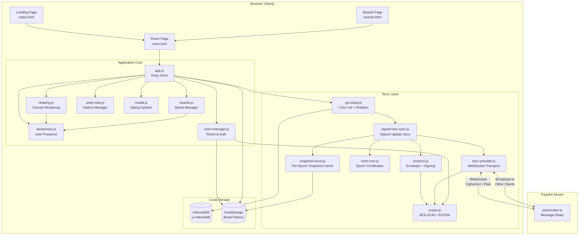
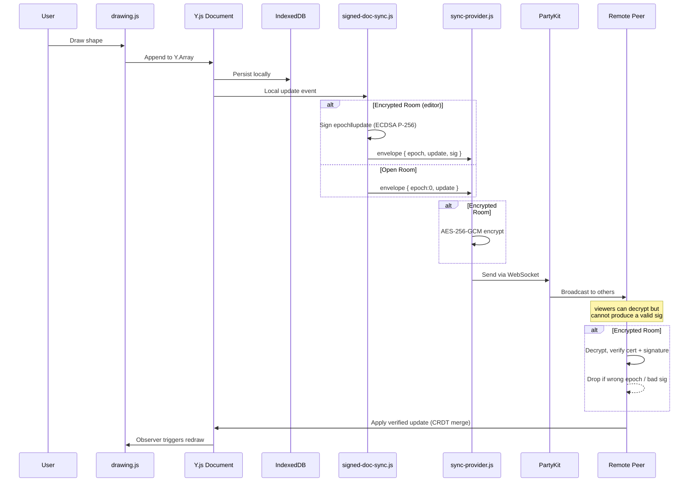

# Architecture Overview

## System Diagram

```mermaid
flowchart TD
    subgraph Browser["Browser (Client)"]
        LP[Landing Page<br>index.html]
        BP[Boards Page<br>boards.html]
        RP[Room Page<br>room.html]

        subgraph AppCore["Application Core"]
            APP[app.js<br>Entry Point]
            DRW[drawing.js<br>Canvas Rendering]
            BRD[boards.js<br>Board Manager]
            AWR[awareness.js<br>User Presence]
            UND[undo-redo.js<br>History Manager]
            MOD[modal.js<br>Dialog System]
            RM[room-manager.js<br>Room & Auth]
        end

        subgraph SyncLayer["Sync Layer"]
            YJS[yjs-setup.js<br>Y.Doc Init + Rotation]
            SDS[signed-doc-sync.js<br>Signed Update Sync]
            PROTO[protocol.js<br>Envelope + Signing]
            SP[sync-provider.js<br>WebSocket Transport]
            CRY[crypto.js<br>AES-GCM + ECDSA]
            CERT[room-cert.js<br>Epoch Certificates]
            SNAP[snapshot-store.js<br>Per-Epoch Snapshot Cache]
        end

        subgraph Storage["Local Storage"]
            IDB[(IndexedDB<br>y-indexeddb)]
            LS[(localStorage<br>Board History)]
        end
    end

    subgraph Server["PartyKit Server"]
        PK[party/index.ts<br>Message Relay]
    end

    LP --> RP
    BP --> RP
    RP --> APP
    APP --> DRW
    APP --> BRD
    APP --> AWR
    APP --> UND
    APP --> MOD
    APP --> RM

    APP --> YJS
    YJS --> SDS
    SDS --> PROTO
    SDS --> CERT
    PROTO --> CRY
    SDS --> SP
    SDS --> SNAP
    SP --> CRY
    SNAP --> LS
    YJS --> IDB

    SP <-->|WebSocket<br>Ciphertext / Plain| PK
    PK <-->|Broadcast to<br>Other Clients| SP

    RM --> CRY
    RM --> LS
    APP --> LS

    DRW --> AWR
    BRD --> AWR
```

## Data Flow Diagram

```mermaid
sequenceDiagram
    participant User
    participant Canvas as drawing.js
    participant YDoc as Y.js Document
    participant IDB as IndexedDB
    participant Signed as signed-doc-sync.js
    participant Provider as sync-provider.js
    participant Server as PartyKit
    participant Peer as Remote Peer

    User->>Canvas: Draw shape
    Canvas->>YDoc: Append to Y.Array
    YDoc->>IDB: Persist locally
    YDoc->>Signed: Local update event

    alt Encrypted Room (editor)
        Signed->>Signed: Sign epoch‖update (ECDSA P-256)
        Signed->>Provider: envelope { epoch, update, sig }
    else Open Room
        Signed->>Provider: envelope { epoch:0, update }
    end

    alt Encrypted Room
        Provider->>Provider: AES-256-GCM encrypt
    end
    Provider->>Server: Send via WebSocket
    Server->>Peer: Broadcast to others

    Note over Peer: viewers can decrypt but<br>cannot produce a valid sig

    alt Encrypted Room
        Peer->>Peer: Decrypt, verify cert + signature
        Peer-->>Peer: Drop if wrong epoch / bad sig
    end

    Peer->>YDoc: Apply verified update (CRDT merge)
    YDoc->>Canvas: Observer triggers redraw
```

## Component Descriptions

### app.js — Main Entry Point
- **Purpose**: Orchestrates initialization and wires all modules together
- **Location**: `js/app.js`
- **Key responsibilities**: Tool switching with per-tool settings persistence, keyboard shortcuts, zoom/pan controls, side panel management, canvas resizing, browser compatibility checks, global error handling

### drawing.js — Canvas Rendering Engine
- **Purpose**: Handles all HTML5 Canvas drawing, hit-testing, shape manipulation, and live drawing previews
- **Location**: `js/drawing.js`
- **Key responsibilities**: Rendering every tool from Y.Array data (freehand/highlighter, line/arrow, rect/circle/ellipse/diamond/triangle, text, sticky notes, connectors), mouse/touch interaction handling, shape selection (single and multi-select), move/resize operations, copy/paste/duplicate, sticky-note text scrolling, relationship-bound connector creation and re-routing, the ephemeral laser-pointer trail, read-only mode enforcement, remote cursor rendering, and an off-screen `renderBoardToCanvas` pass used by the PNG/PDF export

### draw-geometry.js, connector-geometry.js, text-wrap.js — Pure Geometry & Layout
- **Purpose**: Browser-free math extracted from the canvas engine so it can be unit-tested without a DOM
- **Location**: `js/draw-geometry.js`, `js/connector-geometry.js`, `js/text-wrap.js`
- **Key responsibilities**: `draw-geometry.js` — hit-testing, polygon point generation for diamonds/triangles, arrowhead points, dash patterns, degenerate-shape detection, and a spatial shape index that avoids `O(n)` scans. `connector-geometry.js` — resolving a connector's endpoints to the nearest edge anchors of its two bound shapes, and finding dangling connectors whose targets were deleted. `text-wrap.js` — word-wrap and scroll-extent math shared by the text tool and sticky notes.

### laser-trail.js — Ephemeral Pointer Trail
- **Purpose**: The laser-pointer presence effect that is never persisted as a shape
- **Location**: `js/laser-trail.js`
- **Key responsibilities**: Prune trail points older than a fixed age so the laser fades; broadcast over awareness (presence), never written to the Y.Array. `safeToolName` deliberately rejects `laser` so it can't be smuggled in as a stored shape.

### keyboard-intent.js — Shortcut Intent
- **Purpose**: Pure decisions about keyboard handling, kept out of `app.js` so they're testable and never `preventDefault` a no-op
- **Location**: `js/keyboard-intent.js`
- **Key responsibilities**: Decide whether a Delete/Backspace keypress should consume the event and delete the selection (only when not read-only and something is selected).

### yjs-setup.js — Y.js Initialization & Rotation
- **Purpose**: Wires the Y.Doc to local persistence, the WebSocket transport, and the signed sync layer, and drives owner-only room rotation
- **Location**: `js/yjs-setup.js`
- **Key responsibilities**: Y.Doc creation, IndexedDB persistence, AES key derivation from the room password, building the `SignedDocSync` from the URL capability (signed for encrypted rooms, open/unsigned for password-free rooms), a snapshot relay cache keyed by room+epoch, one-time migration of pre-encryption data, and `rotateRoom()` which mints a new epoch and reloads the owner into the fresh link. Deliberately does *not* eagerly create the `default` board (it's created lazily on first write to avoid a Y.Map conflict between joiners).

### signed-doc-sync.js — Signed Update Sync
- **Purpose**: Binds a Y.Doc to the transport and enforces the edit/view-only boundary cryptographically
- **Location**: `js/signed-doc-sync.js`
- **Key responsibilities**: Two modes — *signed* (capability rooms: only editor-signed, current-epoch, cert-valid updates and snapshots are ever applied; viewers can't author) and *open* (password-free rooms: unsigned, everyone edits). Verifies the owner-signed epoch certificate once on start and fails closed if it doesn't pin the editor key. Signs and broadcasts local editor updates, answers snapshot bootstrap requests, persists/relays the latest verified snapshot, and handles owner-signed rotation notices by marking the epoch superseded.

### protocol.js — Wire Protocol
- **Purpose**: Defines the binary message format and the bytes that get signed
- **Location**: `js/protocol.js`
- **Key responsibilities**: Message type constants (UPDATE / SNAPSHOT / SNAPSHOT_REQUEST / AWARENESS / ROTATE), `encodeEnvelope`/`decodeEnvelope` (epoch ‖ update ‖ signature via lib0), and `signUpdate`/`verifyUpdate` which sign the update *prefixed by its epoch* so a signature from one epoch can't be replayed in another.

### room-cert.js — Epoch Certificates
- **Purpose**: The owner root-of-trust primitive that makes the editor key trustworthy
- **Location**: `js/room-cert.js`
- **Key responsibilities**: `mintCert` — the owner key signs a statement binding `{room, epoch, editorPub}`; `verifyCert` — checks a cert against the owner public key and returns the bound epoch/editor key or null (rejecting anything not owner-signed, malformed, or tampered, never throwing).

### snapshot-store.js — Per-Epoch Snapshot Cache
- **Purpose**: A localStorage-backed cache of the latest signed full-state snapshot, used to bootstrap a freshly joined or reconnecting peer without waiting on a live editor
- **Location**: `js/snapshot-store.js`
- **Key responsibilities**: Read/write a snapshot keyed by `room + epoch` (base64 in localStorage), and prune snapshots from superseded epochs on construction so rotated rooms don't accumulate stale blobs. The primary document store stays in IndexedDB; this is only a relay-bootstrap cache. `pruneOldSnapshots` is written pure over a `Storage`-like object so it's unit-testable without a browser.

### sync-provider.js — WebSocket Transport
- **Purpose**: The PartyKit WebSocket transport that carries typed, optionally-encrypted messages and user presence
- **Location**: `js/sync-provider.js`
- **Key responsibilities**: WebSocket connection management with auto-reconnect, a typed message channel consumed by the signed sync layer (`onMessage`/`onConnect`), AES-256-GCM encrypt/decrypt wrapping of all frames in encrypted rooms (silently dropping frames it can't decrypt rather than erroring), awareness for presence (including an `enc` flag so keyless visitors know to ask for an invite link), and re-broadcasting awareness when a new peer appears.

### awareness.js — User Presence
- **Purpose**: Manages ephemeral user state (cursors, names, colors, active board, in-progress drawings)
- **Location**: `js/awareness.js`
- **Key responsibilities**: Local user state broadcasting, remote cursor rendering with labels, user list UI, live drawing preview propagation, throttled cursor updates to reduce network traffic

### boards.js — Multi-Board Manager
- **Purpose**: Manages multiple boards (whiteboards) within a single room
- **Location**: `js/boards.js`
- **Key responsibilities**: Board creation and switching, board tab UI rendering, board clearing, awareness sync of current board per user

### crypto.js — Confidentiality + Authorization Primitives
- **Purpose**: All Web Crypto usage — both the encryption layer and the signing layer
- **Location**: `js/crypto.js`
- **Key responsibilities**: AES-256-GCM authenticated encryption with PBKDF2 key derivation (600K iterations for new rooms, SHA-256, random per-room salt — both the count and salt are caller-supplied from the capability link, with a legacy 100K / room-ID-salt fallback for pre-hardening links) and random IV per message; ECDSA P-256 keypair generation, export/import (raw public, PKCS8 private), raw `signData`/`verifyData` (64-byte r‖s, never throws), and `signStatement`/`verifyStatement` over a canonical JSON serialization for certs and rotation notices.

### room-manager.js — Capabilities & Access Control
- **Purpose**: Encodes and decodes the capability links that grant owner / editor / viewer access
- **Location**: `js/room-manager.js`
- **Key responsibilities**: Minting a fresh owner capability (owner root key + first editor key + epoch-1 cert, plus a random per-room PBKDF2 salt and iteration count), encoding role-scoped links (owner carries both private keys, editor carries the editor key, viewer carries no private key), strict v3 token decode that downgrades any claimed role lacking the matching key and clamps the attacker-supplied `kdf` count to `[legacy, max]`, fail-closed hash parsing (`parseCapabilityHash` throws on a tampered/truncated link rather than silently dropping into open-room editor mode), owner-only `rotateCapability` (new epoch + editor key + cert), and shareable-link generation that never emits an owner link.

### undo-redo.js — History Manager
- **Purpose**: CRDT-aware undo/redo using Y.js UndoManager
- **Location**: `js/undo-redo.js`
- **Key responsibilities**: Only tracks local user's changes (never undoes other users' work), 500ms grouping window for rapid changes, stack state notifications for UI updates

### modal.js — Dialog System
- **Purpose**: Custom modal system replacing native browser dialogs
- **Location**: `js/modal.js`
- **Key responsibilities**: Prompt, confirm, alert dialogs, invite modal, password modal, keyboard shortcuts help, text extraction modal

### board-history.js — Board History Manager
- **Purpose**: Persists room visit history in localStorage
- **Location**: `js/board-history.js`
- **Key responsibilities**: Save/load board history, role tracking (owner/collaborator/viewer) with owner preservation, access counting, relative time formatting

### config.js — Configuration Constants
- **Purpose**: Centralizes all magic numbers and configurable values
- **Location**: `js/config.js`
- **Key responsibilities**: Zoom limits, timing intervals, crypto parameters, drawing defaults, user color palette

### party/index.ts — PartyKit Server
- **Purpose**: Minimal WebSocket message relay
- **Location**: `party/index.ts`
- **Key responsibilities**: Accept WebSocket connections, broadcast messages to all other clients in the room (never echoes back to sender). Only 35 lines — all logic lives client-side.

## External Integrations

| Service | Purpose | Notes |
|---------|---------|---------------|
| PartyKit | WebSocket broadcast relay for real-time sync | Dumb relay — only ever sees ciphertext in encrypted rooms |
| Vercel | Static site hosting with URL rewrites and CSP | Auto-deploys the frontend on push to `main` |
| GitHub Actions | CI (Vitest + Vite build) and PartyKit auto-deploy | Relay deploy is path-filtered and gated behind the test+build job |
| Google Fonts | Inter typeface for UI | Allow-listed in the Vercel CSP |

## Key Architectural Decisions

### CRDTs over Operational Transform
- **Context**: Needed conflict-free real-time collaboration without a central authority
- **Decision**: Y.js CRDT library
- **Rationale**: CRDTs guarantee eventual consistency without a server. Unlike OT (used by Google Docs), CRDTs work offline and don't need a central server to resolve conflicts. Y.js is the most mature CRDT implementation for JavaScript.

### PartyKit over Raw WebRTC
- **Context**: Originally used y-webrtc for peer-to-peer connections, but WebRTC has NAT traversal issues
- **Decision**: Migrated to PartyKit WebSocket relay
- **Rationale**: PartyKit provides reliable message delivery without NAT/firewall issues. The server is a simple broadcast relay (doesn't see decrypted data), maintaining the privacy model while improving reliability.

### Client-Side Encryption (confidentiality)
- **Context**: Wanted true E2E encryption where the relay server never sees plaintext
- **Decision**: AES-256-GCM encryption with PBKDF2 key derivation, all in the browser
- **Rationale**: The Web Crypto API provides hardware-accelerated crypto. By encrypting every frame before sending, the PartyKit server only ever sees ciphertext. Password-derived keys mean no key-exchange protocol is needed — users share the password (embedded in the invite link) out of band.

### Signature-enforced view-only over a client-side flag (authorization)
- **Context**: Encryption hides content from the *server*, but everyone with the password can still decrypt — so a "view-only" link that only sets a client flag is trivially bypassed by editing the URL or the JS. View-only had to survive a hostile viewer.
- **Options**: Trust a client-side `readOnly` flag, run a server-side auth check (breaks the dumb-relay/P2P model), or sign every edit so unauthorized writes are rejected by peers.
- **Decision**: Editors sign each update with a per-epoch ECDSA P-256 key; every peer verifies before applying, and viewers are simply never given a signing key.
- **Rationale**: Enforcement moves from convention to cryptography. A viewer can decrypt and render, but any update they emit fails verification at every honest peer, so it never lands in the shared document. No server and no accounts required.

### Owner root-of-trust with epoch certificates (revocation)
- **Context**: If the editor key is just embedded in links, there's no way to revoke a leaked link or distinguish "can edit" from "controls the room" — and in a serverless system there's no authority to ask.
- **Options**: A single shared editor key (no revocation), a server-issued token (breaks P2P), or a two-tier PKI rooted in an owner key.
- **Decision**: A per-room owner ECDSA keypair is the root of trust. The owner signs an *epoch certificate* binding the current editor public key to an epoch number; peers only trust an editor key that a valid owner cert vouches for. Only the owner holds the owner private key, so only the owner can mint a new epoch.
- **Rationale**: Rotation becomes "owner mints epoch N+1 with a fresh editor key and broadcasts an owner-signed rotate notice." Peers supersede the old epoch and stop applying its updates; anyone holding an old link can no longer sign valid edits. This is real revocation with no central server — see `room-cert.js` and `signed-doc-sync.js`.

### ECDSA P-256 over Ed25519
- **Context**: Needed a signing algorithm available in the browser's Web Crypto API across the installed base, not just the latest releases.
- **Options**: Ed25519 (smaller, modern) or ECDSA P-256 (older, ubiquitous).
- **Decision**: ECDSA P-256.
- **Rationale**: Web Crypto Ed25519 only shipped in very recent browser versions and throws "Unrecognized name" on most installed browsers. ECDSA P-256 has been supported for years everywhere `crypto.subtle` exists, which matters far more than Ed25519's marginal size advantage for a tool people open in whatever browser they already have.

### Custom signed-update sync over Y.js's stock doc-sync protocol
- **Context**: The view-only and rotation guarantees require inspecting, signing, and verifying every update — but `y-protocols`' doc sync is opaque about which bytes are "an authored edit."
- **Options**: Keep `y-protocols` doc sync and try to bolt auth on around it, or replace just the document-sync layer with a thin custom protocol while keeping Y.js's CRDT core and the awareness protocol.
- **Decision**: A small custom layer (`signed-doc-sync.js` + `protocol.js`) that exchanges signed `{epoch, update, sig}` envelopes and full-state snapshots for bootstrap; awareness still rides the standard channel.
- **Rationale**: Owning the doc-sync envelope is what makes per-update signing, epoch tagging (replay protection), and fail-closed verification possible. Y.js still does all the conflict resolution and offline merging — only the transport framing is custom.

### Strict CSP + allow-list sanitization over ad-hoc escaping (XSS)
- **Context**: The untrusted input in a P2P whiteboard is the shared document itself — peer-supplied shape fields, names, and presence state, several of which get interpolated into `innerHTML`. Per-call escaping is easy to forget, and three modules had in fact drifted into separate `escapeHtml` copies (one missing quote-escaping).
- **Options**: Keep hand-escaping at each sink, or layer a centralized sanitization API behind a CSP that fails safe if a sink is ever missed.
- **Decision**: A single shared `escapeHtml` plus type-narrowing allow-list helpers (`safeColor` for `#hex` only, `safeNumber`, `safeToolName`, and `sanitizeShape` in `shape-schema.js`), behind a `script-src 'self'` CSP (no `unsafe-inline`, plus `base-uri 'none'` / `form-action 'self'`).
- **Rationale**: The sanitizers reject anything outside the narrow set of values the app actually produces, so injected markup collapses to an inert fallback rather than executing. The CSP is the backstop — a missed sink still can't run an injected script — and dropping `'unsafe-inline'` forced the previously inline page bootstraps into real modules (`index-home.js`, `boards-home.js`).

### Multi-Page Application (MPA) over SPA
- **Context**: The app has three distinct pages (landing, boards list, whiteboard room)
- **Decision**: Vite MPA mode with separate HTML entry points
- **Rationale**: Each page has very different functionality. MPA keeps bundles small (the landing page doesn't load Y.js), and Vite's MPA support handles the routing cleanly. URL rewrites in Vercel handle the `/room/:id` pattern.

### IndexedDB for Local Persistence
- **Context**: Users need to return to their whiteboards even without network
- **Decision**: y-indexeddb for Y.Doc persistence, localStorage for board history
- **Rationale**: IndexedDB handles the potentially large binary Y.Doc state, while localStorage is simpler for the small structured board history data. y-indexeddb integrates directly with Y.js for seamless offline support.
