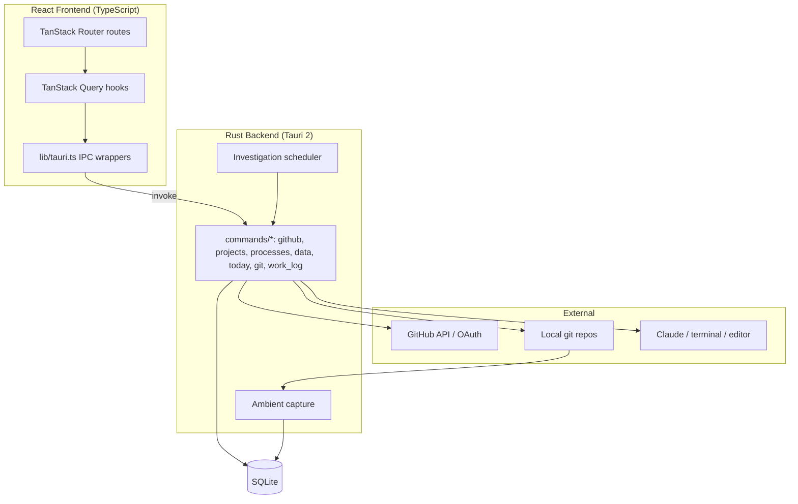

# Architecture Overview

## System Diagram

## Component Descriptions

### Frontend (`src/`)
- **Purpose**: Desktop UI — projects table, project detail, inbox/task board, and the Today workflow page
- **Location**: `src/routes/`, `src/components/`, `src/lib/`
- **Key responsibilities**: File-based routing (TanStack Router), server-state caching and invalidation (TanStack Query), typed IPC calls through `src/lib/tauri.ts`

### Tauri command layer (`src-tauri/src/commands/`)
- **Purpose**: All business logic exposed to the frontend over IPC
- **Location**: `commands/{github,projects,processes,data,today,git,work_log}.rs`
- **Key responsibilities**: GitHub OAuth/sync, project CRUD + clone/link, process spawning (dev server, Claude, terminal), notes/tasks CRUD, Today aggregations, git status/sync

### Ambient capture
- **Purpose**: Turn git history into an activity journal without manual logging
- **Location**: `src-tauri/src/commands/capture.rs` (invoked during `sync_github_repos`)
- **Key responsibilities**: Idempotent commit ingestion into `work_log`; auto-resolve tasks referenced by `[hub-N]` commit messages

### Database (`src-tauri/src/db/`)
- **Purpose**: Local persistence and schema evolution
- **Location**: `db/schema.rs` (`run_migrations` runs on every app start)
- **Key responsibilities**: Tables for projects, notes, tasks, settings, work_log; additive column/table/index migrations

### GitHub client (`src-tauri/src/github/`)
- **Purpose**: OAuth flow and rate-limited API access
- **Location**: `github/oauth.rs`, `github/api.rs`
- **Key responsibilities**: Localhost callback server (port 8765), CSRF state, token storage in `~/.project-hub-token`

## Data Flow

1. App launches → frontend checks auth → triggers `sync_github_repos`
2. Sync fetches repos from GitHub and ingests new commits into `work_log` (ambient capture); `[hub-N]` messages auto-resolve tasks
3. Today-page queries aggregate `work_log` into heatmap, velocity, standup, stuck tasks, and the Stale Work Radar (which also shells out to local `git`)
4. User actions (clone, run dev server, open Claude, resolve task) invoke commands that mutate SQLite and/or spawn processes; Query keys are invalidated to refresh the UI

## External Integrations

| Service | Purpose | Documentation |
|---------|---------|---------------|
| GitHub REST API | Repo + commit sync | https://docs.github.com/rest |
| GitHub OAuth | Authentication | https://docs.github.com/apps/oauth-apps |
| Local `git` CLI | Status, last-commit age, push | https://git-scm.com/docs |
| Claude CLI | Task-focused / batch AI assist | — |

## Key Architectural Decisions

### Local-first SQLite, no server
- **Context**: Single-user personal orchestrator
- **Decision**: All state in a local SQLite DB; OAuth token in a local file
- **Rationale**: Zero infra, offline-capable, fast; no multi-tenant concerns

### Ambient capture over manual logging
- **Context**: Manual activity logging never gets done
- **Decision**: Derive a work log from git history during sync, idempotently
- **Rationale**: Accurate history for free; enables standup/velocity/radar with no extra user effort

### Pure helpers + thin commands
- **Context**: Tauri commands are hard to unit-test directly
- **Decision**: Extract logic into pure functions (e.g. `compute_stale_projects`, `build_task_prompt`) tested in isolation
- **Rationale**: Fast, deterministic tests without spinning up Tauri or a DB where possible

### Idempotent additive migrations on every boot
- **Context**: Schema evolves continuously; no migration tooling
- **Decision**: `run_migrations` checks-then-applies additive changes each start, including stale-index detection
- **Rationale**: Safe re-runs; avoids a migration framework for a single-user app
