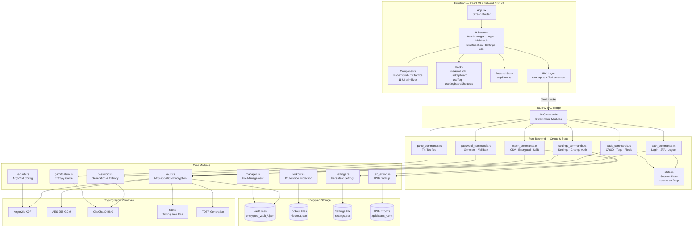
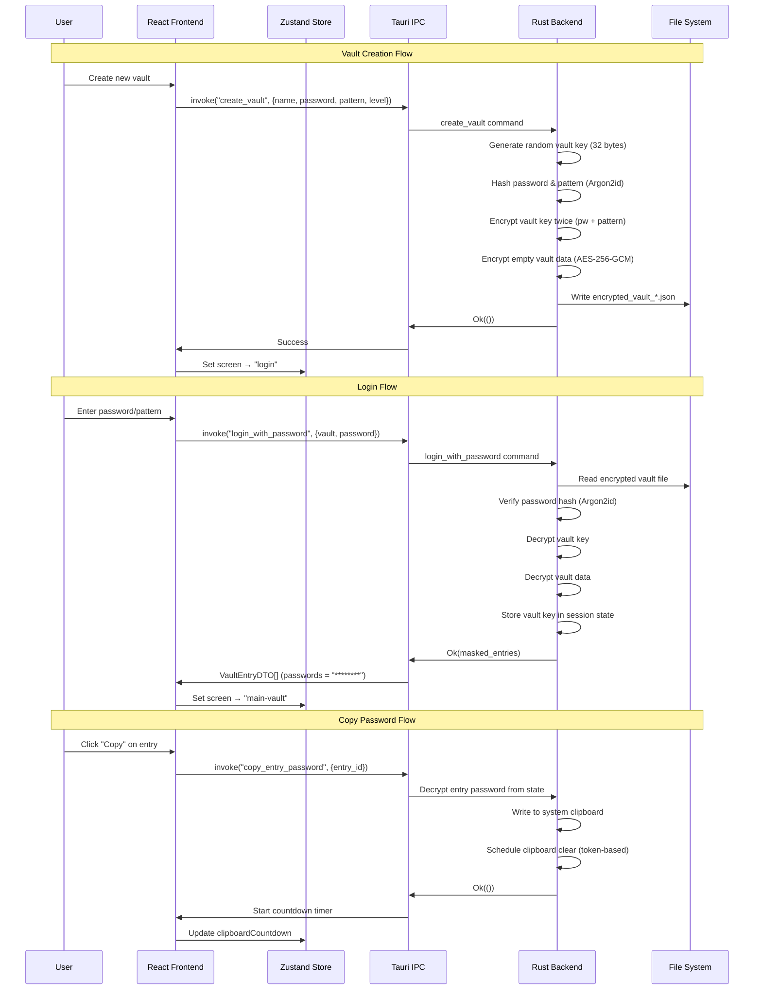

# Architecture Overview

## System Diagram

## Data Flow Diagram

## Component Descriptions

### Frontend Layer

#### App.tsx — Screen Router
- **Purpose**: Zustand-driven conditional rendering based on `screen` state
- **Location**: `src/App.tsx`
- **Routes**: vault-manager → initial-creation → login → main-vault, plus change-password, change-pattern
- **Overlays**: Settings, ExportImport, and UsbExportImport render as modals within MainVault

#### Zustand Store (appStore.ts)
- **Purpose**: Global state management — screen routing, settings, active vault, clipboard countdown
- **Location**: `src/stores/appStore.ts`
- **Key constraint**: Never stores real passwords — only masked DTOs from Rust backend

#### IPC Layer (tauri-api.ts + schemas.ts)
- **Purpose**: Typed wrappers for all 49 Tauri `invoke()` commands with Zod validation
- **Location**: `src/lib/tauri-api.ts`, `src/lib/schemas.ts`
- **Pattern**: `safeInvoke()` wrapper validates every IPC response against Zod schemas before use

### Backend Layer

#### vault.rs — Encryption Engine
- **Purpose**: AES-256-GCM encryption/decryption, dual-key architecture, TOTP handling
- **Location**: `src-tauri/src/vault.rs` (~1,750 lines)
- **Key detail**: `write_encrypted_vault_file` takes `&mut EncryptedVaultFile` for encryption counter tracking

#### state.rs — Session State
- **Purpose**: Holds decrypted vault key and entries in memory during an active session
- **Location**: `src-tauri/src/state.rs`
- **Key detail**: Implements `Drop` with `zeroize` to clear all sensitive data from memory

#### commands/ — IPC Command Layer
- **Purpose**: 49 Tauri commands across 6 modules bridging frontend requests to core logic
- **Location**: `src-tauri/src/commands/`
- **Modules**: auth (login/logout/2FA), vault (CRUD/tags/fields), password (generation), settings, export, game

## Key Architectural Decisions

### Tauri v2 over Electron
- **Context**: Needed a cross-platform desktop framework with strong security properties
- **Decision**: Chose Tauri v2 with Rust backend over Electron
- **Rationale**: Rust backend ensures all cryptographic operations happen in memory-safe native code. No Node.js runtime in production — smaller binary, lower attack surface. IPC boundary enforces clean separation between UI and crypto.

### Dual Authentication System
- **Context**: Users have different preferences for authentication UX
- **Decision**: Implemented both master password and 6x6 visual pattern unlock
- **Rationale**: The vault key is encrypted separately under both credentials. Either can unlock the vault independently. Changing one credential only requires re-encrypting the vault key, not all data.

### Frontend Isolation (Masked DTOs)
- **Context**: Web-based frontends are inherently less trusted than native code
- **Decision**: Frontend never receives real passwords — only masked DTOs with `"********"`
- **Rationale**: Even if the webview is compromised (XSS, devtools), passwords remain protected. Real values are only exposed on explicit clipboard copy via IPC, then auto-cleared.

### Zod Validation at IPC Boundary
- **Context**: Tauri `invoke()` returns untyped data that could be tampered with
- **Decision**: Every IPC response is validated against Zod schemas before use
- **Rationale**: Catches shape mismatches, unexpected null values, or malformed data at the boundary. Provides runtime type safety complementing TypeScript's compile-time checks.

### Atomic File Writes
- **Context**: A crash during save could corrupt vault files permanently
- **Decision**: All vault saves use write-to-temp-then-rename pattern
- **Rationale**: The vault file is always in a valid state — either old or new, never partial. Critical for a password manager where data loss is catastrophic.

### Token-Based Clipboard Clear
- **Context**: Need to auto-clear passwords from clipboard after a timeout
- **Decision**: Uses a unique token per copy operation rather than content comparison
- **Rationale**: Avoids reading clipboard contents (which could expose data to other apps). Each copy generates a token; when the timer fires, it clears the clipboard only if the token is still current.

## Security Model Summary

| Layer | Protection | Implementation |
|-------|-----------|----------------|
| Key Derivation | Memory-hard hashing | Argon2id (19-64 MiB) |
| Data Encryption | Authenticated encryption | AES-256-GCM |
| Memory Safety | Secure memory clearing | zeroize crate on Drop |
| Timing Safety | Constant-time comparison | subtle crate |
| Frontend Isolation | Masked DTOs only | Passwords never in React state |
| IPC Validation | Schema enforcement | Zod validation on all responses |
| Brute-force | Progressive lockouts | Exponential backoff + vault deletion |
| Path Safety | Input sanitization | Strict vault name validation |
| Content Security | Block external resources | CSP in index.html |
| Clipboard | Auto-clear after timeout | Token-based clear approach |
| IPC Rate Limiting | Password exfiltration prevention | 5 reveals / 10-second sliding window |
| Input Validation | Resource exhaustion prevention | Length bounds on all string/numeric IPC inputs |
| USB Fail-Secure | Path traversal prevention | Canonicalization with fail-secure fallback |

## Security Audit History

### Round 1: Security Hardening (20 issues, 2026-02-09)
Full security hardening pass covering CSP, devtools, timing-safe comparisons, memory zeroization, and Tauri capabilities.

### Round 2: IPC Boundary Audit (7 issues, 2026-02-11)
Focused audit of all 49 IPC commands. Key fixes: rate limiting on password clipboard copy, USB auth gates, clipboard timeout clamping, pattern length validation, string input length bounds, fail-secure USB canonicalization. Added 48 tests.

### Round 3: Deep Security Audit (21 findings, 2026-02-11)
4-parallel-agent comprehensive audit covering crypto, IPC, memory safety, and frontend/Tauri config. Findings: 3 critical (derived key zeroization gaps), 5 high (lockout bypass, auto-lock enforcement, VaultEntry clones), 8 medium, 5 low. Core crypto primitives and frontend isolation rated excellent.

## Limitations

1. **No Browser Integration**: QuickPass is standalone — users must manually copy passwords
2. **No Cloud Sync**: Each device maintains its own vaults (USB export provides manual transfer)
3. **Platform Signing**: macOS/Windows binaries are unsigned, requiring manual trust approval
4. **Single-User Design**: No multi-user or sharing features
5. **No Frontend Tests**: Test coverage is backend-only (167 Rust tests)
