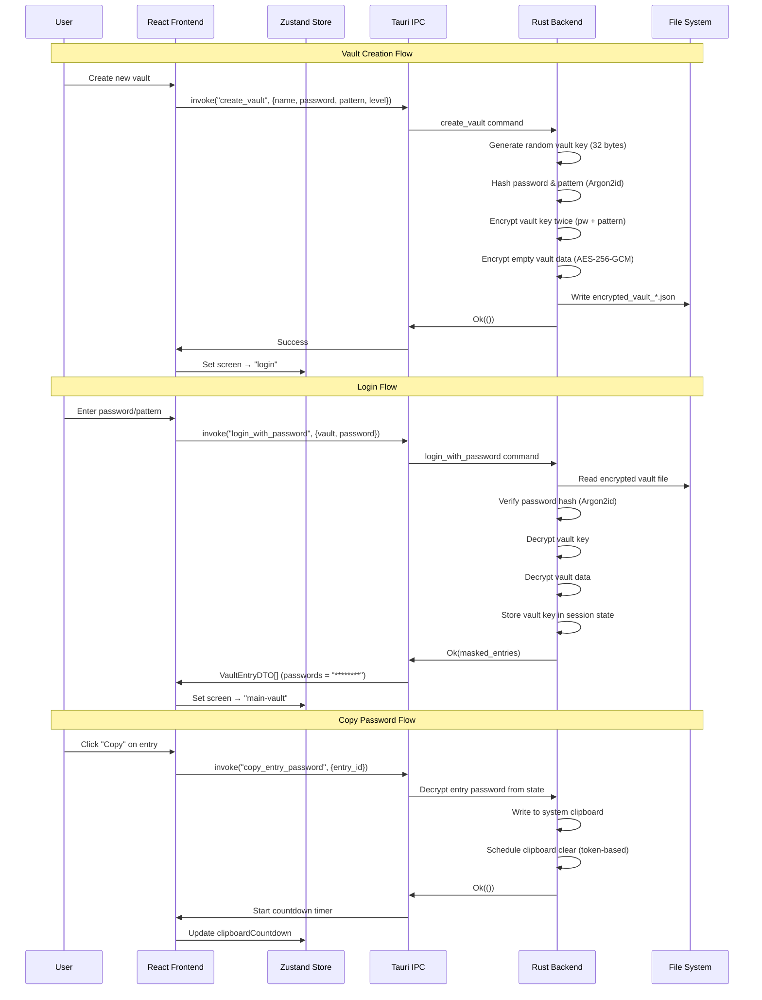

# Architecture Overview

## System Diagram

```mermaid
flowchart TB
    subgraph FRONTEND["Frontend — React 19 + Tailwind CSS v4"]
        direction TB
        APP[App.tsx<br/>Screen Router]
        SCREENS[9 Screens<br/>VaultManager · Login · MainVault<br/>InitialCreation · Settings · etc.]
        COMPONENTS[Components<br/>PatternGrid · TicTacToe<br/>11 UI primitives]
        HOOKS[Hooks<br/>useAutoLock · useClipboard<br/>useTotp · useKeyboardShortcuts]
        STORE[Zustand Store<br/>appStore.ts]
        API[IPC Layer<br/>tauri-api.ts + Zod schemas]
    end

    subgraph TAURI["Tauri v2 IPC Bridge"]
        IPC[55 Commands<br/>6 Command Modules]
    end

    subgraph BACKEND["Rust Backend — Crypto & State"]
        STATE[state.rs<br/>Session State<br/>zeroize on Drop]
        CMD_AUTH[auth_commands.rs<br/>Login · 2FA · Logout]
        CMD_VAULT[vault_commands.rs<br/>CRUD · Tags · Fields]
        CMD_PW[password_commands.rs<br/>Generate · Validate]
        CMD_SET[settings_commands.rs<br/>Settings · Change Auth]
        CMD_EXP[export_commands.rs<br/>CSV · Encrypted · USB]
        CMD_GAME[game_commands.rs<br/>Tic-Tac-Toe]
    end

    subgraph CORE["Core Modules"]
        V[vault.rs<br/>AES-256-GCM Encryption]
        S[security.rs<br/>Argon2id Config]
        P[password.rs<br/>Generation & Entropy]
        M[manager.rs<br/>File Management]
        L[lockout.rs<br/>Brute-force Protection]
        SET[settings.rs<br/>Persistent Settings]
        G[gamification.rs<br/>Entropy Game]
        U[usb_export.rs<br/>USB Backup]
        CRED[credential.rs<br/>Zeroize-on-Drop IPC wrapper]
        CLIP[clipboard.rs<br/>Centralized clipboard lifecycle]
        AUD[audit.rs<br/>Tamper-evident HMAC log]
        TR[tray.rs<br/>System tray menu]
    end

    subgraph CRYPTO["Cryptographic Primitives"]
        A2[Argon2id KDF]
        AES[AES-256-GCM]
        RNG[ChaCha20 RNG]
        SUB[subtle<br/>Timing-safe Ops]
        TOTP[TOTP Generation]
    end

    subgraph STORAGE["Encrypted Storage"]
        VF[(Vault Files<br/>encrypted_vault_*.json)]
        LF[(Lockout Files<br/>*.lockout.json)]
        SF[(Settings File<br/>settings.json)]
        USB_F[(USB Exports<br/>.quickpass_*.enc)]
    end

    APP --> SCREENS
    SCREENS --> COMPONENTS
    SCREENS --> HOOKS
    SCREENS --> STORE
    SCREENS --> API

    API -->|Tauri invoke| IPC

    IPC --> CMD_AUTH
    IPC --> CMD_VAULT
    IPC --> CMD_PW
    IPC --> CMD_SET
    IPC --> CMD_EXP
    IPC --> CMD_GAME

    CMD_AUTH --> STATE
    CMD_VAULT --> STATE
    CMD_AUTH --> V
    CMD_VAULT --> V
    CMD_PW --> P
    CMD_SET --> SET
    CMD_SET --> V
    CMD_EXP --> V
    CMD_EXP --> U
    CMD_GAME --> G

    V --> AES
    V --> A2
    V --> TOTP
    S --> A2
    P --> RNG
    G --> RNG
    V --> SUB

    V --> VF
    L --> LF
    SET --> SF
    U --> USB_F
    M --> VF
```

## Data Flow Diagram

```mermaid
sequenceDiagram
    participant U as User
    participant FE as React Frontend
    participant ZS as Zustand Store
    participant IPC as Tauri IPC
    participant RS as Rust Backend
    participant FS as File System

    Note over U,FS: Vault Creation Flow
    U->>FE: Create new vault
    FE->>IPC: invoke("create_vault", {name, password, pattern, level})
    IPC->>RS: create_vault command
    RS->>RS: Generate random vault key (32 bytes)
    RS->>RS: Hash password & pattern (Argon2id)
    RS->>RS: Encrypt vault key twice (pw + pattern)
    RS->>RS: Encrypt empty vault data (AES-256-GCM)
    RS->>FS: Write encrypted_vault_*.json
    RS->>IPC: Ok(())
    IPC->>FE: Success
    FE->>ZS: Set screen → "login"

    Note over U,FS: Login Flow
    U->>FE: Enter password/pattern
    FE->>IPC: invoke("login_with_password", {vault, password})
    IPC->>RS: login_with_password command
    RS->>FS: Read encrypted vault file
    RS->>RS: Verify password hash (Argon2id)
    RS->>RS: Decrypt vault key
    RS->>RS: Decrypt vault data
    RS->>RS: Store vault key in session state
    RS->>IPC: Ok(masked_entries)
    IPC->>FE: VaultEntryDTO[] (passwords = "********")
    FE->>ZS: Set screen → "main-vault"

    Note over U,FS: Copy Password Flow
    U->>FE: Click "Copy" on entry
    FE->>IPC: invoke("copy_entry_password", {entry_id})
    IPC->>RS: Decrypt entry password from state
    RS->>RS: Write to system clipboard
    RS->>RS: Schedule clipboard clear (token-based)
    RS->>IPC: Ok(())
    IPC->>FE: Start countdown timer
    FE->>ZS: Update clipboardCountdown
```

## Component Descriptions

### Frontend Layer

#### App.tsx — Screen Router
- **Purpose**: Zustand-driven conditional rendering based on `screen` state
- **Location**: `src/App.tsx`
- **Routes**: vault-manager → initial-creation → login → main-vault, plus change-password, change-pattern
- **Overlays**: Settings, ExportImport, and UsbExportImport render as modals within MainVault

#### Zustand Store (appStore.ts)
- **Purpose**: Global state management — screen routing, settings, active vault, clipboard countdown
- **Location**: `src/stores/appStore.ts`
- **Key constraint**: Never stores real passwords — only masked DTOs from Rust backend

#### IPC Layer (tauri-api.ts + schemas.ts)
- **Purpose**: Typed wrappers for all 55 Tauri `invoke()` commands with Zod validation
- **Location**: `src/lib/tauri-api.ts`, `src/lib/schemas.ts`
- **Pattern**: `safeInvoke()` wrapper validates every IPC response against Zod schemas before use

### Backend Layer

#### vault.rs — Encryption Engine
- **Purpose**: AES-256-GCM encryption/decryption, dual-key architecture, TOTP handling
- **Location**: `src-tauri/src/vault.rs` (~1,750 lines)
- **Key detail**: `write_encrypted_vault_file` takes `&mut EncryptedVaultFile` for encryption counter tracking

#### state.rs — Session State
- **Purpose**: Holds decrypted vault key and entries in memory during an active session
- **Location**: `src-tauri/src/state.rs`
- **Key detail**: Implements `Drop` with `zeroize` to clear all sensitive data from memory

#### commands/ — IPC Command Layer
- **Purpose**: 55 Tauri commands across 6 modules bridging frontend requests to core logic
- **Location**: `src-tauri/src/commands/`
- **Modules**: auth (login/logout/2FA/Touch ID), vault (CRUD/tags/fields), password (generation/validation), settings, export, game

#### credential.rs — Zeroize-on-Drop IPC Wrapper
- **Purpose**: Type-safe wrapper for credential parameters crossing the IPC boundary
- **Location**: `src-tauri/src/credential.rs`
- **Key detail**: `#[serde(transparent)]` makes the JSON wire format identical to `String`, but the wrapper's `Drop` impl zeroizes the inner buffer on every exit path — including panics and early returns. No `Clone`, no `into_inner` — once a `Credential` is constructed, the bytes cannot escape the wiped lifecycle.

#### clipboard.rs — Centralized Auto-Clear Lifecycle
- **Purpose**: Single owner of the clipboard-write-then-clear flow used by every sensitive-write site (password copy, custom field copy, history copy, generated-password copy, tray menu)
- **Location**: `src-tauri/src/clipboard.rs`
- **Pattern**: `write_with_auto_clear(app, text, secs)` writes the text, records a per-write token in session state, and spawns the clear task. `force_clear(app)` invalidates any pending token and wipes immediately — used by the window close handler so sensitive contents don't linger while the app is hidden in the tray.

#### audit.rs — Tamper-Evident Audit Log
- **Purpose**: Append-only event log with HMAC chain integrity for forensic visibility into login attempts, vault deletions, credential rotations, exports, and Touch ID lockouts
- **Location**: `src-tauri/src/audit.rs`
- **Key detail**: Last-hash and HMAC-key caches make event writes O(1) instead of O(n) file scans. Holding the cache mutex during the read-modify-write also serializes concurrent writers, so chain integrity is preserved under contention.

## Key Architectural Decisions

### Tauri v2 over Electron
- **Context**: Needed a cross-platform desktop framework with strong security properties
- **Decision**: Chose Tauri v2 with Rust backend over Electron
- **Rationale**: Rust backend ensures all cryptographic operations happen in memory-safe native code. No Node.js runtime in production — smaller binary, lower attack surface. IPC boundary enforces clean separation between UI and crypto.

### Dual Authentication System
- **Context**: Users have different preferences for authentication UX
- **Decision**: Implemented both master password and 6x6 visual pattern unlock
- **Rationale**: The vault key is encrypted separately under both credentials. Either can unlock the vault independently. Changing one credential only requires re-encrypting the vault key, not all data.

### Frontend Isolation (Masked DTOs)
- **Context**: Web-based frontends are inherently less trusted than native code
- **Decision**: Frontend never receives real passwords — only masked DTOs with `"********"`
- **Rationale**: Even if the webview is compromised (XSS, devtools), passwords remain protected. Real values are only exposed on explicit clipboard copy via IPC, then auto-cleared.

### Zod Validation at IPC Boundary
- **Context**: Tauri `invoke()` returns untyped data that could be tampered with
- **Decision**: Every IPC response is validated against Zod schemas before use
- **Rationale**: Catches shape mismatches, unexpected null values, or malformed data at the boundary. Provides runtime type safety complementing TypeScript's compile-time checks.

### Atomic File Writes
- **Context**: A crash during save could corrupt vault files permanently
- **Decision**: All vault saves use write-to-temp-then-rename pattern
- **Rationale**: The vault file is always in a valid state — either old or new, never partial. Critical for a password manager where data loss is catastrophic.

### Token-Based Clipboard Clear
- **Context**: Need to auto-clear passwords from clipboard after a timeout
- **Decision**: Uses a unique token per copy operation rather than content comparison
- **Rationale**: Avoids reading clipboard contents (which could expose data to other apps). Each copy generates a token; when the timer fires, it clears the clipboard only if the token is still current.

### Typed Credential Wrapper at the IPC Boundary
- **Context**: Plain `mut password: String` plus a manual `.zeroize()` before return only protects the happy path — early returns, panics, or `?`-propagated errors skip the wipe and leak the credential to the heap.
- **Decision**: All IPC commands that accept a credential (master password, pattern, vault key blob) take a `Credential` wrapper type whose `Drop` impl zeroizes the inner `String` regardless of how the function exits.
- **Rationale**: Moves the lifetime guarantee from "everyone remembers to wipe before every return" to a compile-time invariant. The wrapper deliberately doesn't implement `Clone` or expose `into_inner` — the only way to read the bytes is through a read-only `Deref<Target=str>`, so the data physically cannot escape the wiped owner.

### Asymmetric Lockout Budgets with Knowledge Supremacy
- **Context**: A single shared lockout budget across password, pattern, Touch ID, and TOTP creates a budget-swap attack — exhaust the cheap path, fall back to the expensive one with a fresh budget.
- **Decision**: Each authentication path has its own counter. Knowledge proofs (password, pattern) reset *all* lockouts on success; possession proofs (Touch ID) reset only their own.
- **Rationale**: Touch ID lockout disables only the Touch ID path — the vault remains usable via password/pattern, but a stale-keychain attacker can't fall back to fresh password attempts. Password lockout still blocks Touch ID (the strong direction was already protected). This gives directional protection in both directions without sharing budget pools.

## Security Model Summary

| Layer | Protection | Implementation |
|-------|-----------|----------------|
| Key Derivation | Memory-hard hashing | Argon2id (19-64 MiB) |
| Data Encryption | Authenticated encryption | AES-256-GCM |
| Memory Safety | Secure memory clearing | zeroize crate on Drop |
| Timing Safety | Constant-time comparison | subtle crate |
| Frontend Isolation | Masked DTOs only | Passwords never in React state |
| IPC Validation | Schema enforcement | Zod validation on all responses |
| Brute-force | Progressive lockouts | Exponential backoff + vault deletion |
| Path Safety | Input sanitization | Strict vault name validation |
| Content Security | Block external resources | CSP in index.html |
| Clipboard | Auto-clear after timeout | Token-based clear approach |
| IPC Rate Limiting | Password exfiltration prevention | 5 reveals / 10-second sliding window |
| Input Validation | Resource exhaustion prevention | Length bounds on all string/numeric IPC inputs |
| USB Fail-Secure | Path traversal prevention | Canonicalization with fail-secure fallback |

## Defense-in-Depth Layers

The security posture is built from independent layers, each of which has to fail before user data is exposed:

| Layer | What it stops |
|-------|----------------|
| OS-level data directory + atomic writes | Partial-write corruption and unauthorized peer-process reads of vault files |
| Argon2id (19–64 MiB, memory-hard) | Offline GPU/ASIC brute-force of master password or pattern |
| Dual-key envelope encryption of the vault key | Cross-credential leakage — knowing the password tells you nothing about the pattern-encrypted copy |
| AES-256-GCM authenticated encryption | Ciphertext tampering and confidentiality breaches |
| `Credential` wrapper + `zeroize` on `Drop` | Recoverable plaintext in process memory after lock, error, or panic |
| `subtle` constant-time comparisons | Timing side channels on hash and TOTP verification |
| Strict CSP + capability-restricted webview | Webview-side resource loading or unauthorized command invocation |
| Masked DTOs across the IPC layer | Bulk password exfiltration from a compromised frontend |
| Per-command rate limiting and length bounds | Resource exhaustion and brute-force reveal of stored passwords |
| Progressive lockouts with eventual vault deletion | Online brute force against a live vault file |
| Asymmetric lockout budgets (password / pattern / Touch ID / TOTP) | Budget-swap attacks where exhausting one path grants fresh attempts on another |
| Tamper-evident HMAC-chained audit log | Silent tampering with the forensic record of credential rotations, exports, and lockouts |
| `cargo-auditable` dep manifest embedded in release binaries | Inability to match a shipped artifact against later RUSTSEC advisories without source access |

## Limitations

1. **No Browser Integration**: QuickPass is standalone — users must manually copy passwords
2. **No Cloud Sync**: Each device maintains its own vaults (USB export provides manual transfer)
3. **Single-User Design**: No multi-user or sharing features
4. **No Frontend Tests**: Test coverage is backend-only (220+ Rust tests across unit, command, and integration layers)
