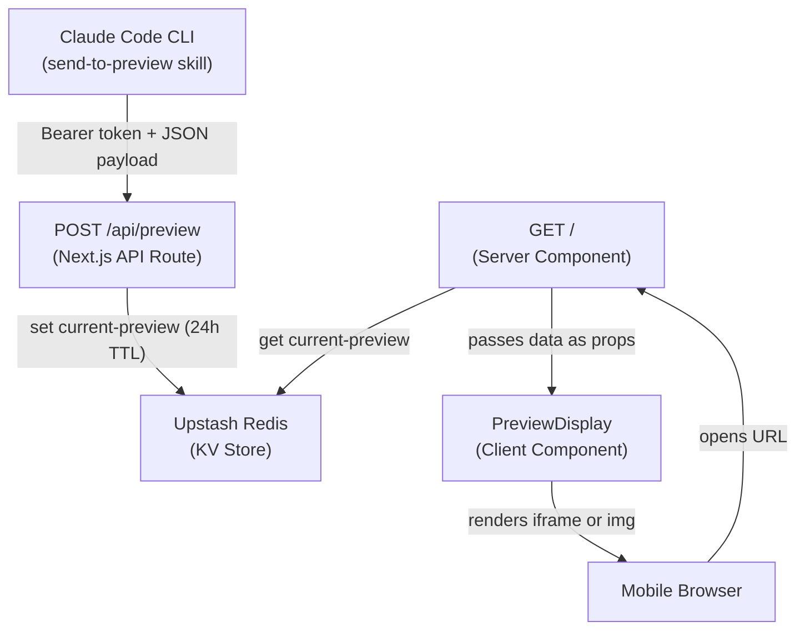

# Architecture

## System Overview

## Components

### API Route (`src/app/api/preview/route.ts`)
- **POST /api/preview** — Receives content from the CLI
- Bearer token authentication against `PREVIEW_API_KEY`
- 5MB payload size limit (checked via `content-length` header)
- Validates `type` (html/image/markdown) and `content` fields at runtime
- Converts Markdown to styled HTML via `marked` before storage
- Stores to Redis with 24-hour TTL

### Server Component (`src/app/page.tsx`)
- Reads the latest preview from Redis on every request (`force-dynamic`)
- Passes data to client component as props
- Handles Redis connection failures gracefully

### Client Component (`src/components/PreviewDisplay.tsx`)
- Renders HTML content in a sandboxed iframe (`allow-scripts` only)
- Renders images as base64-encoded `` tags
- Collapsible header with filename and relative timestamp
- Empty state when no preview exists

### Redis Layer (`src/lib/redis.ts`)
- Upstash Redis singleton using `KV_REST_API_URL` and `KV_REST_API_TOKEN`
- Single key (`current-preview`) — latest always wins

### Claude Skill (`skill/SKILL.md`)
- Constructs JSON payloads with `jq -n` for safe escaping
- Handles images (base64 encoding), HTML, and Markdown files
- Reads env vars from `~/.zshrc`

## Data Flow

1. User says "send to preview" in Claude Code
2. Skill reads file, base64-encodes images, POSTs JSON to `/api/preview`
3. API validates auth + payload, stores in Redis with 24h TTL
4. User opens `happy-preview.vercel.app` on phone
5. Server component reads from Redis, renders via client component

## Key Decisions

| Decision | Choice | Rationale |
|----------|--------|-----------|
| Storage | Upstash Redis | Free tier, native Vercel integration, TTL support |
| Auth | Bearer token | Simple, sufficient for single-user CLI tool |
| Image storage | Base64 in Redis | No file storage needed, simpler than blob storage |
| Preview model | Single key, latest wins | One preview at a time keeps it simple |
| iframe sandbox | `allow-scripts` only | No `allow-same-origin` prevents XSS on parent |
| Payload limit | 5MB | Covers most images; base64 adds ~33% overhead |
| Markdown rendering | Server-side conversion via `marked` | Keeps client unchanged; viewer already handles HTML |
