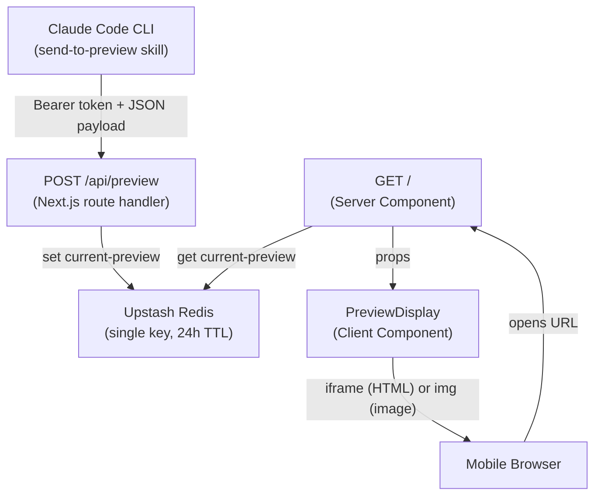

# Architecture

## System Diagram

```mermaid
flowchart TD
    CLI["Claude Code CLI<br/>(send-to-preview skill)"]
    API["POST /api/preview<br/>(Next.js route handler)"]
    Redis["Upstash Redis<br/>(single key, 24h TTL)"]
    Page["GET /<br/>(Server Component)"]
    Display["PreviewDisplay<br/>(Client Component)"]
    Phone["Mobile Browser"]

    CLI -->|"Bearer token + JSON payload"| API
    API -->|"set current-preview"| Redis
    Phone -->|"opens URL"| Page
    Page -->|"get current-preview"| Redis
    Page -->|"props"| Display
    Display -->|"iframe (HTML) or img (image)"| Phone
```

## Component Descriptions

### API Route
- **Purpose**: Accept HTML, image, or Markdown payloads from the CLI and stash the latest into Redis
- **Location**: `src/app/api/preview/route.ts`
- **Key responsibilities**: Bearer token auth, 5MB payload guard via `content-length`, runtime type validation, Markdown → sanitized HTML conversion, Redis write with TTL

### Server Component (root page)
- **Purpose**: Read the latest preview and hand it to the client renderer
- **Location**: `src/app/page.tsx`
- **Key responsibilities**: `force-dynamic` so every request hits Redis, swallow Redis errors and fall through to the empty state

### Preview Display
- **Purpose**: Render the stored preview on the phone
- **Location**: `src/components/PreviewDisplay.tsx`
- **Key responsibilities**: Sandboxed iframe (`allow-scripts` only) for HTML, `` with `data:` URL for images, collapsible header with filename and relative timestamp

### Markdown Converter
- **Purpose**: Turn Markdown payloads into self-contained styled HTML before storage
- **Location**: `src/lib/markdown.ts`
- **Key responsibilities**: `marked` for parsing, `sanitize-html` for safety, inline CSS for the dark theme so the iframe needs no external stylesheet

### Redis Layer
- **Purpose**: Single-key KV access with no abstraction
- **Location**: `src/lib/redis.ts`
- **Key responsibilities**: Construct the `@upstash/redis` client from `KV_REST_API_URL`/`TOKEN` env vars; export the shared client and the `current-preview` key constant

### CLI Skill
- **Purpose**: One-command "send to preview" from a developer terminal
- **Location**: `skill/SKILL.md`
- **Key responsibilities**: Detect file type (image / HTML / Markdown), base64-encode images, build the JSON payload with `jq -n` for safe escaping, POST with the bearer token

## Data Flow

1. Developer triggers "send to preview" in their terminal; the skill resolves the file and content type.
2. Skill base64-encodes images (or passes HTML/Markdown straight through), builds a JSON body with `jq -n`, and POSTs to `/api/preview` with the bearer token.
3. API validates auth + payload size + field types. For Markdown payloads, it converts to sanitized HTML server-side.
4. API writes the result to Redis under `current-preview` with a 24-hour TTL.
5. Developer opens the deployment URL on their phone; the server component reads `current-preview` from Redis on every request.
6. `PreviewDisplay` renders the content — HTML in a sandboxed iframe, images as a centered ``, or an empty state if Redis returned `null`.

## External Integrations

| Service | Purpose | Notes |
|---------|---------|-------|
| Upstash Redis | Single-key KV with native TTL | Provisioned through Vercel KV; `@upstash/redis` REST client is HTTP-only (no persistent socket needed in serverless) |
| Vercel | Hosting + serverless runtime | Hobby tier; CI is just `git push` |

## Key Architectural Decisions

### Single-key "latest wins" instead of multi-preview history
- **Context**: The workflow is "I generated something, let me check it on my phone before pushing." History isn't useful — I never want yesterday's preview.
- **Decision**: One Redis key (`current-preview`) with a 24-hour TTL.
- **Rationale**: No IDs, no gallery, no expiration logic in app code — Redis handles cleanup. The simplest schema that solves the actual problem.

### Server-side Markdown conversion
- **Context**: Markdown could be rendered on the client (extra deps, larger bundle) or on the server (extra CPU on the POST path).
- **Decision**: Convert in the API route with `marked` + `sanitize-html` and store HTML, not Markdown.
- **Rationale**: The viewer already knows how to render HTML in a sandboxed iframe, so Markdown becomes free once it's converted. Keeps the client component a single render path.

### Bearer token over OAuth/session auth
- **Context**: One developer, one CLI. Anything more than "is the key right?" is overkill.
- **Decision**: Compare `Authorization: Bearer ${PREVIEW_API_KEY}` literally.
- **Rationale**: Two lines of code, no session storage, no rotation surface. The bearer key lives in `~/.zshrc` next to the URL.

### iframe sandbox without `allow-same-origin`
- **Context**: Previews include untrusted HTML — anything a developer might paste in.
- **Decision**: `sandbox="allow-scripts"` only; explicitly no `allow-same-origin`.
- **Rationale**: Scripts run for interactive previews, but the iframe can't reach the parent page's storage, cookies, or DOM. Combined with a hard payload cap (5MB via `content-length`) this keeps the surface area tight.

### Base64 in Redis instead of blob storage
- **Context**: Images need to round-trip without a separate file store.
- **Decision**: Base64-encode in the CLI, send as a string field, store the string in Redis.
- **Rationale**: No signed URLs, no blob lifecycle, no second service to authorize against. The 5MB ceiling (≈3.7MB raw image) covers screenshots and OG image previews — the actual use cases.

### `force-dynamic` server component over an API + client fetch
- **Context**: The phone needs the latest preview every time it opens the URL.
- **Decision**: Server component with `export const dynamic = "force-dynamic"` reads Redis directly.
- **Rationale**: No client-side loading state, no API round-trip after the page loads, no auth needed for the read path (the URL is unguessable enough for personal use). One Redis lookup per request and the page is already painted.
