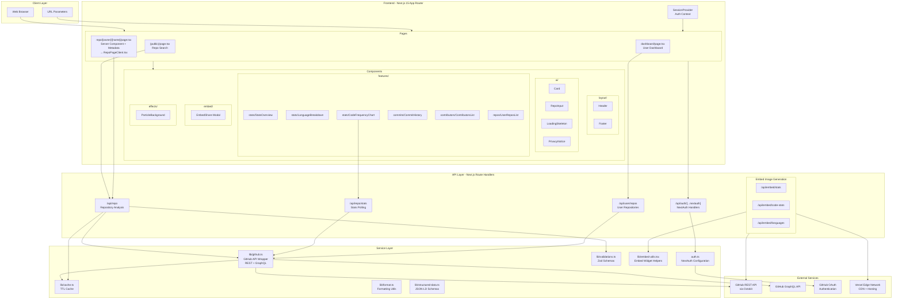
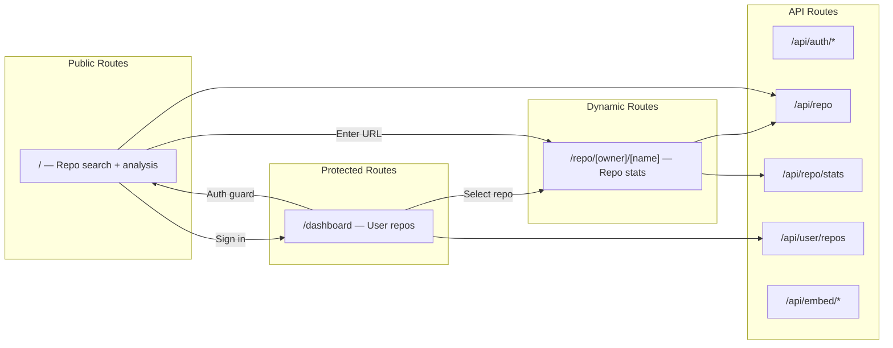
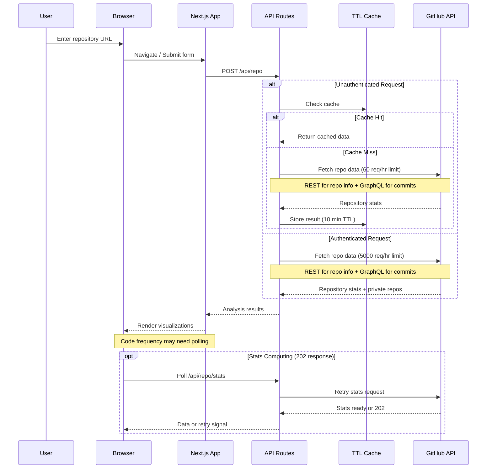

# Architecture Overview

## System Architecture Diagram



## Routing Architecture



## Data Flow Diagram



## Component Architecture

```
components/
├── index.ts                    # Barrel exports for clean imports
├── layout/                     # Page structure components
│   ├── Header.tsx              # Navigation, auth state, branding
│   └── Footer.tsx              # Attribution and tech stack info
├── ui/                         # Reusable atomic UI components
│   ├── Card.tsx                # Card system (default/glass/stat variants)
│   ├── LoadingSkeleton.tsx     # Loading states, spinners, skeletons
│   ├── RepoInput.tsx           # Repository URL input form
│   └── PrivacyNotice.tsx       # Privacy disclosure banner
├── features/                   # Domain-specific feature components
│   ├── stats/
│   │   ├── StatsOverview.tsx       # Stars, forks, watchers grid
│   │   ├── LanguageBreakdown.tsx   # Color-coded language bar
│   │   └── CodeFrequencyChart.tsx  # Additions/deletions area chart
│   ├── commits/
│   │   └── CommitHistory.tsx       # Commit log with details
│   ├── contributors/
│   │   └── ContributorsList.tsx    # Top contributors grid
│   └── repos/
│       └── UserReposList.tsx       # User's repo dashboard
├── embed/
│   └── EmbedShare.tsx          # Widget embed code generator modal
└── effects/
    └── ParticleBackground.tsx  # Animated background particles
```

## Key Architectural Decisions

### 1. Next.js 15 App Router with Route Groups

I chose Next.js 15's App Router because it provides the best developer experience for a React application that needs both client-side interactivity and server-side data fetching. The refactored routing uses:

- **Route groups** `(public)` for unauthenticated pages without affecting URLs
- **Server-side layout guards** in `/dashboard/layout.tsx` for protected routes
- **Dynamic segments** `/repo/[owner]/[name]` for deep-linkable repo analyses
- Turbopack for faster development builds

### 2. Feature-Sliced Component Architecture

Components are organized by domain rather than flat in a single directory:

- **layout/** — structural components that appear on every page
- **ui/** — generic, reusable atomic components (Card, LoadingSkeleton)
- **features/** — domain-specific components grouped by feature area
- **embed/** and **effects/** — specialized concerns
- A barrel export (`index.ts`) enables clean imports from `@/components`

### 3. GraphQL + REST Hybrid API Strategy

The GitHub integration now uses both REST and GraphQL APIs:

- **GraphQL** fetches commit history in a single call (replacing 51+ REST calls)
- **REST** handles repo info, languages, contributors, and code frequency
- **Fallback chain**: GraphQL → REST → calculated approximation for code frequency
- This hybrid approach dramatically reduces API rate limit consumption

### 4. Edge Runtime for Embed Image Generation

The embed routes (`/api/embed/*`) use the Edge runtime with `next/og` (Satori) for SVG-to-image generation. I made this choice because:

- Edge functions have lower cold start times than serverless functions
- Image generation needs to be fast for README embeds
- CDN caching at the edge reduces API calls significantly
- The 1-hour cache (`s-maxage=3600`) balances freshness with performance

### 5. Typed In-Memory Caching with TTL

The caching layer was extracted into a dedicated generic `Cache<T>` class in `lib/cache.ts`:

- Type-safe with generics — `repoCache` and `statsCache` are pre-configured instances
- Configurable TTL (10 min for repos, 10 min for stats) and max size (100/50 entries)
- Automatic cleanup of expired entries
- Only used for unauthenticated requests to respect GitHub's 60 req/hr limit

### 6. Zod Validation at API Boundaries

All API route inputs are validated with Zod schemas in `lib/validations.ts`:

- `RepoRequestSchema` handles multiple GitHub URL formats (`owner/repo`, full URLs, etc.)
- `StatsRequestSchema` validates stats polling requests
- Clear, user-friendly error messages via `formatZodError()`
- Validation at the boundary only — internal code trusts validated data

### 7. Client-Side Authentication State with NextAuth v5

I use NextAuth v5 (Auth.js) with the GitHub provider for authentication. The access token is stored in the JWT and passed to the client session. Key reasons:

- No database required — tokens exist only in signed JWTs
- Privacy-first approach — no credentials stored server-side
- The `repo` scope allows access to private repositories
- Session data is available on both client and server via `SessionProvider`

### 8. Parallel Data Fetching

In `lib/github.ts`, I fetch repository data, languages, commits, code frequency, and contributors in parallel using `Promise.all()`. This significantly reduces total request time compared to sequential fetching, though it increases API usage per request.

### 9. Progressive Enhancement for Statistics

GitHub's statistics API returns 202 when stats are still being computed. Rather than blocking the UI, I:

- Return empty data immediately and render placeholders
- Poll with exponential backoff (3s, 6s, 12s, 24s, 48s) on the client
- Use a fallback endpoint for contributors if stats aren't ready
- Show clear loading states with helpful messaging

### 10. URL-Based State Management

Repository selection is reflected in the URL via dynamic routes (`/repo/[owner]/[name]`) and query params (`?repo=owner/repo`). This enables:

- Shareable links to specific repository analyses
- Browser history navigation
- Bookmarkable results
- SEO benefits for public repository pages

### 11. SEO Infrastructure

I added a comprehensive SEO layer to improve discoverability:

- **Static OG/favicon images** — replaced dynamic edge-generated `ImageResponse` icons with pre-rendered PNGs in `public/`, eliminating unnecessary edge compute for images that never change
- **`robots.ts`** — allows `/`, disallows `/api/` and `/dashboard`, references sitemap
- **`sitemap.ts`** — includes only the homepage (dynamic repo pages are infinite and discovered organically)
- **JSON-LD structured data** — `WebApplication` schema on every page via root layout, `WebPage` schema on individual repo pages via `lib/structured-data.ts`
- **Per-page metadata** — the repo page uses a server/client split so the server component can export `generateMetadata()` with dynamic title, description, and OG tags for each `owner/name` combination
- **Dashboard noindex** — the protected dashboard has `robots: { index: false, follow: false }` to prevent accidental crawling
