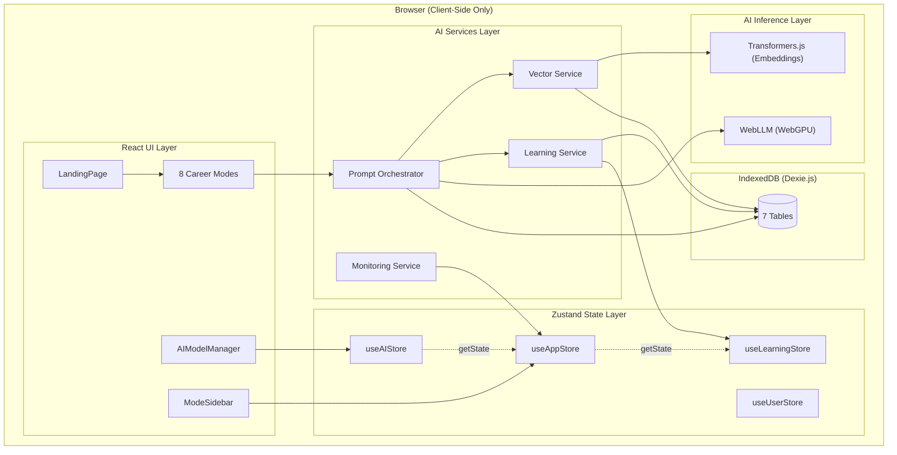

# Architecture Overview

## System Diagram

## Component Descriptions

### Prompt Orchestrator
- **Purpose**: Central coordination layer for all AI processing
- **Location**: `src/services/promptOrchestrator.ts`
- **Key responsibilities**:
  - Splits resumes into ~400-char section chunks by detected headers
  - Queries vector service for RAG context (similar past documents)
  - Retrieves learned patterns from learning service
  - Runs micro-prompts per section (score, feedback, keywords)
  - Aggregates section results into overall analysis
  - Records successful interactions for future learning
  - Provides deterministic fallback when no model is loaded

### Vector Service (RAG)
- **Purpose**: Local semantic search using embeddings
- **Location**: `src/services/vectorService.ts`
- **Key responsibilities**:
  - Lazy-loads embedding models from HuggingFace (MiniLM, GTE, BGE)
  - Generates 384-dimensional vectors for documents
  - Stores embeddings in IndexedDB with overlapping 500-char chunks (100-char overlap)
  - Performs cosine similarity search against stored documents
  - Graceful degradation on CDN/CORS failures

### Learning Service
- **Purpose**: Pattern extraction and prompt enhancement from past usage
- **Location**: `src/services/learningService.ts`
- **Key responsibilities**:
  - Records prompt/response interactions with success ratings
  - Extracts keyword, structure, and tone patterns from successful analyses
  - Enhances future prompts with top-performing patterns (frequency * rating)
  - Provides career-level and industry-specific personalized tips
  - Suggests keywords from 10 industry keyword maps + RAG-enhanced discovery

### Monitoring Service
- **Purpose**: Privacy-first local error tracking and performance metrics
- **Location**: `src/services/monitoringService.ts`
- **Key responsibilities**:
  - In-memory error logs (last 1000) and performance metrics (last 500)
  - Session tracking in localStorage
  - Performance stats with p95 calculations
  - Global error handler (window.onerror, unhandledrejection)

### Zustand Stores
- **Purpose**: Application state management with selective persistence
- **Location**: `src/stores/`
- **Key responsibilities**:
  - `useAIStore` - Model loading, inference, cache tracking (ephemeral, no persistence)
  - `useAppStore` - Mode navigation, settings (partially persisted: embeddingModel, learningEnabled, sidebarOpen)
  - `useUserStore` - Profile, analysis history (fully persisted)
  - `useLearningStore` - Interaction history, success patterns (partially persisted: last 100 interactions, all patterns)

## Data Flow

### Resume Analysis Pipeline

1. User uploads resume (PDF/DOCX/TXT) in a career mode
2. File parsed by `fileParser.ts` (PDF.js or Mammoth.js)
3. Prompt Orchestrator receives resume content + optional job description
4. Vector Service searches IndexedDB for similar past documents (cosine similarity >= 0.6)
5. Learning Service retrieves top patterns for the current mode
6. Resume split into sections by header detection (~400 chars each)
7. Per section: score prompt + feedback prompt + keyword extraction (micro-prompts)
8. WebLLM processes each micro-prompt via WebGPU inference
9. Section results aggregated into overall score, feedback, and keyword analysis
10. Results displayed with ATS score breakdown, improvements, and personalized tips
11. Successful interactions (score >= 60) recorded in learning service + vector DB

### Deterministic Fallback

When no AI model is loaded, the app provides deterministic analysis:
- Keyword matching against industry-specific keyword lists (10 industries)
- Section scoring based on content length, header presence, and structure
- ATS score calculated from keyword density, formatting, and completeness

## Key Architectural Decisions

### Micro-Prompt Architecture Over Single Large Prompts
- **Context**: Local models (0.5B-7B parameters) struggle with large context windows
- **Decision**: Split resumes into ~400-char chunks and run focused micro-prompts per section
- **Rationale**: 3-5 second responses per chunk vs 45-60 seconds for full resume; more consistent output quality; section-specific prompt tuning possible

### Passthrough Sections
- **Context**: AI rewrites of Skills, Certifications, Education, and Header sections consistently introduced errors (hallucinated skills, mangled formatting)
- **Decision**: Return these sections unchanged, only enhancing Experience, Summary, Projects, and Awards
- **Rationale**: Preserves data integrity for structured sections where AI adds no value

### Browser-Only with No Server Component
- **Context**: Privacy is the core differentiator; users are sensitive about resume data
- **Decision**: All processing runs client-side via WebGPU (WebLLM) and IndexedDB
- **Rationale**: Zero data transmission eliminates privacy concerns; models cached in browser for offline use; no server costs

### Cross-Store Communication via getState()
- **Context**: Stores need to read each other's state (e.g., checking if learning is enabled before recording)
- **Decision**: Use Zustand's `getState()` for synchronous cross-store reads
- **Rationale**: Avoids circular dependencies; keeps stores independent; no need for a global event bus
