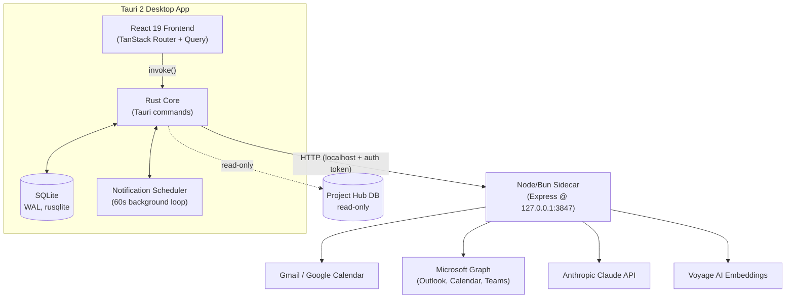

# Architecture

## System Diagram

## Component Descriptions

### React Frontend
- **Purpose**: The entire user surface — backlog, today view, weekly planner, email, settings, organization dashboards.
- **Location**: `src/`
- **Key responsibilities**: File-based routing (`src/routes/`), server-state caching and invalidation through React Query (`src/lib/queries.ts`), and a single typed wrapper layer (`src/lib/tauri.ts`) that mirrors every Rust command.

### Rust Core
- **Purpose**: Owns persistence, OS integration, and orchestration. The front end never talks to a database or a third-party API directly.
- **Location**: `src-tauri/src/`
- **Key responsibilities**: One command module per feature area (`commands/tasks.rs`, `schedules.rs`, `ai.rs`, `email*.rs`, `calendar.rs`, `embeddings.rs`, `project_hub.rs`, …), the SQLite schema and access layer (`db/`), and a background notification scheduler.

### Node/Bun Sidecar
- **Purpose**: Isolates the third-party API surface — Google, Microsoft, Anthropic, Voyage, Shopify — where the official SDKs are first-class.
- **Location**: `sidecar/src/`
- **Key responsibilities**: OAuth flows, email/calendar sync, Claude calls (scoring, planning, vision, email analysis), embeddings, and token encryption. Binds to `127.0.0.1:3847` and authenticates requests from the Rust core with a shared token.

### Notification Scheduler
- **Purpose**: Fire time-block reminders without a server.
- **Location**: `src-tauri/src/notifications.rs`
- **Key responsibilities**: A background loop that wakes on a 60-second interval and emits notifications for upcoming blocks within a short look-ahead window.

## Data Flow

A representative action — generating a weekly schedule:

1. In the planner (`src/routes/weekly.tsx`), I set objectives and per-day working hours; a React Query mutation calls the typed wrapper in `src/lib/tauri.ts`.
2. The wrapper `invoke()`s a Rust command (`commands/ai.rs`), which gathers open tasks, the active plan, fixed calendar events, and retrieval context from SQLite.
3. The Rust command POSTs that payload to the sidecar, which prompts the Claude API and returns day-by-day blocks.
4. The Rust command persists each day's schedule row and its time blocks **in a single transaction**, then returns.
5. React Query invalidates the affected keys and the new schedule renders.

## External Integrations

| Service | Purpose | Notes |
|---------|---------|-------|
| Gmail / Google Calendar | Email + calendar sync | OAuth 2.0; paginated backfill then incremental history sync |
| Microsoft Graph | Outlook mail, calendar, Teams messages | MSAL auth; delta sync where available |
| Anthropic Claude | Task scoring, schedule generation, replanning, email analysis, screenshot parsing | Per-call timeouts; data-only system prompts to resist prompt injection |
| Voyage AI | Document embeddings for file search | Embeddings stored locally in SQLite |
| Shopify (via email) | Parse order/payout emails into structured records | Used by the organization revenue view |

## Key Architectural Decisions

### A Node sidecar instead of calling APIs from Rust
- **Context**: The app depends on Google, Microsoft, and Anthropic SDKs, all of which are most complete and best-maintained in JavaScript.
- **Decision**: Keep all third-party API logic in a small Express sidecar; keep the Rust core focused on SQLite, OS integration, and orchestration.
- **Rationale**: Reimplementing OAuth and Graph/Gmail clients in Rust would be a large, fragile surface. The trade-off is a second process and a localhost hop, mitigated by binding to loopback and gating requests with a shared auth token.

### SQLite as both the data store and the vector store
- **Context**: File search needs semantic retrieval, but a desktop app shouldn't ship or manage a separate vector database.
- **Decision**: Store embeddings as little-endian `f32` BLOBs in SQLite and compute cosine similarity in Rust over a bounded candidate set (`commands/embeddings.rs`).
- **Rationale**: For single-user, desktop-scale corpora a brute-force scan with a hard candidate cap is simpler and fast enough, and it keeps everything in one file with the rest of the data. The cap bounds memory and latency as the corpus grows.

### A single shared connection with explicit transactions
- **Context**: Several commands perform multi-statement writes (archive-then-insert, schedule-plus-blocks) that must not half-apply.
- **Decision**: Run on one SQLite connection in WAL mode behind a mutex, with scoped lock blocks and `BEGIN IMMEDIATE`/`COMMIT` transactions (with rollback on any failure, including a failed commit) for every multi-statement write.
- **Rationale**: WAL gives good read/write concurrency for a desktop workload, and wrapping compound writes in transactions guarantees atomicity — e.g. a schedule and all of its time blocks commit together or not at all.

### Versioned schedules for replanning
- **Context**: Replanning the rest of the day shouldn't destroy the original plan.
- **Decision**: Daily schedules carry an auto-incrementing `version` per date; replan writes a new version rather than mutating the old one.
- **Rationale**: Keeps history intact and makes "regenerate from now" a non-destructive operation.

### Streaming subprocess output instead of blocking on a result
- **Context**: The repository-investigation feature runs a long external analysis whose progress the user wants to watch.
- **Decision**: Spawn the analysis as a subprocess, read its newline-delimited JSON output line by line, and forward each event to the UI through Tauri's event system — all under a wall-clock timeout that force-kills and reaps the process (`commands/project_hub.rs`).
- **Rationale**: Streaming keeps the UI responsive and informative during a multi-minute task, and the timeout guards against an external process that writes its result and then fails to exit.

### Encrypted tokens at rest
- **Context**: OAuth access/refresh tokens are sensitive and persist in the local database.
- **Decision**: Encrypt tokens with AES-256-GCM using a key supplied via environment variable (`sidecar/src/lib/encryption.ts`).
- **Rationale**: Authenticated encryption protects token confidentiality and integrity even though the store is local-only.
