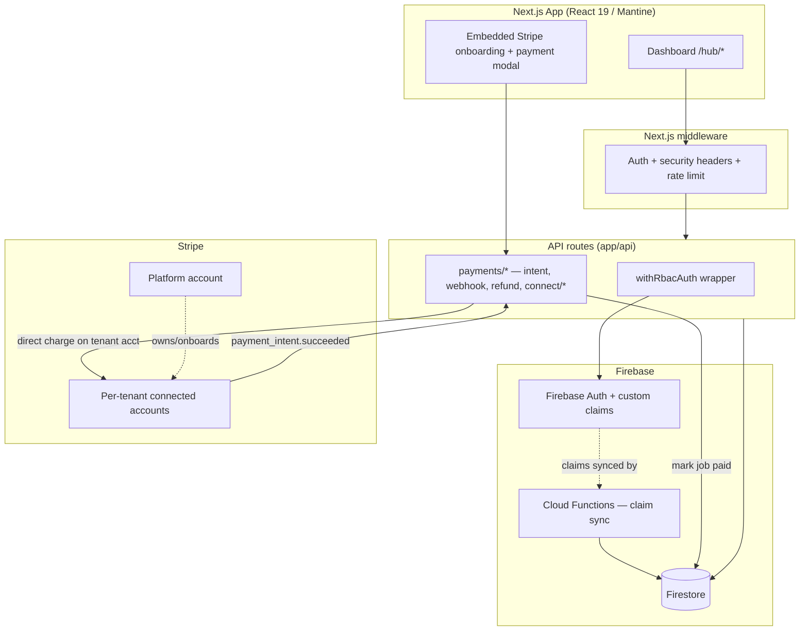

# Architecture

## System Diagram

## Component Descriptions

### Dashboard modules

- **Purpose**: jobs, customers, employees, scheduling, services, inventory for a single tenant
- **Location**: `app/hub/*` (URL `/hub/*`)
- **Key responsibilities**: domain UI; each module bundles its own `components/`, `hooks/`, `services/`, `types/`

### RBAC layer

- **Purpose**: owner/manager/technician access control
- **Location**: `app/lib/rbac/`, `app/lib/auth/apiAuth.ts`, `app/middleware.ts`
- **Key responsibilities**: permissions live in Firebase custom claims (JWT); checked in middleware (routes), `usePermission()` (UI), and `withRbacAuth()` (API). Claims are synced to the token by Cloud Functions.

### Payments (Stripe Connect)

- **Purpose**: per-tenant card payments that settle to the tenant
- **Location**: `app/lib/integrations/stripe/`, `app/api/payments/`
- **Key responsibilities**: create Express connected accounts, embedded onboarding (account sessions), create payment intents **on the connected account** (direct charges), receive Connect webhooks to mark jobs paid, expose balance/payouts and refunds.

### Integrations

- **Purpose**: QuickBooks Online + Google Calendar sync
- **Location**: `app/lib/integrations/{quickbooks,google-calendar}/`
- **Key responsibilities**: OAuth flows with CSRF nonces, environment-switched sandbox/production credentials, webhook handling.

## Data Flow — taking a payment

1. An owner connects Stripe via the embedded onboarding component; the server creates (or reuses) their Express connected account and returns an Account Session client secret.
2. On a job, a permitted user opens the payment modal. `POST /api/payments/create-intent` derives the amount server-side from the job record and creates a PaymentIntent **on the tenant's connected account**.
3. Stripe.js (initialized with the connected account) confirms the card payment.
4. Stripe delivers `payment_intent.succeeded` to the Connect webhook, which idempotently marks the job `paid` — the single source of truth for payment state.
5. The owner sees the funds in the in-app balance/payout view; refunds are issued back on the connected account.

## External Integrations

| Service             | Purpose                  | Notes                                                                                                                 |
| ------------------- | ------------------------ | --------------------------------------------------------------------------------------------------------------------- |
| Stripe Connect      | Per-tenant card payments | Express accounts + direct charges; no platform fee; tenant is merchant of record. Test/live switched by `STRIPE_ENV`. |
| Firebase Auth       | Identity + RBAC claims   | Custom claims carry role/ownerId/permissions in the JWT                                                               |
| Firestore           | Primary datastore        | Real-time listeners; server access via Admin SDK only                                                                 |
| QuickBooks Online   | Accounting sync          | OAuth; env-switched sandbox/production                                                                                |
| Google Calendar     | Schedule sync            | OAuth with single-use state nonce                                                                                     |
| Upstash / Vercel KV | Rate limiting            | Per-user counters on billed endpoints                                                                                 |

## Key Architectural Decisions

### Per-tenant Stripe Connect with direct charges (not a pooled platform account)

- **Context**: a multi-tenant SaaS where each business collects from its own customers. Routing all payments into one platform account would make the platform a money transmitter and force manual payouts.
- **Decision**: Stripe Connect with **Express** accounts and **direct charges** — each tenant onboards their own account; charges are created on it; funds settle to them; the platform takes no fee and never holds funds.
- **Rationale**: keeps the platform out of the flow of funds (compliance + liability), makes the tenant the merchant of record, and Express (over Standard) lets non-technical owners onboard inside the app without ever managing a Stripe dashboard.

### Webhook as the source of truth for "paid"

- **Context**: a client-side "payment succeeded" callback can be lost (closed tab, network drop) and can't be trusted for money state.
- **Decision**: the job is marked `paid` only by the Stripe `payment_intent.succeeded` **webhook**, which is signature-verified, fail-closed, and idempotent (keyed on the event id).
- **Rationale**: the payment state matches Stripe's ledger regardless of what the browser did; retries are safe.

### Single-variable test/live environment switch

- **Context**: needing to validate in Stripe test mode and later go live without re-wiring credentials each time.
- **Decision**: a resolver reads `STRIPE_*_TEST` / `STRIPE_*_LIVE` keys based on a single `STRIPE_ENV` value (defaults to test); all key access goes through it.
- **Rationale**: test and live keys live side by side; flipping environments is one variable, and a fresh deploy can never accidentally go live.

### Admin SDK for all server-side Firestore access

- **Context**: the Firebase client SDK has no auth context server-side; in a serverless function it can block on a connection that never establishes, timing out at 30s (a 504).
- **Decision**: every server-side Firestore read/write uses the Firebase **Admin SDK**, lazy-imported so it never lands in a client bundle.
- **Rationale**: eliminates intermittent payment-endpoint timeouts and makes server data access deterministic.

### Permissions in JWT custom claims, not per-request DB lookups

- **Context**: RBAC checks happen on every protected route, hook render, and API call.
- **Decision**: role/ownerId/permissions are stored as Firebase custom claims in the auth token and synced by Cloud Functions on role changes.
- **Rationale**: permission checks are local to the verified token — no extra Firestore round-trip per check — while staying centralized and revocable.
