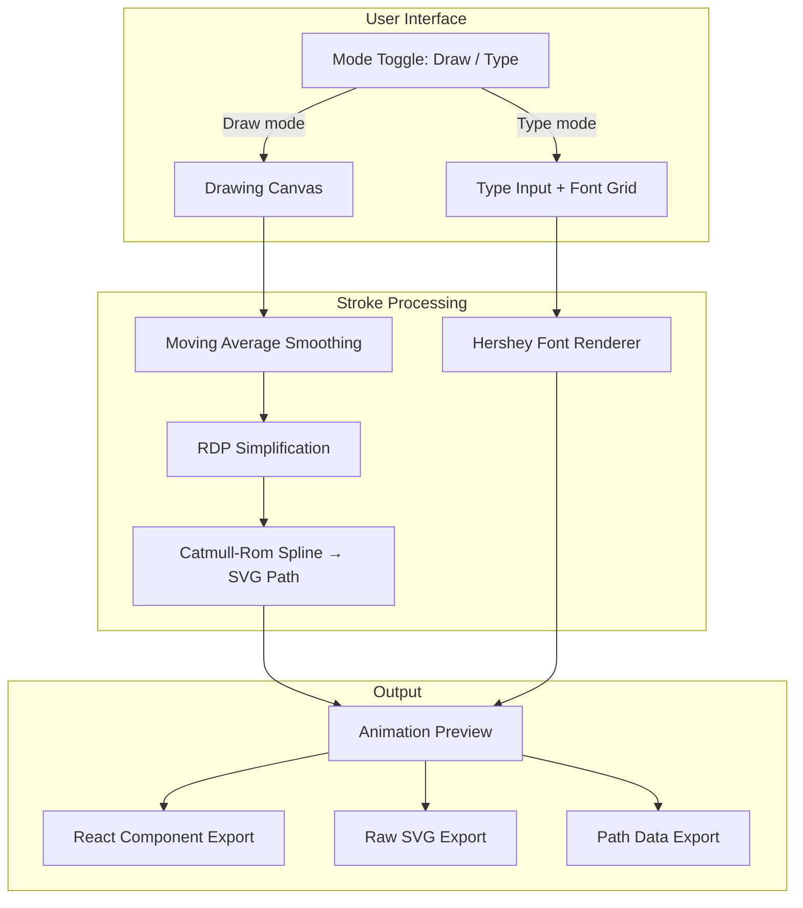

# Architecture Overview

## System Diagram

## Component Descriptions

### Drawing Canvas
- **Purpose**: Captures freehand signature input via pointer movement
- **Location**: `index.html` (lines 563–676)
- **Key responsibilities**: Point capture, real-time Bézier rendering, stroke management (undo/clear), lift detection (150ms timeout), spacebar pause/resume

### Hershey Font Renderer
- **Purpose**: Converts typed text into single-stroke SVG paths using Hershey vector fonts
- **Location**: `index.html` (lines 735–786)
- **Key responsibilities**: Character lookup by ASCII code, coordinate scaling/offsetting, viewBox calculation, multi-character path assembly

### Stroke Processing Pipeline
- **Purpose**: Smooths raw drawn points into clean SVG cubic Bézier curves
- **Location**: `index.html` (lines 434–536)
- **Key responsibilities**: Two-pass moving average (window 5, then 3), Ramer-Douglas-Peucker simplification (tolerance 2.8), Catmull-Rom to cubic Bézier conversion

### Animation Preview
- **Purpose**: Plays stroke-by-stroke drawing animation using SVG stroke-dashoffset
- **Location**: `index.html` (lines 930–1010)
- **Key responsibilities**: Per-stroke timing proportional to path length, ghost paths at 8% opacity, cubic ease-out per stroke, adjustable speed slider, +2 dashoffset buffer to prevent linecap artifacts

### Export System
- **Purpose**: Generates copy-pasteable code in three formats
- **Location**: `index.html` (lines 1037–1101)
- **Key responsibilities**: React component with Framer Motion variants, raw SVG markup, raw path data strings

## Data Flow

1. **Input**: User draws on canvas (pointermove events) or types a name (text input)
2. **Processing**: Raw points are smoothed → simplified → converted to SVG cubic Bézier paths. Typed text is rendered through Hershey font lookup and coordinate transformation.
3. **Preview**: Paths are animated via `requestAnimationFrame` loop manipulating `stroke-dashoffset` on SVG path elements
4. **Export**: Paths and viewBox are formatted into React/SVG/path data strings for clipboard copy

## Embedded Data

### Hershey Font Data (~40KB)
- Three font families: `scripts` (light), `scriptc` (medium), `cursive`
- Format: JSON objects keyed by ASCII char code
- Each entry: `{ d: "M x,y L x,y ...", w: advanceWidth }`
- Embedded in `<script id="hershey-fonts">` tag (lines 423–427)

## Key Architectural Decisions

### Single-File Architecture
- **Context**: Needed a zero-dependency tool deployable anywhere
- **Decision**: All CSS, HTML, JS, and font data in one `index.html`
- **Rationale**: No build step, no dependencies, instant Vercel static deploy. Font data is ~40KB but avoids external requests.

### SVG stroke-dashoffset Animation
- **Context**: Needed realistic pen-drawing animation effect
- **Decision**: Use `stroke-dasharray` + `stroke-dashoffset` with `requestAnimationFrame`
- **Rationale**: Pure CSS/SVG technique, no animation library needed for preview. Works with any SVG path. Per-stroke timing creates natural writing cadence.

### Movement-Based Drawing (No Click)
- **Context**: User wanted frictionless drawing without click-to-start
- **Decision**: `pointermove` starts strokes automatically, 150ms timeout detects finger lift, spacebar toggles drawing on/off
- **Rationale**: Mimics natural signing experience. Paused by default prevents accidental drawing.
