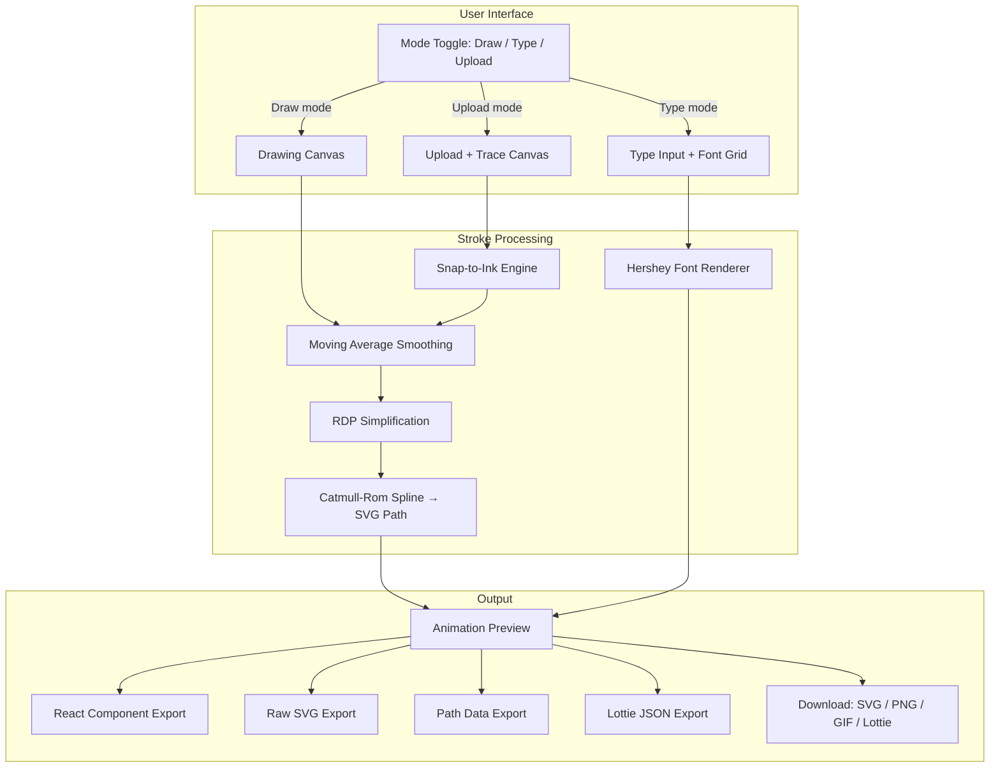

# Architecture Overview

## System Diagram

```mermaid
flowchart TD
    subgraph UI["User Interface"]
        A[Mode Toggle: Draw / Type / Upload]
        B[Drawing Canvas]
        C[Type Input + Font Grid]
        D[Upload + Trace Canvas]
    end

    subgraph Processing["Stroke Processing"]
        E[Moving Average Smoothing]
        F[RDP Simplification]
        G[Catmull-Rom Spline → SVG Path]
        H[Hershey Font Renderer]
        I[Snap-to-Ink Engine]
    end

    subgraph Output["Output"]
        J[Animation Preview]
        K[React Component Export]
        L[Raw SVG Export]
        M[Path Data Export]
        N[Lottie JSON Export]
        O[Download: SVG / PNG / GIF / Lottie]
    end

    A -->|Draw mode| B
    A -->|Type mode| C
    A -->|Upload mode| D
    B --> E --> F --> G
    C --> H
    D --> I --> E
    G --> J
    H --> J
    J --> K
    J --> L
    J --> M
    J --> N
    J --> O
```

## Component Descriptions

### Drawing Canvas
- **Purpose**: Captures freehand signature input via pointer movement
- **Location**: `src/app.js` (draw mode section)
- **Key responsibilities**: Point capture, real-time Bezier rendering, stroke management (undo/clear), lift detection (150ms timeout), spacebar pause/resume

### Hershey Font Renderer
- **Purpose**: Converts typed text into single-stroke SVG paths using Hershey vector fonts
- **Location**: `src/app.js` (type mode section), `src/fonts/`
- **Key responsibilities**: Character lookup by ASCII code, coordinate scaling/offsetting, viewBox calculation, multi-character path assembly. Supports 7 font families across two data files.

### Upload + Trace Canvas
- **Purpose**: Allows users to upload an image and trace over it with snap-to-ink drawing
- **Location**: `src/app.js` (upload mode section), `src/index.html` (trace UI)
- **Key responsibilities**: Image upload via drag-and-drop or file picker, ink detection via brightness thresholding, snap-to-ink point adjustment within configurable radius, view modes (original/threshold/ink overlay), adjustable pen weight and threshold

### Stroke Processing Pipeline
- **Purpose**: Smooths raw drawn points into clean SVG cubic Bezier curves
- **Location**: `src/app.js` (math helpers section)
- **Key responsibilities**: Two-pass moving average (window 5, then 3), Ramer-Douglas-Peucker simplification (tolerance 2.8), Catmull-Rom to cubic Bezier conversion

### Lottie Export Engine
- **Purpose**: Converts SVG path data into Lottie JSON for After Effects / Lottie Player compatibility
- **Location**: `src/lottie.js`
- **Key responsibilities**: SVG path tokenization (M/L/C commands), conversion to Lottie shape keyframe data, Trim Path animation (stroke-dashoffset equivalent), per-stroke timing with delays

### Animation Preview
- **Purpose**: Plays stroke-by-stroke drawing animation using SVG stroke-dashoffset
- **Location**: `src/app.js` (preview section)
- **Key responsibilities**: Per-stroke timing proportional to path length, ghost paths at 8% opacity, cubic ease-out per stroke, adjustable speed slider, +2 dashoffset buffer to prevent linecap artifacts

### Export System
- **Purpose**: Generates copy-pasteable code in four formats plus file downloads
- **Location**: `src/app.js` (export section)
- **Key responsibilities**: React component with Framer Motion variants, raw SVG markup, raw path data strings, Lottie JSON. Downloads: SVG file, PNG (canvas render), animated GIF (gif.js), Lottie JSON file.

## Data Flow

1. **Input**: User draws on canvas (pointermove events), types a name (text input), or traces over an uploaded image (snap-to-ink pointermove)
2. **Processing**: Raw points are smoothed → simplified → converted to SVG cubic Bezier paths. Typed text is rendered through Hershey font lookup and coordinate transformation. Trace mode snaps points to detected ink pixels before smoothing.
3. **Preview**: Paths are animated via `requestAnimationFrame` loop manipulating `stroke-dashoffset` on SVG path elements
4. **Export**: Paths and viewBox are formatted into React/SVG/path data/Lottie strings for clipboard copy or file download

## Embedded Data

### Hershey Font Data
- **7 font families**: `scripts` (light), `scriptc` (medium), `cursive`, `gothic`, `gothic italic`, `roman`, `roman complex`
- **Location**: `src/fonts/hershey-data.js` and `src/fonts/hershey-extended.js`
- **Format**: JSON objects keyed by ASCII char code
- Each entry: `{ d: "M x,y L x,y ...", w: advanceWidth }`

## Key Architectural Decisions

### Migration from Single-File to Vite
- **Context**: The app grew beyond what a single HTML file could comfortably maintain, and new features required npm dependencies (fit-curve, gif.js)
- **Decision**: Migrated to Vite with `src/` directory containing modular JS, CSS, and HTML files
- **Rationale**: Vite provides fast HMR for development, handles npm imports, and produces optimized builds. The original `index.html` is preserved as a reference.

### SVG stroke-dashoffset Animation
- **Context**: Needed realistic pen-drawing animation effect
- **Decision**: Use `stroke-dasharray` + `stroke-dashoffset` with `requestAnimationFrame`
- **Rationale**: Pure CSS/SVG technique, no animation library needed for preview. Works with any SVG path. Per-stroke timing creates natural writing cadence.

### Snap-to-Ink Tracing
- **Context**: Users wanted to trace over existing signatures from uploaded images
- **Decision**: Brightness-based ink detection with configurable threshold, snapping drawn points to nearest ink pixel within a radius
- **Rationale**: Simple and effective — the threshold slider lets users tune for different image qualities, and the snap radius keeps strokes aligned with the original ink without being too rigid.

### Movement-Based Drawing (No Click)
- **Context**: Wanted frictionless drawing without click-to-start
- **Decision**: `pointermove` starts strokes automatically, 150ms timeout detects finger lift, spacebar toggles drawing on/off
- **Rationale**: Mimics natural signing experience. Paused by default prevents accidental drawing.
