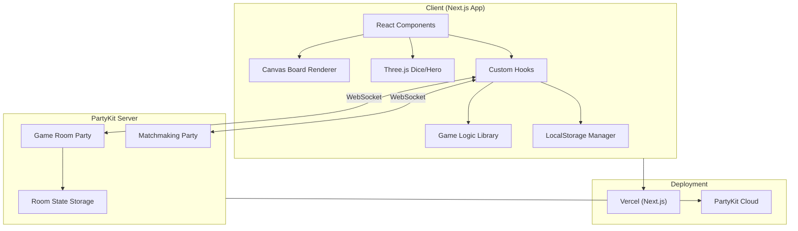
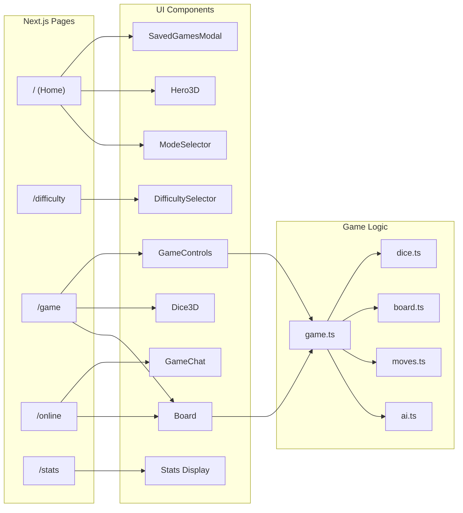
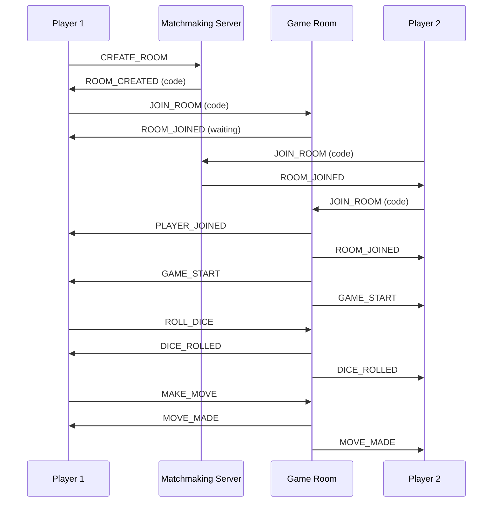

# Simple-Backgammon Architecture

## System Architecture Diagram



## Component Relationships



## Online Multiplayer Data Flow



## Architecture Overview

### Key Architectural Decisions

#### 1. Canvas-Based Board Rendering

I chose HTML5 Canvas over SVG or DOM-based rendering for the game board for several reasons:

- **Performance**: Canvas provides smooth 60fps animations for piece movements, hit detection, and board interactions without DOM thrashing
- **Precise Control**: I have pixel-perfect control over drawing triangles, pieces, and calculating click zones
- **Single Surface**: All board elements (points, pieces, bar, bear-off areas) render on one surface, simplifying coordinate calculations

The downside is accessibility - Canvas content is not accessible to screen readers. For a future iteration, I would add ARIA live regions to announce game state changes.

#### 2. Pure TypeScript Game Logic

I implemented all game rules (move validation, bearing off, hitting blots) in pure TypeScript without any UI dependencies:

- **Testability**: The game logic can be unit tested independently
- **Server Reuse**: The same logic runs on both client and PartyKit server for authoritative game state
- **Functional Style**: Functions like `makeMove()` return new state objects rather than mutating, making undo trivial

#### 3. PartyKit for Real-Time Multiplayer

I selected PartyKit over alternatives like Socket.io or Firebase for real-time features:

- **Edge-First**: PartyKit runs on Cloudflare Workers, placing game rooms close to players
- **Durable Objects**: Room state persists automatically, handling disconnections gracefully
- **Simple API**: WebSocket management is handled automatically with the `partysocket` React hook

I duplicated the game logic in the PartyKit server rather than importing from the shared lib due to PartyKit's build constraints. This ensures the server is authoritative - clients cannot cheat by sending invalid moves.

#### 4. Three.js for 3D Dice Only

I intentionally limited Three.js usage to dice animations and the hero background:

- **Bundle Size**: Three.js is ~150KB gzipped. Keeping it isolated to specific components allows code splitting
- **Complexity Budget**: A full 3D board would add complexity without proportional UX benefit
- **CSS 3D Fallback**: The 3D dice use CSS transforms with Three.js only for the more complex hero scene

#### 5. Local-First with Optional Online

The game works entirely offline with localStorage persistence:

- **Save/Resume**: Up to 5 games can be saved and resumed anytime
- **Statistics**: Win/loss records persist across sessions
- **PWA Support**: The app can be installed and played without internet

Online multiplayer is an enhancement, not a requirement. This architecture means the core game never depends on server availability.

#### 6. AI Strategy Implementation

I implemented three difficulty levels with increasing sophistication:

- **Easy**: Random valid move selection
- **Medium**: Single-move scoring (hit blots, make points, avoid danger)
- **Hard**: Lookahead evaluation considering future move potential

The AI runs entirely client-side, keeping server load minimal and allowing instant responses.

### Directory Structure Rationale

```
/app              - Next.js 14 App Router pages
/components       - React components (UI only, no business logic)
/lib              - Pure TypeScript modules (game logic, storage, types)
/lib/multiplayer  - Multiplayer-specific type definitions
/hooks            - Custom React hooks (bridge between UI and logic)
/party            - PartyKit server code (separate runtime)
/public           - Static assets, PWA icons
```

This separation ensures:
- Components remain presentational and testable
- Game logic is reusable across client/server
- Hooks encapsulate complex stateful interactions
