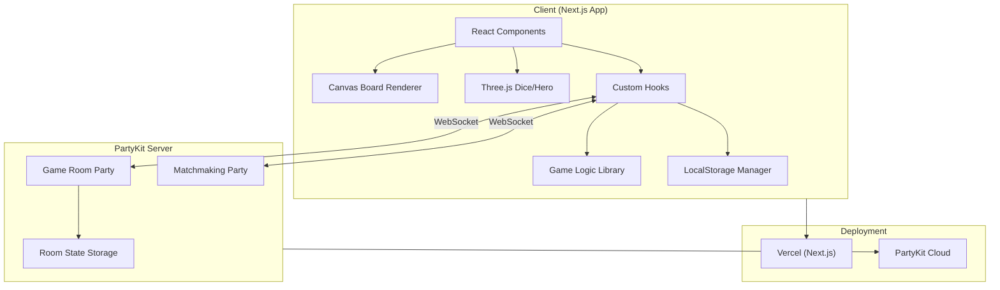
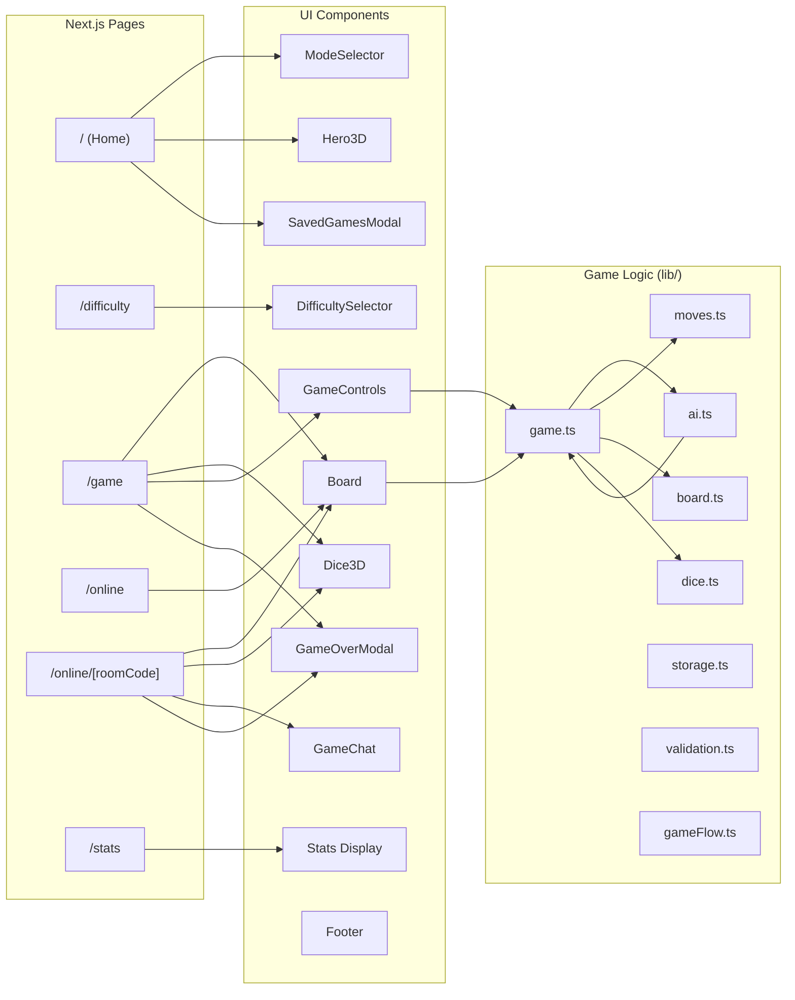
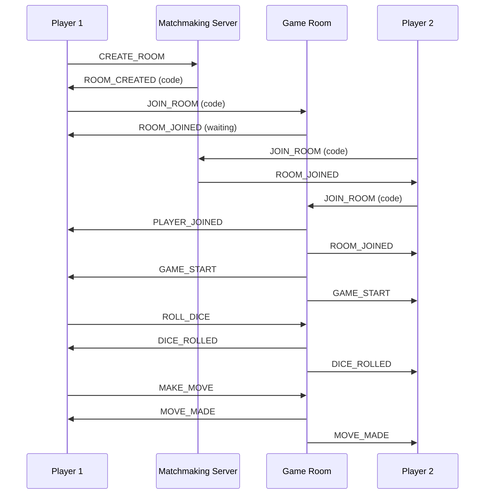

# Simple-Backgammon Architecture

## System Architecture Diagram


```mermaid
flowchart TB
    subgraph Client["Client (Next.js App)"]
        UI["React Components"]
        Canvas["Canvas Board Renderer"]
        Three["Three.js Dice/Hero"]
        Hooks["Custom Hooks"]
        GameLib["Game Logic Library"]
        Storage["LocalStorage Manager"]
    end

    subgraph Server["PartyKit Server"]
        MatchMaking["Matchmaking Party"]
        GameRoom["Game Room Party"]
        RoomStorage["Room State Storage"]
    end

    subgraph Hosting["Deployment"]
        Vercel["Vercel (Next.js)"]
        PartyKitCloud["PartyKit Cloud"]
    end

    UI --> Canvas
    UI --> Three
    UI --> Hooks
    Hooks --> GameLib
    Hooks --> Storage

    Hooks <--> |WebSocket| MatchMaking
    Hooks <--> |WebSocket| GameRoom
    GameRoom --> RoomStorage

    Client --> Vercel
    Server --> PartyKitCloud
```

## Component Relationships


```mermaid
flowchart LR
    subgraph Pages["Next.js Pages"]
        Home["/ (Home)"]
        Difficulty["/difficulty"]
        Game["/game"]
        Online["/online"]
        OnlineRoom["/online/[roomCode]"]
        Stats["/stats"]
    end

    subgraph Components["UI Components"]
        ModeSelector
        DifficultySelector
        Board
        Dice3D
        Hero3D
        GameControls
        GameChat
        GameOverModal
        SavedGamesModal
        Stats_Comp["Stats Display"]
        Footer
    end

    subgraph Logic["Game Logic (lib/)"]
        GameModule["game.ts"]
        AIModule["ai.ts"]
        MovesModule["moves.ts"]
        BoardModule["board.ts"]
        DiceModule["dice.ts"]
        StorageModule["storage.ts"]
        ValidationModule["validation.ts"]
        FlowModule["gameFlow.ts"]
    end

    Home --> ModeSelector
    Home --> Hero3D
    Home --> SavedGamesModal
    Difficulty --> DifficultySelector
    Game --> Board
    Game --> Dice3D
    Game --> GameControls
    Game --> GameOverModal
    Online --> Board
    OnlineRoom --> Board
    OnlineRoom --> Dice3D
    OnlineRoom --> GameChat
    OnlineRoom --> GameOverModal
    Stats --> Stats_Comp

    Board --> GameModule
    GameControls --> GameModule
    GameModule --> AIModule
    GameModule --> MovesModule
    GameModule --> BoardModule
    GameModule --> DiceModule

    AIModule --> GameModule
```

## Online Multiplayer Data Flow


```mermaid
sequenceDiagram
    participant P1 as Player 1
    participant MM as Matchmaking Server
    participant GR as Game Room
    participant P2 as Player 2

    P1->>MM: CREATE_ROOM
    MM->>P1: ROOM_CREATED (code)
    P1->>GR: JOIN_ROOM (code)
    GR->>P1: ROOM_JOINED (waiting)

    P2->>MM: JOIN_ROOM (code)
    MM->>P2: ROOM_JOINED
    P2->>GR: JOIN_ROOM (code)
    GR->>P1: PLAYER_JOINED
    GR->>P2: ROOM_JOINED
    GR->>P1: GAME_START
    GR->>P2: GAME_START

    P1->>GR: ROLL_DICE
    GR->>P1: DICE_ROLLED
    GR->>P2: DICE_ROLLED

    P1->>GR: MAKE_MOVE
    GR->>P1: MOVE_MADE
    GR->>P2: MOVE_MADE
```

## Architecture Overview

### Key Architectural Decisions

#### 1. Canvas-Based Board Rendering

I chose HTML5 Canvas over SVG or DOM-based rendering for the game board for several reasons:

- **Performance**: Canvas provides smooth 60fps animations for piece movements, hit detection, and board interactions without DOM thrashing
- **Precise Control**: I have pixel-perfect control over drawing triangles, pieces, and calculating click zones
- **Single Surface**: All board elements (points, pieces, bar, bear-off areas) render on one surface, simplifying coordinate calculations

The downside is accessibility - Canvas content is not accessible to screen readers. For a future iteration, I would add ARIA live regions to announce game state changes.

#### 2. One Rule Engine, Shared by Client and Server

I implemented all game rules (move validation, bearing off, hitting blots) as pure TypeScript in `lib/` with no UI dependencies, and the PartyKit server imports the *same* modules rather than carrying its own copy:

- **Single source of truth**: `party/backgammon.ts` imports `createInitialState`, `makeMove`, `doRollDice`, `endTurn`, etc. from `lib/game`. The client and the authoritative server validate moves with byte-for-byte identical code, so they can never silently drift apart.
- **Enforced, not hoped for**: `party/__tests__/shared-engine.test.ts` reads the server source and asserts it does *not* re-declare any engine function (`calculateAvailableMoves`, `canBearOff`, …). If someone hand-copies a rule into the server, the test fails. The invariant is structural, not a comment.
- **Functional style**: `makeMove()` returns a new state object rather than mutating, which makes undo a history stack and makes AI lookahead a matter of simulating against snapshots.

#### 3. PartyKit for Real-Time Multiplayer

I selected PartyKit over alternatives like Socket.io or Firebase for real-time features:

- **Edge-First**: PartyKit runs on Cloudflare Workers, placing game rooms close to players
- **Durable Objects**: Room state persists automatically, surviving the platform's hibernation between bursts of activity
- **Simple API**: WebSocket management is handled automatically with the `partysocket` React hook

Because the server reuses the `lib/` engine (Decision #2), it is fully authoritative: clients send only intents (`ROLL_DICE`, `MAKE_MOVE`) and the server recomputes legality every time, so a tampered client cannot fabricate a move.

#### 3b. Durable Disconnect Handling and Forfeit

Reconnect grace can't be a `setTimeout` — PartyKit hibernates idle rooms, which would silently drop the timer. Instead the room records `disconnectedAt` in its persisted state and schedules a **durable storage alarm** (`reconcileDisconnectAlarm()` in `party/backgammon.ts`). When a player has been gone past the 90-second grace window, `onAlarm()` fires even after a restart and resolves the room deterministically: if a game is in progress and the opponent is still present, the opponent **wins by forfeit**; otherwise the room closes. The alarm is recomputed on every connect/disconnect so it always reflects the soonest pending deadline.

#### 3c. Server Hardening

The multiplayer servers defend against malformed and abusive input at the edge:

- **Input sanitization** (`lib/validation.ts`): player names and chat messages are stripped of control characters and length-capped (30 / 500 chars) before being stored or broadcast.
- **Rate limiting**: each connection is capped at 20 messages/second in both the game room and the matchmaker.
- **Tamper-resistant restore** (`lib/storage.ts`): `isValidGameState()` is a type guard that rejects corrupt or hand-edited localStorage (wrong board length, out-of-range borne-off counts) instead of crashing on load.

#### 4. Three.js for 3D Dice Only

I intentionally limited Three.js usage to dice animations and the hero background:

- **Bundle Size**: Three.js is ~150KB gzipped. Keeping it isolated to specific components allows code splitting
- **Complexity Budget**: A full 3D board would add complexity without proportional UX benefit
- **CSS 3D Fallback**: The 3D dice use CSS transforms with Three.js only for the more complex hero scene

#### 5. Local-First with Optional Online

The game works entirely offline with localStorage persistence:

- **Save/Resume**: Up to 5 games can be saved and resumed anytime
- **Statistics**: Win/loss records persist across sessions
- **PWA Support**: The app can be installed and played without internet

Online multiplayer is an enhancement, not a requirement. This architecture means the core game never depends on server availability.

#### 6. AI Strategy Implementation

I implemented three difficulty levels with increasing sophistication:

- **Easy**: Random valid move selection
- **Medium**: Single-move scoring (hit blots, make points, avoid danger)
- **Hard**: Lookahead evaluation considering future move potential

The AI runs entirely client-side, keeping server load minimal and allowing instant responses.

### Directory Structure Rationale

```
/app                 - Next.js 15 App Router pages
/app/online/[roomCode] - Dynamic route for online game rooms
/components          - React components (UI only, no business logic)
/lib                 - Pure TypeScript modules (game logic, AI, storage, validation, types)
/lib/__tests__       - Vitest suite for the rule engine and pure helpers
/lib/multiplayer     - Multiplayer message/type definitions
/hooks               - Custom React hooks (matchmaking, multiplayer game)
/party               - PartyKit server code (imports the lib/ engine; separate runtime)
/party/__tests__     - Room forfeit + shared-engine invariant tests
/public              - Static assets, PWA icons
/scripts             - Build utilities (icon generation)
```

This separation ensures:
- Components remain presentational and testable
- The rule engine is reused verbatim across client and server
- Hooks encapsulate complex stateful interactions
- Decision logic is extracted into pure helpers (`lib/gameFlow.ts`, `lib/boardGeometry.ts`) so it can be unit-tested without rendering a component
