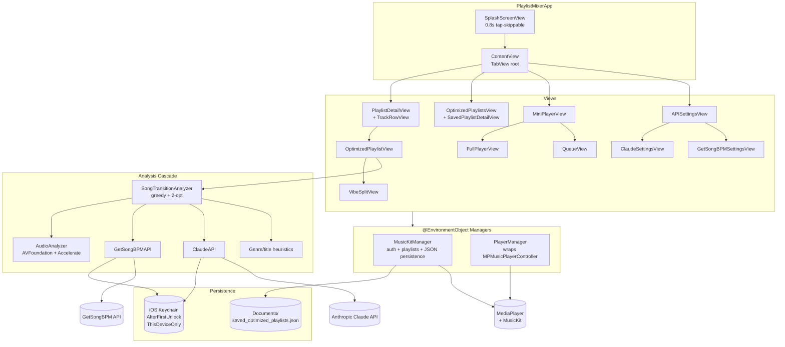

# Architecture Overview

SmoothQueue is a single-binary iOS app (no backend, no shared infrastructure) that
reorders Apple Music playlists by combining multi-source audio analysis with a
greedy + 2-opt optimization pass. The architecture is intentionally simple: two
`ObservableObject` managers hold all mutable state, views consume them via
`@EnvironmentObject`, and a handful of singletons wrap external APIs.

## System Diagram

## Component Descriptions

### `PlaylistMixerApp`
- **Purpose**: SwiftUI `App` root.
- **Location**: `PlaylistMixer/PlaylistMixerApp.swift`
- **Key responsibilities**: Instantiates the two `@StateObject` managers and
  injects them into the view tree. Entry point is `SplashScreenView`.

### `MusicKitManager`
- **Purpose**: All Apple-Music interaction + local persistence of optimized playlists.
- **Location**: `PlaylistMixer/MusicKitManager.swift`
- **Key responsibilities**:
  - Authorization (MediaPlayer-first, MusicKit-second cascade)
  - Playlist + track fetching (both frameworks)
  - Apple Music playlist creation (export)
  - JSON-Codable persistence of `SavedOptimizedPlaylist` to
    `Documents/saved_optimized_playlists.json`
  - In-memory `playlistCache: [String: MPMediaPlaylist]` for fast lookup

### `PlayerManager`
- **Purpose**: Wraps `MPMusicPlayerController.applicationMusicPlayer` for playback control.
- **Location**: `PlaylistMixer/PlayerManager.swift`
- **Key responsibilities**:
  - Sets the *full* track collection on the system player so auto-advance is native
  - Maintains a parallel `customPlaybackQueue: [String]` for in-app "Up Next" display
  - Custom shuffle (with pre-shuffle order snapshot for restore)
  - Queue reorder / remove with playback-position preservation across `setQueue`
  - Notification observers for `MPMusicPlayerControllerNowPlayingItemDidChange`
    and `MPMusicPlayerControllerPlaybackStateDidChange`

### `SongTransitionAnalyzer`
- **Purpose**: The "smart" part. Resolves track characteristics via the analysis
  cascade, then orders them for smooth listening.
- **Location**: `PlaylistMixer/SongTransitionAnalyzer.swift`
- **Key responsibilities**:
  - `analyzeTracksInPlaylist`: `DispatchGroup`-coordinated cascade across tracks
  - Per-track `TrackCharacteristics` Codable model (cached + persisted)
  - O(n²) `calculateTransitionScore` matrix
  - Greedy nearest-neighbor construction
  - 2-opt local-search improvement (asymmetric-cost-aware — includes interior
    segment cost when reversing, since `cost(A→B) ≠ cost(B→A)` for our scorer)
  - FNV-1a `stableHash` for reproducible-per-seed determinism (Swift's built-in
    `Hasher` is per-process-seeded; would have defeated reproducibility)

### `AudioAnalyzer`
- **Purpose**: Real signal processing for DRM-free local files.
- **Location**: `PlaylistMixer/AudioAnalyzer.swift`
- **Key responsibilities**:
  - BPM detection via spectral flux + autocorrelation
  - Energy via RMS at start/end + max-RMS normalization
  - Fade-in/out via amplitude envelope comparison
  - Key estimation via chroma features + Krumhansl-Schmuckler profiles
  - Cached `vDSP_DFT` setup (created in `init`, destroyed in `deinit`); hot loops
    use `withUnsafeBufferPointer` to avoid allocator churn

### `ClaudeAPI` / `GetSongBPMAPI`
- **Purpose**: External-service clients for the analysis cascade.
- **Location**: `PlaylistMixer/ClaudeAPI.swift`, `PlaylistMixer/GetSongBPMAPI.swift`
- **Key responsibilities**:
  - `URLSession`-based REST clients
  - Per-process in-memory cache, thread-safe via per-client `stateQueue`
  - API key storage in iOS Keychain (`KeychainStore`), with one-shot
    migration from a legacy UserDefaults entry
  - `testConnection` returns `(success, message)` so the settings UI shows
    real failure reasons instead of a generic "Test failed"
  - `Retry-After` header parsed and preserved on 429

### `KeychainStore`
- **Purpose**: Generic-password Keychain wrapper.
- **Location**: `PlaylistMixer/Keychain.swift`
- **Key responsibilities**:
  - `read` / `write` / `delete` with `kSecAttrAccessibleAfterFirstUnlock-
    ThisDeviceOnly` (background-task safe; not iCloud-synced)
  - Service identifier derived from `Bundle.main.bundleIdentifier`
  - Diagnostic logging of unexpected OSStatus values (e.g. missing entitlement
    on unsigned simulator builds)

### `ColorExtraction`
- **Purpose**: Shared dominant-color algorithm for album-artwork-derived gradients.
- **Location**: `PlaylistMixer/ColorExtraction.swift`
- **Key responsibilities**:
  - Pure-function pixel-sampling + HSV vibrancy sort + complementary hue lookup
  - `extractAsync` that handles the off-main hop so callers don't have to
  - Two preset `Settings` (`.miniPlayer`, `.fullPlayer`) for different sampling densities

## Data Flow

### Optimize → Save → Play (the happy path)

1. User taps a playlist row in `PlaylistDetailView`.
2. `MusicKitManager.fetchTracksForPlaylist(playlistID:)` populates
   `currentPlaylistTracks`.
3. User taps the wand icon → `OptimizedPlaylistView` opens.
4. User adjusts profile (or accepts default) → taps "Optimize Playlist".
5. `runOptimization()` creates a fresh `SongTransitionAnalyzer`, hydrates it
   with any cached characteristics from previously-saved playlists, and calls
   `analyzeTracksInPlaylist`.
6. The cascade runs per-track (real audio → GetSongBPM → Claude → fallback),
   each step falling through to the next on failure. All async; coordinated by
   `DispatchGroup`.
7. After all tracks have characteristics, `calculateTransitionScores()` builds
   the O(n²) score matrix.
8. `reorderTracksForOptimalFlow` runs greedy nearest-neighbor + 2-opt.
9. User taps Save → `MusicKitManager.saveOptimizedPlaylistLocally` writes JSON
   to `Documents/`.
10. User taps a track → `PlayerManager.setCustomPlaybackQueue` + `playTrack`.

### API key resolution + first-launch migration

1. App launches → `ClaudeAPI.shared.init` runs `loadAPIKey()`.
2. Checks `KeychainStore.read(account: "ClaudeAPIKey")`. If present → done.
3. Otherwise checks `UserDefaults.standard.string(forKey: "ClaudeAPIKey")` as a
   one-shot migration path for older installs that used the previous storage.
4. If a legacy value exists: writes it to Keychain. Only on confirmed success,
   removes the UserDefaults entry. On failure: leaves legacy in place + logs
   warning, so the key isn't lost from both stores.
5. Same pattern for `GetSongBPMAPI`.

## External Integrations

| Service | Purpose | Documentation |
|---------|---------|---------------|
| Apple MediaPlayer | Local library playlists, playback control, artwork | Apple framework |
| Apple MusicKit | Apple Music catalog fallback when MediaPlayer is unauthorized | Apple framework |
| GetSongBPM | BPM, key, danceability from a curated database | <https://getsongbpm.com/api> |
| Anthropic Claude | AI-estimated audio features for DRM tracks | <https://docs.anthropic.com> |

## Key Architectural Decisions

### Two manager singletons + EnvironmentObject (not Redux/TCA)
- **Context**: App needed shared state for music auth, playlists, and playback.
- **Decision**: Two `ObservableObject` classes (`MusicKitManager`,
  `PlayerManager`) injected via `@EnvironmentObject`.
- **Rationale**: Small app; no need for Redux-style state machines. SwiftUI's
  built-in observation model is sufficient. Two managers (not one) keeps the
  boundary clear: one talks to Apple Music, one talks to the player.

### Multi-source analysis cascade
- **Context**: DRM-protected Apple Music tracks expose no audio data, so the
  "smart shuffle" feature would be useless on most user libraries.
- **Decision**: Four-tier cascade. Each tier falls through to the next on
  failure. User-configurable API keys for GetSongBPM and Claude are optional.
- **Rationale**: Real-audio analysis is the gold standard but only fires for
  ripped/owned DRM-free files. GetSongBPM is curated and free with attribution.
  Claude AI can estimate characteristics from title + artist for anything else.
  Metadata heuristics catch the rest.

### JSON file persistence (no Core Data, no SwiftData)
- **Context**: Need to persist optimized playlists across launches.
- **Decision**: `Codable` `SavedOptimizedPlaylist` array written to
  `Documents/saved_optimized_playlists.json`.
- **Rationale**: Data is small (~tracks × IDs), structured but flat, and never
  queried with predicates. SwiftData/Core Data overhead would dwarf the data.

### iOS Keychain for API keys
- **Context**: API keys are entered by the user and used per-request.
- **Decision**: Keychain at `kSecAttrAccessibleAfterFirstUnlockThisDeviceOnly`.
- **Rationale**: UserDefaults is plaintext on disk (readable by any backup
  workflow). Keychain is OS-managed secure storage. `AfterFirstUnlock` keeps
  background analysis working; `ThisDeviceOnly` prevents iCloud-Keychain sync.
  See [`docs/SECURITY.md`](../docs/SECURITY.md) for the full storage policy.

### Asymmetric-cost-aware 2-opt
- **Context**: Standard 2-opt assumes a symmetric cost function (Euclidean TSP).
  Our transition score is *asymmetric*: `cost(A→B) ≠ cost(B→A)` because energy
  uses `source.endEnergy → target.startEnergy` and fade flags depend on
  direction.
- **Decision**: When evaluating a candidate segment-reverse, include the cost
  of every interior edge in both forward and reversed direction — not just the
  two boundary edges.
- **Rationale**: Textbook 2-opt would "improve" the boundary while making the
  interior strictly worse on asymmetric cost functions.

### Native full-queue + parallel custom queue
- **Context**: Need auto-advance through optimized order, but also need to
  display "Up Next" and support manual reorder.
- **Decision**: Set the *full* track collection on `MPMusicPlayerController` so
  the system handles auto-advance natively. Maintain a parallel
  `customPlaybackQueue: [String]` for UI / manual navigation.
- **Rationale**: System player's auto-advance + lock-screen integration are
  much better than anything we could emulate. The parallel array is purely a
  display + manipulation surface, with `syncCustomQueueIndex` keeping it in
  step with what the system reports.

## Testing

XCTest target at `PlaylistMixerTests/` covers the pure-function layer:

| Suite | Covers |
|---|---|
| `StableHashTests` | FNV-1a determinism (the foundation of reproducibility) |
| `TempoScoreTests` | Lorentzian falloff curve (0→1.0, 20→0.5, 40→0.2, 60→0.1) |
| `KeyScoringTests` | Camelot-wheel mode-aware key compatibility |
| `GenreLookupTests` | `findMatchingGenre` containment direction (catches "pop" → "bubblegum pop" regression) |
| `KeychainTests` | `KeychainStore.read/write/delete` round-trip (XCTSkip on unsigned CI) |

CI (`.github/workflows/ci.yml`) runs `xcodebuild test` on iOS Simulator on
every push, alongside the build gate. Pure-function tests cover the most
regression-prone code; manager-layer and view-layer testing is the next
expansion area.
