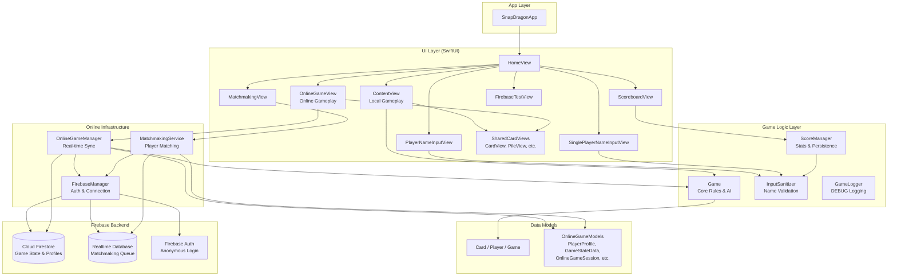

# Architecture Overview

## System Diagram

## Component Descriptions

### SnapDragonApp
- **Purpose**: App entry point — configures Firebase and injects the FirebaseManager environment object
- **Location**: `SnapDragon/SnapDragonApp.swift`
- **Key responsibilities**: Firebase initialization, root view setup

### Game (Core Logic)
- **Purpose**: Contains all game rules, card mechanics, and AI opponent logic
- **Location**: `SnapDragon/Game.swift`
- **Key responsibilities**:
  - Standard 52-card deck creation and shuffling
  - Card dealing (4 hand, 4 face-up, 4 face-down per player)
  - Play validation (rank comparison, special cards 2 and 10)
  - Four-of-a-kind detection and pile clearing
  - AI opponent with multi-layered strategy (setup switching, prioritized card selection, opponent awareness)
  - Turn management and card drawing

### ContentView (Local Gameplay)
- **Purpose**: Full gameplay UI for local 2-player and vs-AI modes
- **Location**: `SnapDragon/ContentView.swift`
- **Key responsibilities**: Card rendering, tap/selection handling, player handoff screens, AI turn animation, game-over detection

### HomeView
- **Purpose**: Main menu with game mode selection
- **Location**: `SnapDragon/HomeView.swift`
- **Key responsibilities**: Navigation to all game modes (local, AI, online), scoreboard access, Firebase test access

### OnlineGameManager
- **Purpose**: Manages real-time game state synchronization for online matches
- **Location**: `SnapDragon/OnlineGameManager.swift`
- **Key responsibilities**: Firestore snapshot listeners, game state serialization/deserialization, move validation and sync, conflict resolution

### MatchmakingService
- **Purpose**: Handles online matchmaking queue and opponent discovery
- **Location**: `SnapDragon/MatchmakingService.swift`
- **Key responsibilities**: Queue management via Realtime Database, skill-based matching (±200 ELO), game session creation, search cancellation

### FirebaseManager
- **Purpose**: Singleton managing Firebase authentication and database connections
- **Location**: `SnapDragon/FirebaseManager.swift`
- **Key responsibilities**: Anonymous authentication, player profile CRUD, connection status tracking, game state updates

### ScoreManager
- **Purpose**: Local game statistics and history persistence
- **Location**: `SnapDragon/GameScore.swift`
- **Key responsibilities**: Win/loss tracking, player stats calculation, recent players list, UserDefaults persistence

### SharedCardViews
- **Purpose**: Shared UI components used by both local and online gameplay views
- **Location**: `SnapDragon/SharedCardViews.swift`
- **Key responsibilities**: `CardView`, `CardBackView`, `EmptySlotView`, `SharedPileView`, and `rankString()` helper — extracted to eliminate duplication between ContentView and OnlineGameView

### InputSanitizer
- **Purpose**: Defense-in-depth player name sanitization
- **Location**: `SnapDragon/InputSanitizer.swift`
- **Key responsibilities**: Strip HTML tags, filter to allowed character set (alphanumeric + spaces + basic punctuation), collapse whitespace, enforce 20-char limit. Applied at both UI input and persistence layers.

### GameLogger
- **Purpose**: Debug-only logging utility gated behind `#if DEBUG`
- **Location**: `SnapDragon/GameLogger.swift`
- **Key responsibilities**: Replaces all `print()` calls with `GameLogger.log()` using `@autoclosure` to avoid string interpolation cost in release builds

### OnlineGameModels
- **Purpose**: Data models for online multiplayer serialization
- **Location**: `SnapDragon/OnlineGameModels.swift`
- **Key responsibilities**: Codable structs for Firebase (PlayerProfile, OnlineGameSession, GameStateData, CardData, PlayerData, GameMove, etc.)

## Data Flow

1. **Local Game**: `HomeView` → `ContentView` → `Game` struct handles all logic locally. `ScoreManager` persists results to UserDefaults.
2. **AI Game**: Same as local, but `Game.performAITurn()` runs the AI strategy tree on the AI player's turn with configurable delay for animation.
3. **Online Game**: `HomeView` → `MatchmakingView` → `MatchmakingService` polls Realtime Database for opponents → Creates `OnlineGameSession` in Firestore → `OnlineGameView` uses `OnlineGameManager` which listens to Firestore snapshots → Converts `GameStateData` ↔ `Game` struct for each move → Syncs back to Firestore.

## External Integrations

| Service | Purpose | Documentation |
|---------|---------|---------------|
| Firebase Auth | Anonymous player authentication | [Firebase Auth Docs](https://firebase.google.com/docs/auth) |
| Cloud Firestore | Game state storage, player profiles, leaderboards | [Firestore Docs](https://firebase.google.com/docs/firestore) |
| Firebase Realtime Database | Matchmaking queue (low-latency reads) | [RTDB Docs](https://firebase.google.com/docs/database) |
| Firebase Analytics | Game event tracking | [Analytics Docs](https://firebase.google.com/docs/analytics) |

## Key Architectural Decisions

### Local-first Game Logic
- **Context**: Online games need the same rules as local games
- **Decision**: The `Game` struct is the single source of truth for all game logic — online mode converts `GameStateData` ↔ `Game` for every move
- **Rationale**: Avoids duplicating rules, ensures consistency between offline and online play

### Dual Database Strategy
- **Context**: Matchmaking needs low-latency real-time presence; game state needs structured queries
- **Decision**: Realtime Database for matchmaking queue, Firestore for game state and player profiles
- **Rationale**: RTDB excels at presence/queue patterns; Firestore excels at structured document queries and offline support

### Anonymous Authentication
- **Context**: Needed user identity for online play without friction
- **Decision**: Firebase Anonymous Auth — no signup required
- **Rationale**: Reduces barrier to entry; players can start playing online immediately

### Value-type Game Model
- **Context**: Game state needs to be copied, compared, and serialized frequently
- **Decision**: `Game`, `Card`, and `Player` are all structs (value types), not classes
- **Rationale**: Value semantics make state management predictable — each mutation creates a new copy, preventing shared mutable state bugs

### Defense-in-Depth Input Sanitization
- **Context**: Player names are entered by users and persisted locally and in Firebase
- **Decision**: Sanitize at both the UI layer (name input views) and the persistence layer (ScoreManager). Firebase security rules enforce per-user write restrictions.
- **Rationale**: Multi-layer sanitization ensures no code path can persist unsanitized input, even if a future call site bypasses the UI

### Debug-Only Logging
- **Context**: Production builds contained ~160 print() statements that leaked game state to device logs
- **Decision**: Replace all print() with `GameLogger.log()` using `@autoclosure` behind `#if DEBUG`
- **Rationale**: Zero runtime cost in release builds — the `@autoclosure` defers string interpolation entirely when DEBUG is not set
