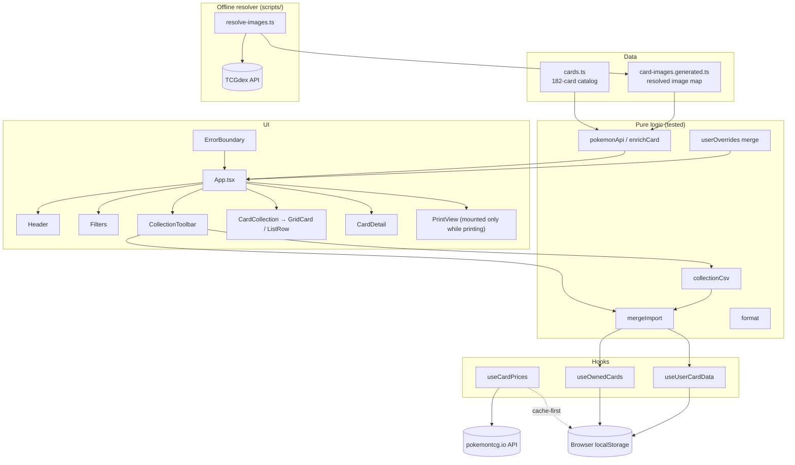

# Architecture Overview

## System Diagram

## Component Descriptions

### App (composition root)
- **Purpose**: Wires hooks + libs into the UI; owns cross-tree state (filters, view, sort, open card id) and the export/import handlers.
- **Location**: `src/App.tsx`
- **Key responsibilities**: builds `enriched` (cards × prices × images), maps `applyUserOverrides` → `displayed`, derives filtered/grouped lists and the collection-value total, opens the detail view by id so live edits reflect.

### Data layer
- **Purpose**: The static Snorlax catalog and the offline-resolved image map.
- **Location**: `src/data/cards.ts` (182 cards + era/language constants), `src/data/card-images.generated.ts` (committed artifact: `{ base, proxy }` per card).
- **Key responsibilities**: single source of truth for card identity; image URLs without runtime resolution.

### Offline image resolver
- **Purpose**: Resolve every card to a TCGdex scan (or a labeled English proxy) once, reviewably, instead of guessing in the browser.
- **Location**: `scripts/resolve-images.ts` composing `lib/tcgdexClient`, `lib/setMapper`, `lib/imageResolver`, `lib/resolveUtils`.
- **Key responsibilities**: set-name → TCGdex-set-id mapping, exact set+number+language matching with a Snorlax-name guard, English-proxy fallback, reverse-holo reuse; writes `card-images.generated.ts`.

### Pricing
- **Purpose**: Live TCGPlayer prices for English cards, served cache-first.
- **Location**: `src/lib/pokemonApi.ts` (`fetchAllCardData`, `pickPriceTier`, `enrichCard`), `src/lib/priceQuery.ts`, `src/lib/priceCache.ts`, `src/hooks/useCardPrices.ts`.
- **Key responsibilities**: batched `id:(…)` query to pokemontcg.io (closes the old pokédex-number gap); `enrichCard` joins static card + resolved image + fetched price; `priceCache` reads/writes a 24h-TTL snapshot in `localStorage["snorlax_prices_v1"]` so repeat visits render instantly and only refresh after the TTL expires.

### Hooks (stateful side effects)
- **Purpose**: Persistence, fetching, and the print lifecycle, isolated from UI.
- **Location**: `src/hooks/`
- **Key responsibilities**: `useCardPrices` (cache-first read, then network fetch + cache write), `useOwnedCards` (owned `Set` ↔ `localStorage["snorlax_v3"]`, `toggle`/`replaceOwned`), `useUserCardData` (manual image/price ↔ `localStorage["snorlax_user_v1"]`, size-guarded, `replace*`), `usePrint` (flips a `printing` flag, fires the print dialog in an effect once `PrintView` is committed, and resets on `afterprint`).

### Resilience
- **Purpose**: Keep a render crash recoverable instead of a blank page.
- **Location**: `src/components/ErrorBoundary.tsx` (wraps the app in `src/main.tsx`).
- **Key responsibilities**: catches render errors via `getDerivedStateFromError`, shows a fallback with **Reload** and **Clear saved data & reload** (the latter purges all three `localStorage` keys to recover from corrupted state).

### Card UI
- **Purpose**: Browse, own, and edit cards.
- **Location**: `src/components/`
- **Key responsibilities**: `Header` (stats), `Filters` (era/lang/search/sort/view), `CollectionToolbar` (export/import/print), `CardCollection`→`GridCard`/`ListRow` (a full-bleed overlay `<button>` opens the detail view and a sibling owned-toggle `<button>` stacks above it — both keyboard-operable, with a clipped focus ring drawn over the card), `CardDetail` (owned toggle + manual image URL/upload + manual price + fetched-price reference), `PrintView` (print-only era-grouped checklist, mounted only while printing).

## Data Flow

1. `useCardPrices` serves a fresh (<24h) price snapshot from `localStorage` if present, otherwise fetches from pokemontcg.io and writes the snapshot back; static cards + the generated image map are bundled.
2. `enrichCard` joins each card with its resolved image and fetched price.
3. `applyUserOverrides` layers per-card manual image/price (from `useUserCardData`) on top → `displayed`.
4. `App` filters/sorts/groups `displayed`; owned state comes from `useOwnedCards`.
5. Export serializes owned + overrides to CSV; import parses + `mergeImport` (file-wins, owned synced) → bulk hook setters → `localStorage`.
6. Print: `usePrint` sets a `printing` flag → `App` mounts `PrintView` → an effect fires the print dialog once the DOM is committed → `afterprint` clears the flag and unmounts it.

## External Integrations

| Service | Purpose | Documentation |
|---------|---------|---------------|
| pokemontcg.io | Live TCGPlayer prices for English cards (runtime) | https://docs.pokemontcg.io |
| TCGdex | Card scans incl. non-English & TCG Pocket (offline resolver only) | https://tcgdex.dev |

## Key Architectural Decisions

### Hybrid image strategy (build-time images, runtime prices)
- **Context**: pokemontcg.io misses many cards and has no non-English scans; resolving in-browser is slow and unreviewable.
- **Decision**: Resolve images offline into a committed `card-images.generated.ts`; fetch only prices at runtime.
- **Rationale**: Images never change, so baking them makes the app fast and the resolution auditable in a diff; prices stay fresh.

### Pure-logic libs + thin hooks + presentational components
- **Context**: Behavior-preserving refactors and new features needed confidence without a backend.
- **Decision**: All non-trivial logic (CSV codec, merge rule, enrichment, resolver) lives in pure, unit-tested `src/lib` modules; hooks own persistence; components are thin.
- **Rationale**: The risky logic is testable in isolation; UI changes can't silently break it.

### localStorage-only persistence + CSV portability
- **Context**: No accounts/backend, but users want their collection on multiple devices.
- **Decision**: Owned and manual overrides persist to namespaced `localStorage` keys; a CSV export/import moves state between devices (merge, file wins on conflicts).
- **Rationale**: Zero infrastructure; the CSV doubles as a portable backup.

### Print on demand instead of an always-mounted hidden view
- **Context**: The print checklist renders all 182 cards. An always-mounted, CSS-hidden `PrintView` keeps that subtree in the DOM on every interaction.
- **Decision**: `usePrint` mounts `PrintView` only while printing, fires `window.print()` from an effect after React commits the node, and unmounts on `afterprint`. `printFn` lives in a ref so re-renders don't re-trigger the dialog.
- **Rationale**: No permanent hidden DOM cost during normal use, and the print dialog is guaranteed to see a fully-rendered checklist because the effect runs post-commit.
