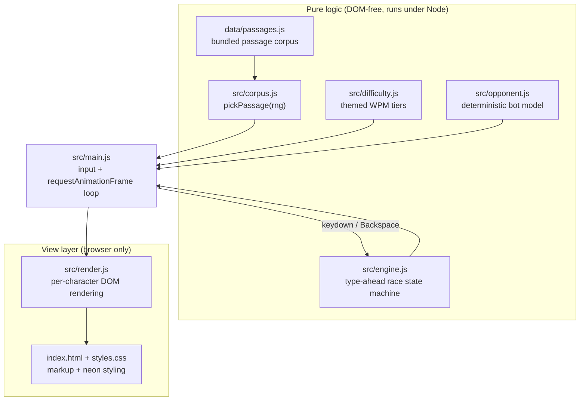

# Architecture

## System Diagram

## Component Descriptions

### Race engine
- **Purpose**: The pure state machine for a single race — what a keystroke does, how far the player has progressed, and the live stats.
- **Location**: `src/engine.js`
- **Key responsibilities**: `createRace` builds the per-character state; `pressKey`/`backspace` mutate it under the type-ahead model; `playerProgress` derives the racer's position from the count of correct characters; `accuracy`, `playerWpm`, and `playerCpm` compute stats; `raceOutcome` resolves first-to-finish and ties.

### Deterministic opponent
- **Purpose**: A computer racer whose position is a pure, deterministic function of elapsed time and a target words-per-minute — no randomness, no keystroke simulation.
- **Location**: `src/opponent.js`
- **Key responsibilities**: `wpmToCps` converts WPM to characters/second (1 word = 5 chars); `botProgress` returns the clamped 0–1 fraction at a given elapsed time; `botFinishMs` reports the finish time.

### Difficulty tiers and corpus
- **Purpose**: The selectable themed opponents and the text being raced.
- **Location**: `src/difficulty.js`, `src/corpus.js`, `data/passages.js`
- **Key responsibilities**: `TIERS` defines five ghost tiers (40–160 WPM) plus `clampWpm` for custom speeds; `pickPassage` selects a passage, with an injectable RNG so tests are deterministic.

### View + wiring
- **Purpose**: Everything that touches the DOM.
- **Location**: `src/render.js` (rendering), `src/main.js` (input + loop), `index.html`, `styles.css`
- **Key responsibilities**: `render.js` paints each character by state (correct / wrong / wrong-space / caret / rest) and updates the live HUD and racers; `main.js` owns difficulty selection, the countdown, the `requestAnimationFrame` race loop, keystroke + Backspace handling, and the results screen.

## Data Flow

1. The player picks a ghost tier (or a custom WPM) on the difficulty screen.
2. `main.js` calls `pickPassage()` and `createRace(passage)`, shows the race screen, and runs a 3-2-1-GO countdown.
3. On "GO", a `requestAnimationFrame` loop starts. Each frame it computes `botProgress(elapsed, wpm, totalChars)` and `playerProgress(state)`, positions both racers, and refreshes the live WPM/CPM HUD.
4. Each keystroke flows through `pressKey` (or `backspace`); `render.js` repaints the passage so correct characters glow, mistakes show red, and a caret marks the cursor.
5. When `raceOutcome` reports a winner, the loop stops and the results screen shows final WPM, CPM, accuracy, and time.

## External Integrations

| Service | Purpose | Notes |
|---------|---------|-------|
| Vercel | Static hosting for the production site | No build step; the repo root is served as-is. |

## Key Architectural Decisions

### Logic / DOM split for testability
- **Context**: Typing-game rules (progress, scoring, win conditions) are easy to get subtly wrong and tedious to verify by clicking.
- **Decision**: Keep `corpus`, `difficulty`, `opponent`, and `engine` completely DOM-free; isolate all DOM access to `render.js` and `main.js`.
- **Rationale**: The same modules import cleanly under Node, so the entire rule set is covered by fast `node:test` unit tests. The browser only ever exercises thin glue, where bugs are visible by eye.

### Deterministic opponent instead of a simulated typist
- **Context**: The computer needs to feel like a fair, consistent racer across runs.
- **Decision**: Model the bot's progress as `wpmToCps(wpm) * elapsed`, clamped to 0–1 — a pure function of time, not a stateful keystroke simulator.
- **Rationale**: It is reproducible (a given elapsed time always yields the same position), trivially unit-testable with no timing flakiness, and lets the on-screen WPM map exactly to a finish time. The live clock only enters in the render loop.

### Type-ahead typing with correctness-driven progress
- **Context**: An earlier "block until corrected" model gave almost no feedback — a rejected key, especially a missed space, looked like nothing happened.
- **Decision**: Let every keystroke register and advance the cursor (mistakes shown in red, fixable with Backspace), but drive the racer's position by the count of *correct* characters.
- **Rationale**: Players see exactly what they typed, while the race stays skill-based — mashing keys can't win, and uncorrected mistakes visibly stall the racer until fixed.

### No build step, native ES modules
- **Context**: The project is small and should deploy anywhere with zero ceremony.
- **Decision**: Ship hand-written ES modules loaded directly by the browser (`<script type="module">`), with no bundler or transpiler.
- **Rationale**: Nothing to configure or break, instant local serving, and any static host (here, Vercel) serves the repo root directly. The same modules run under Node for tests without a compile step.
