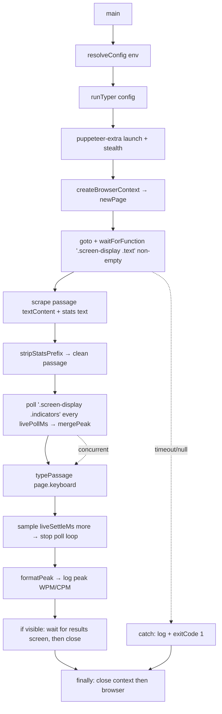

# Architecture

## System Diagram

## Component Descriptions

### Orchestrator
- **Purpose**: Owns the browser session and sequences the run: launch → isolated context → wait for readiness → scrape → poll for peak live speed while typing → report peak → guaranteed teardown.
- **Location**: `FlashTyper.js`
- **Key responsibilities**: Registers the stealth plugin once at module load; exposes `runTyper(config)` and a `main()` entry point; wraps the whole run in `try/catch/finally` so the browser always closes; holds the stable DOM selectors (passage, stats); runs a concurrent poll loop that samples the live `.indicators` stats every `livePollMs` and folds each sample into the running peak, continuing for `liveSettleMs` after typing before stopping and logging the peak; closes the default-context blank page so a headful run shows a single window, and keeps a visible window up only until the site redirects to its results screen (capped by `holdOpenMs`) before tearing down.

### Configuration
- **Purpose**: Turns environment variables into a single typed config object so behavior is changed without touching code.
- **Location**: `src/config.js`
- **Key responsibilities**: `resolveConfig(env)` resolves the target URL, Chrome executable path, headless flag, per-keystroke delay, the passage-wait timeout, the live-stats poll interval (`livePollMs`) and post-typing settle window (`liveSettleMs`), and the cap on how long a visible window waits for the results screen before closing (`holdOpenMs`), applying safe defaults and numeric parsing with fallbacks.

### Scrape cleanup
- **Purpose**: Extracts the passage to type from the raw text content of the test display, which is prefixed with the live stats bar.
- **Location**: `src/text.js`
- **Key responsibilities**: `stripStatsPrefix(rawText, statsText)` removes the stats prefix — slicing an exact live-read stats string when available, or falling back to a regex that strips a leading run of stat tokens only when a numeric value is present.

### Typing loop
- **Purpose**: Replays a string as keyboard input against an injectable keyboard interface.
- **Location**: `src/typer.js`
- **Key responsibilities**: `typePassage(keyboard, text, { delayMs })` iterates by code point, presses Enter on the return marker (`⏎`) and types every other character with the configured delay.

### Live-stats peak tracking
- **Purpose**: Parses the site's live stats readout and tracks the highest speed seen across samples, since the end-of-test screen caps superhuman runs while the live readout shows the real burst figure.
- **Location**: `src/stats.js`
- **Key responsibilities**: `parseLiveStats(text)` extracts the current WPM and CPM from the live `.indicators` text; `mergePeak(peak, sample)` folds a sample into the running peak element-wise (per-field max, null-safe); `formatPeak(peak)` renders the peak as a one-line `"<wpm> WPM, <cpm> CPM"` string for logging.

## Data Flow

1. `main()` calls `resolveConfig(process.env)` to build the run configuration.
2. `runTyper()` launches a stealth-patched Chromium and opens a page inside a fresh, isolated browser context.
3. It navigates to the test URL and waits — via `waitForFunction` — for the passage node (`.screen-display .text`) to actually contain non-empty text, rather than sleeping a fixed amount of time or settling for the node merely existing.
4. It reads the passage's text content and, separately, the stats bar text; `stripStatsPrefix` produces the clean passage.
5. Before typing it starts a concurrent poll loop that reads the live `.indicators` stats every `livePollMs`, parsing each sample with `parseLiveStats` and folding it into the running peak via `mergePeak`.
6. It types one throwaway key to start the timed test, then `typePassage` replays the passage keystroke by keystroke — the poll loop runs the whole time.
7. After typing it keeps sampling for `liveSettleMs` to catch the post-burst spike, then stops the loop and logs the peak via `formatPeak`. There's no results-screen wait or parse — the live peak is the reported figure.
8. In a visible window, it waits for the site to redirect to its results screen and then closes (capped by `holdOpenMs` so it never hangs); no-op when headless.
9. A `finally` block stops the poll loop and closes the context and the browser on every path — success, error, or timeout.

## External Integrations

| Service | Purpose | Notes |
|---------|---------|-------|
| thetypingcat.com | The typing-speed test the tool drives | Public web page; no auth. The scrape relies on semantic class names, not generated style hashes, to tolerate UI churn. |
| Chromium (via Puppeteer) | The browser that's automated | Bundled with Puppeteer by default; overridable with `CHROME_PATH`. Driven through `puppeteer-extra` with the stealth plugin. |

## Key Architectural Decisions

### Thin orchestrator over pure, injectable modules
- **Context**: The original implementation was a single inline async function that mixed browser control, scraping, text cleanup, and the typing loop — none of it testable without a live browser.
- **Decision**: Extract configuration, stats stripping, and the keystroke loop into pure modules, and have the typing loop accept an injected keyboard interface.
- **Rationale**: The interesting logic (prefix stripping, Enter handling, delay passthrough) is now covered by fast unit tests with a fake keyboard. The alternative — testing everything through Puppeteer — would be slow and flaky for logic that has nothing to do with a browser.

### Offline HTML fixture for the end-to-end test
- **Context**: I wanted an integration test that proves the real scrape-then-type pipeline works, but live-site tests are non-deterministic and break when the site changes or the network is slow.
- **Decision**: Ship a small local HTML fixture that mirrors the test page's structure and drive real Chromium against it over a `file://` URL.
- **Rationale**: The test exercises the genuine Puppeteer keyboard and DOM-scrape path, asserts the exact typed output (including the `⏎`→Enter newline), and runs deterministically with no network. The orchestrator's lifecycle/teardown is covered by a second test against the same fixture.

### Dynamic stats stripping instead of a hardcoded replace
- **Context**: The display text is the stats bar concatenated with the passage. The original code stripped it with a hardcoded literal of the exact stats string, which breaks the moment any score or label changes.
- **Decision**: Prefer slicing a live-read stats string; fall back to a regex that only strips a leading stat run when it contains a numeric token.
- **Rationale**: The numeric gate is the key detail — it prevents over-stripping a passage that legitimately begins with a word like "Time" or "Accuracy", while still removing the real glued stats bar.

### Stable semantic selector over generated style hashes
- **Context**: The page is built with styled-components, whose generated class names (e.g. `…hXkFOq`) change on every rebuild. The original selector chained several of those hashes.
- **Decision**: Target the human-authored `.screen-display .text` class path — the inner `.text` node holds the passage, while the container also carries the live `.indicators` stats table.
- **Rationale**: Semantic class names are far stickier than build-generated hashes, so the scrape survives routine site rebuilds; scoping to the inner `.text` node avoids pulling the stats table into the scrape in the first place.

### Peak live speed over the capped final result
- **Context**: The site re-averages and caps superhuman runs at the end of the test. A passage burst-typed in a second briefly shows thousands of WPM in the live stats bar, but the end-of-test screen reports a low, capped final number — so reading that screen would understate what actually happened.
- **Decision**: Ignore the end-of-test screen entirely and instead sample the live `.indicators` readout concurrently while typing, keep the element-wise maximum across samples, and continue sampling for a short settle window after typing to catch the post-burst spike.
- **Rationale**: The live readout is the only place the real burst figure surfaces, and the peak across samples is the honest measure of how fast the run actually went. Sampling concurrently (rather than once at the end) is what makes the spike observable at all; the settle window covers the brief lag between the last keystroke and the readout peaking.

### Wait for populated content, not just a present node
- **Context**: The `.text` container mounts immediately but is filled asynchronously, so a plain `waitForSelector` can resolve against an empty node and scrape nothing.
- **Decision**: Use `waitForFunction` to block until the node exists *and* its trimmed text content is non-empty, then re-guard with a null check before scraping.
- **Rationale**: This keys the wait on real readiness rather than DOM attachment, eliminating a race that would otherwise yield an empty passage on slower loads.

### Guaranteed teardown in an isolated context
- **Context**: The original run had no error handling and never closed the browser, leaking a headful Chromium process on every failure.
- **Decision**: Open the page from a fresh `createBrowserContext()` and close both context and browser in a `finally` block; signal failure via `process.exitCode`.
- **Rationale**: No orphaned processes on any path, and each run gets a clean, cookieless session. The isolated context makes the intent explicit instead of silently using the default one.

### One window despite the isolated context
- **Context**: `puppeteer.launch()` always opens a blank page in the *default* browser context. Opening the real page in a separate `createBrowserContext()` meant a headful run showed two windows — the stray blank one and the actual test page.
- **Decision**: Capture the default context's pages right after launch and close them once the isolated-context page exists.
- **Rationale**: Keeps the clean-session benefit of the isolated context without the confusing second window. Reusing the default page instead would have given up the isolation; suppressing the window via flags would have been more brittle than just closing the page I don't need.

### Close on the results redirect, not a fixed timer
- **Context**: After typing, a visible window used to stay open for a fixed two minutes so the result could be read — long after the run was actually over.
- **Decision**: Wait for the site to navigate to its results screen (`.typing-speed-test-result`) and close immediately when it appears, with `holdOpenMs` only as a safety cap so the wait can never hang.
- **Rationale**: The results redirect is the real "run finished" signal, so keying the close on it means the window lingers exactly as long as the test actually takes — no arbitrary delay, no hang if the screen never shows.
