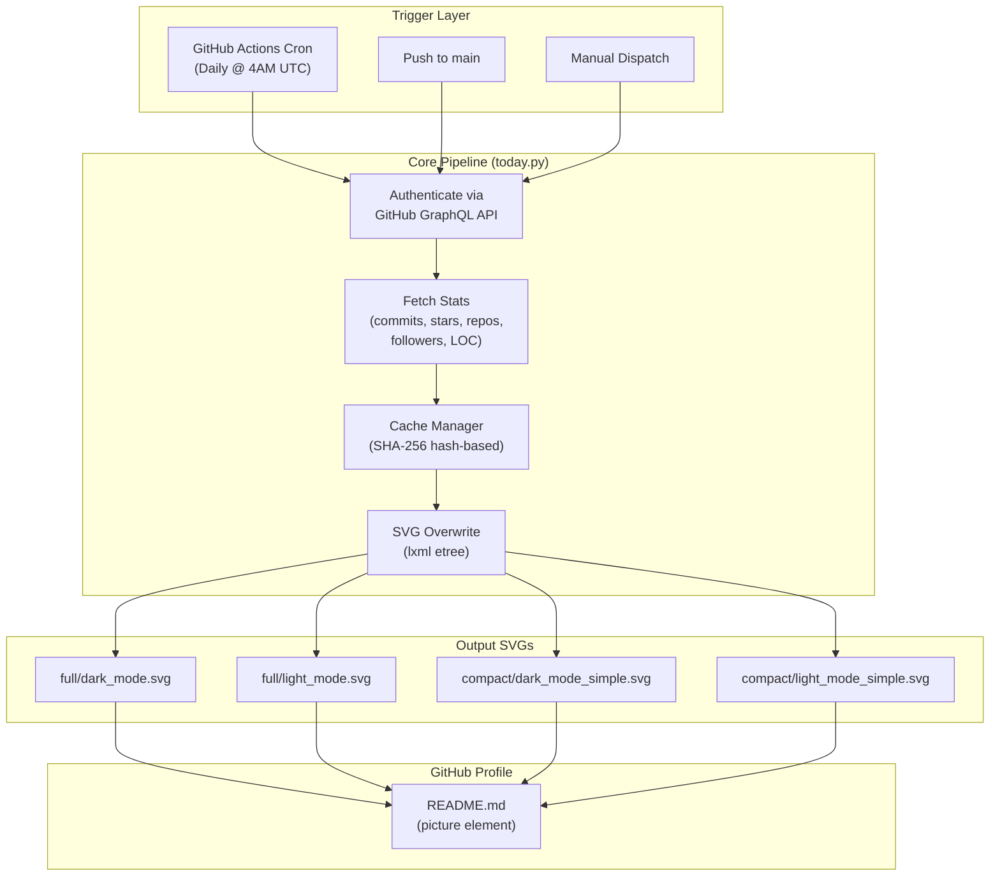

# Architecture Overview

## System Diagram

## Component Descriptions

### `scripts/today.py` - Main Stats Pipeline
- **Purpose**: Orchestrates the entire data fetching, caching, and SVG update pipeline
- **Location**: `scripts/today.py`
- **Key responsibilities**:
  - Authenticates with the GitHub GraphQL v4 API using a personal access token
  - Fetches user account data, commit counts, star counts, repo counts, follower counts, and lines of code
  - Manages a per-user cache file to avoid re-querying unchanged repos
  - Parses and updates 4 SVG files with the latest stats using lxml's etree
  - Implements retry logic with exponential backoff for gateway errors

### `scripts/generate_ascii.py` - ASCII Art Generator
- **Purpose**: Converts images to ASCII art formatted for SVG embedding
- **Location**: `scripts/generate_ascii.py`
- **Key responsibilities**:
  - Opens and resizes images using Pillow
  - Maps pixel brightness to ASCII characters
  - Outputs either plain text or SVG `<tspan>` elements

### `.github/workflows/build.yaml` - CI/CD Workflow
- **Purpose**: Automates the stats update pipeline
- **Location**: `.github/workflows/build.yaml`
- **Key responsibilities**:
  - Runs on push, daily schedule (4 AM UTC), and manual dispatch
  - Sets up Python 3.12 with pip caching
  - Executes `today.py` and commits/pushes any SVG changes

### SVG Templates (compact/ and full/)
- **Purpose**: Visual banners that display on the GitHub profile
- **Key responsibilities**:
  - Render an animated ASCII art logo with cascading opacity pulses
  - Display dynamic stats (commits, stars, LOC, repos, followers) in styled text
  - Support dark/light theme variants via GitHub's `prefers-color-scheme`

### Cache System (cache/)
- **Purpose**: Persists per-repository LOC data to minimize API calls
- **Location**: `cache/*.txt`
- **Key responsibilities**:
  - Stores SHA-256 hashes of repo names with commit count and LOC data
  - Only re-fetches repos whose commit count has changed since last run
  - Handles cache invalidation when repository count changes

## Data Flow

1. **Trigger**: GitHub Actions fires (cron, push, or manual dispatch)
2. **Authentication**: `today.py` reads `ACCESS_TOKEN` and `USER_NAME` from environment, authenticates with GitHub GraphQL API
3. **User Data**: Fetches user ID and account creation date via `user_getter()`
4. **LOC Calculation**: `loc_query()` fetches all repos, `cache_builder()` checks each against the cache, and `recursive_loc()` re-counts only repos with new commits (50 commits per paginated request)
5. **Stats Aggregation**: Parallel queries fetch commit counts, star counts, repo counts, contributed repo counts, and follower counts
6. **SVG Update**: `svg_overwrite()` parses each SVG file with lxml, finds elements by ID, and updates their text content with formatted stats, adjusting dot-leader justification
7. **Commit**: The workflow stages all changes and pushes to `main`, making the updated SVGs immediately visible on the GitHub profile

## External Integrations

| Service | Purpose | Documentation |
|---------|---------|---------------|
| GitHub GraphQL API v4 | Fetch commits, stars, repos, followers, LOC | [GitHub GraphQL Docs](https://docs.github.com/en/graphql) |
| GitHub Actions | Automated daily pipeline execution | [Actions Docs](https://docs.github.com/en/actions) |

## Key Architectural Decisions

### SVG as Dynamic Display Format
- **Context**: GitHub profile READMEs can only render images, not dynamic HTML/JS
- **Decision**: Use SVG files with embedded text elements that are programmatically updated
- **Rationale**: SVGs are the only format GitHub renders that supports styled text, animation, and can be updated server-side. The `<animate>` elements create visual interest without JavaScript.

### Hash-Based Cache for LOC Counting
- **Context**: Counting lines of code across 80+ repositories requires hundreds of API calls
- **Decision**: Cache LOC data per-repo using SHA-256 hashes of repo names, only re-querying when commit counts change
- **Rationale**: Reduces API calls from hundreds to a handful on most runs. The cache file format (hash, commit_count, my_commits, additions, deletions) allows selective invalidation.

### GraphQL over REST API
- **Context**: Need to fetch multiple types of data (commits, stars, repos, followers, LOC)
- **Decision**: Use GitHub's GraphQL v4 API instead of REST v3
- **Rationale**: GraphQL allows fetching exactly the needed fields in fewer requests, critical for staying within rate limits when paginating through commit histories.
