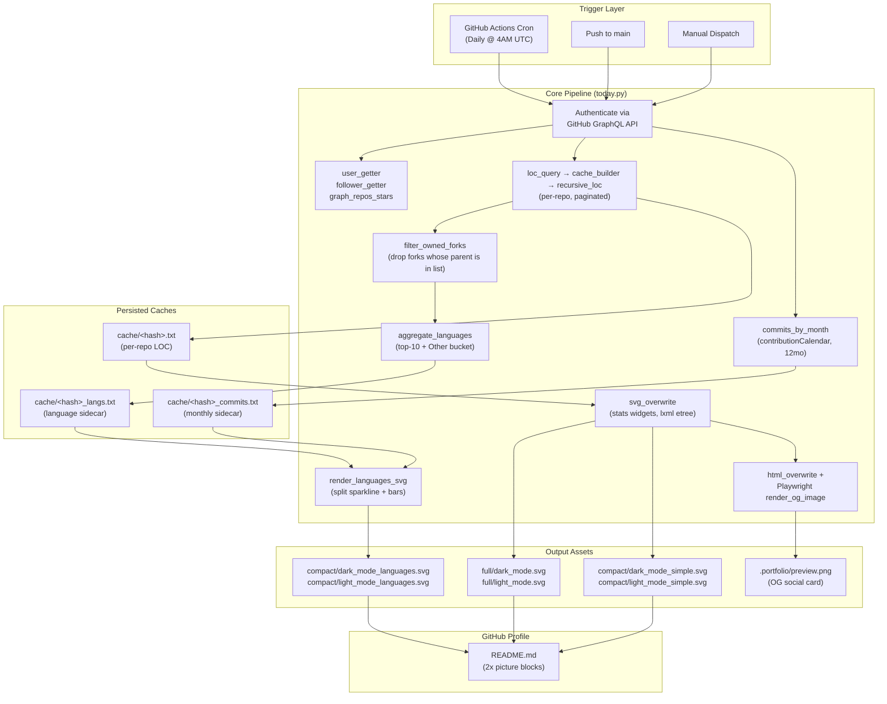

# Architecture Overview

## System Diagram

```mermaid
flowchart TD
    subgraph Trigger["Trigger Layer"]
        CRON["GitHub Actions Cron<br/>(Daily @ 4AM UTC)"]
        PUSH["Push to main"]
        MANUAL["Manual Dispatch"]
    end

    subgraph Core["Core Pipeline (today.py)"]
        AUTH["Authenticate via<br/>GitHub GraphQL API"]
        FETCH_USER["user_getter<br/>follower_getter<br/>graph_repos_stars"]
        FETCH_LOC["loc_query → cache_builder → recursive_loc<br/>(per-repo, paginated)"]
        FILTER_FORKS["filter_owned_forks<br/>(drop forks whose parent is in list)"]
        AGG_LANG["aggregate_languages<br/>(top-10 + Other bucket)"]
        FETCH_COMMITS["commits_by_month<br/>(contributionCalendar, 12mo)"]
        SVG_SIMPLE["svg_overwrite<br/>(stats widgets, lxml etree)"]
        SVG_LANG["render_languages_svg<br/>(split sparkline + bars)"]
        OG_HTML["html_overwrite +<br/>Playwright render_og_image"]
    end

    subgraph Caches["Persisted Caches"]
        C_REPO["cache/&lt;hash&gt;.txt<br/>(per-repo LOC)"]
        C_LANGS["cache/&lt;hash&gt;_langs.txt<br/>(language sidecar)"]
        C_COMMITS["cache/&lt;hash&gt;_commits.txt<br/>(monthly sidecar)"]
    end

    subgraph Output["Output Assets"]
        FULL_D["full/dark_mode.svg<br/>full/light_mode.svg"]
        COMP_D["compact/dark_mode_simple.svg<br/>compact/light_mode_simple.svg"]
        COMP_L["compact/dark_mode_languages.svg<br/>compact/light_mode_languages.svg"]
        OG_PNG[".portfolio/preview.png<br/>(OG social card)"]
    end

    subgraph Display["GitHub Profile"]
        README["README.md<br/>(2x picture blocks)"]
    end

    CRON --> AUTH
    PUSH --> AUTH
    MANUAL --> AUTH
    AUTH --> FETCH_USER
    AUTH --> FETCH_LOC
    AUTH --> FETCH_COMMITS
    FETCH_LOC --> FILTER_FORKS
    FILTER_FORKS --> AGG_LANG
    FETCH_LOC --> C_REPO
    AGG_LANG --> C_LANGS
    FETCH_COMMITS --> C_COMMITS
    C_REPO --> SVG_SIMPLE
    C_LANGS --> SVG_LANG
    C_COMMITS --> SVG_LANG
    SVG_SIMPLE --> FULL_D
    SVG_SIMPLE --> COMP_D
    SVG_LANG --> COMP_L
    SVG_SIMPLE --> OG_HTML
    OG_HTML --> OG_PNG
    FULL_D --> README
    COMP_D --> README
    COMP_L --> README
```

## Component Descriptions

### `scripts/today.py` — Main Stats Pipeline
- **Purpose**: Orchestrates data fetching, caching, aggregation, and SVG/PNG rendering
- **Location**: `scripts/today.py`
- **Key responsibilities**:
  - Authenticates with the GitHub GraphQL v4 API using a fine-grained personal access token
  - Fetches user metadata, contribution calendar (12 months), per-repo LOC, top languages
  - Filters out owned forks whose upstream parent is also in the user's repo list (avoids double-counting commits)
  - Persists three caches: main per-repo LOC + per-language sidecar + per-month commits sidecar
  - Renders four SVG variants (full + compact stats widgets) and a split-layout languages widget
  - Renders an OG preview PNG via Playwright + Chromium for social card metadata

### `filter_owned_forks(edges)`
- **Purpose**: De-duplicates the same commits appearing in both an original repo and the user's fork
- **Location**: `scripts/today.py`
- **Why**: Querying with `OWNER+COLLABORATOR+ORGANIZATION_MEMBER` affiliations can return both the original (where the user collaborates) and the user's fork (which they own). The commits are identical → double-counted LOC. The filter drops any fork whose `parent.nameWithOwner` is also in the same edge list.

### `recursive_loc()` with SKIP-cache fallback
- **Purpose**: Walks a repo's commit history via GraphQL, counting user-authored additions/deletions
- **Resilience**: 5 retries with exponential backoff on 502/503/504 gateway errors AND on `200`-with-empty-body JSON decode failures. If all retries are exhausted, returns the `'SKIP'` sentinel instead of raising — `cache_builder` then writes the row with the live `totalCount` and **preserves the prior LOC values** so a temporary GitHub outage doesn't zero out the displayed stats. Self-healing: the next push to a SKIP-cached repo bumps `totalCount`, invalidates the row, and triggers a fresh attempt.

### `aggregate_languages(edges, data)`
- **Purpose**: Builds the language buckets for the right panel of the languages SVG
- **Location**: `scripts/today.py`
- **Behavior**: Walks the (already fork-filtered) edges, sums each repo's additions into its `primaryLanguage.name` bucket, skips null-primaryLanguage repos. Returns top 9 plus a single `Other` bucket when there are 11+ distinct languages, else returns all languages — max 10 rows total.

### `commits_by_month(months=12)`
- **Purpose**: Per-calendar-month contribution counts for the sparkline
- **Why `contributionCalendar` and not `totalCommitContributions`**: the latter only counts commits to repos the user owns or has explicit access to, dramatically undercounting OSS contributions. `contributionCalendar` mirrors the green graph on github.com/Technical-1 directly.

### `render_languages_svg(commits, buckets, mode, output_path)`
- **Purpose**: Renders the split-panel languages widget (commits sparkline left, languages bars right)
- **Layout**: 850×255 SVG. Left panel: 12 vertical `<rect>` bars in lighter-mint GitHub-contribution green (`#7ee787` dark / `#40c463` light), month-initial labels, "Last 12mo: X contributions" total. Right panel: up to 10 rows of `. <name>   <bar>  <count> (<pct>%)` with GitHub's official `primaryLanguage.color` per bar (Other uses mode-appropriate `.cc` gray). Sub-1% values render with one decimal so they don't show as `0%`.

### `svg_overwrite()` — Existing Stats Widgets
- **Purpose**: Updates the compact + full stats SVGs (Commits/Repos/Stars/Followers/LOC text labels)
- **Mechanism**: lxml etree finds tspans by `id` attribute, overwrites text content, adjusts dot-leader justification

### `html_overwrite()` + `render_og_image()` — OG Preview Pipeline
- **Purpose**: Generates `.portfolio/preview.png` for social card embeds (iMessage, Twitter, LinkedIn)
- **Mechanism**: Regex-substitutes stat values into `og-preview.html`, then Playwright + Chromium snapshots the page at 2× retina

### `.github/workflows/build.yaml` — CI/CD Workflow
- **Purpose**: Automates the daily refresh
- **Runs on**: push to main, daily cron (4 AM UTC), manual `workflow_dispatch`
- **Action versions** (bumped May 2026 ahead of GitHub's Node 24 cutoff): `actions/checkout@v6`, `actions/setup-python@v6`, `actions/cache@v5`

### Cache System (`cache/`)
- **Per-user LOC cache**: `cache/<sha256(USER_NAME)>.txt` — one row per repo: `<repo_hash> <commit_count> <my_commits> <additions> <deletions>`
- **Language sidecar**: `cache/<sha256(USER_NAME)>_langs.txt` — `<rank> "<language>" <hex_color> <additions>` per row (names quoted to handle spaces like "Jupyter Notebook")
- **Commits sidecar**: `cache/<sha256(USER_NAME)>_commits.txt` — `<yyyy_mm> <count>` per row, 12 monthly rows
- `flush_cache` preserves LOC values by hash when the edge list shrinks (added/removed repo, fork filter activated) so a changing repo set doesn't wipe cached data

## Data Flow

1. **Trigger**: GitHub Actions fires (cron / push / manual dispatch)
2. **Auth**: `today.py` reads `ACCESS_TOKEN` and `USER_NAME` from environment, authenticates with GitHub GraphQL
3. **User metadata**: `user_getter` returns `OWNER_ID` (used to filter commits by author) and account creation date
4. **LOC pipeline**: `loc_query` paginates the user's repos with primaryLanguage info, `filter_owned_forks` drops self-forks, `cache_builder` walks each repo, calling `recursive_loc` only for repos whose commit count changed since the last cached run. Failed repos are SKIP-cached with prior LOC preserved.
5. **Language aggregation**: `aggregate_languages` runs inside `cache_builder` (as a side effect) and writes the language sidecar
6. **Contribution sparkline**: `commits_by_month` issues a single GraphQL call for the last 12 months of `contributionCalendar` and writes the commits sidecar
7. **Stats fan-out**: parallel queries for `commit_counter` (cache-derived), `star_count`, `repo_count`, `contrib_count`, `follower_count`
8. **Render**: `svg_overwrite` updates the four stats SVGs; `render_languages_svg` builds the two languages SVGs from the sidecars; `html_overwrite` + Playwright generates the OG preview PNG
9. **Commit**: workflow stages all changed files (SVGs, caches, preview.png) and pushes to main, immediately updating the profile

## External Integrations

| Service | Purpose | Documentation |
|---------|---------|---------------|
| GitHub GraphQL API v4 | Fetch user data, commits, stars, repos, followers, LOC, languages, contributions | [GitHub GraphQL Docs](https://docs.github.com/en/graphql) |
| GitHub Actions | Daily cron pipeline, runs `today.py` on `ubuntu-latest` | [Actions Docs](https://docs.github.com/en/actions) |
| Playwright + Chromium | Renders `og-preview.html` to `preview.png` for OG social card | [Playwright Python Docs](https://playwright.dev/python/) |

## Key Architectural Decisions

### SVG as Dynamic Display Format
- **Context**: GitHub profile READMEs render images but not HTML/JS
- **Decision**: Use SVG files with text elements updated server-side by the workflow
- **Rationale**: SVG is the only format GitHub renders that supports styled text, animation, and theme switching via `<picture media="prefers-color-scheme: dark">`. Embedded `<animate>` elements provide visual life without JS.

### Hash-Based LOC Cache
- **Context**: Per-commit pagination across 100+ repos would cost hundreds of API calls per run
- **Decision**: Cache LOC per-repo keyed by `sha256(nameWithOwner)`, only re-query when commit count differs
- **Rationale**: Reduces a full run from ~10 minutes / 100+ calls to ~1.5 minutes / 30 calls on typical days.

### SKIP-Cache for Persistent GraphQL Failures
- **Context**: One large repo (`AkshayAshok2/property-probe`, 8.6M LOC) consistently triggered GitHub backend timeouts (502s) for its commit-history pagination. Retries didn't help; the repo would fail the same way every day.
- **Decision**: After 5 retries on persistent gateway errors OR `200`-with-empty-body, return a `'SKIP'` sentinel. `cache_builder` writes the row with the live `totalCount` but **keeps the prior LOC values**, so the row appears "fresh" next run and `recursive_loc` isn't called again until the repo gets new commits.
- **Rationale**: Treats each problematic repo as a one-time ~93s cost (the retries), then ~0s for every subsequent run. Self-healing: if GitHub recovers OR the repo gets pushed to, the row invalidates and a fresh attempt happens. Prevents the 5-week failure cascade that this fix resolved.

### Parent-Aware Fork Filtering
- **Context**: Querying with `OWNER+COLLABORATOR+ORGANIZATION_MEMBER` affiliations returned both the original `AkshayAshok2/property-probe` AND the user's fork `Technical-1/property-probe`. Both contained the same user-authored commits → counted twice (~8.6M LOC × 2 = 17M overcount).
- **Decision**: Add `isFork` and `parent.nameWithOwner` to the GraphQL query. After accumulating all edges, drop any fork whose parent is also in the user's repo list. Forks of unrelated upstream projects are kept (they're the only place the user's work appears).
- **Rationale**: Honest LOC count without losing legitimate fork contributions. Filter is applied identically in `loc_query` and `graph_repos_stars` for consistent repo counts across widgets.

### `contributionCalendar` over `totalCommitContributions`
- **Context**: GitHub's API offers both metrics. `totalCommitContributions` is described as "commit-only" but excludes commits to public repos the user doesn't own — a major undercount for OSS contributors.
- **Decision**: Use `contributionCalendar.contributionCount` (all contribution types: commits + PRs + issues + reviews) and label the widget "Contributions / month"
- **Rationale**: Matches the green contribution graph on the user's GitHub profile directly. Honest labeling — the metric is broader than commits but accurately so.

### GraphQL over REST
- **Context**: Multiple data types (commits, stars, repos, languages, contributions) needed
- **Decision**: Use GitHub's GraphQL v4 API
- **Rationale**: GraphQL allows fetching exactly the needed fields in fewer requests, critical for staying under rate limits when paginating commit histories.
