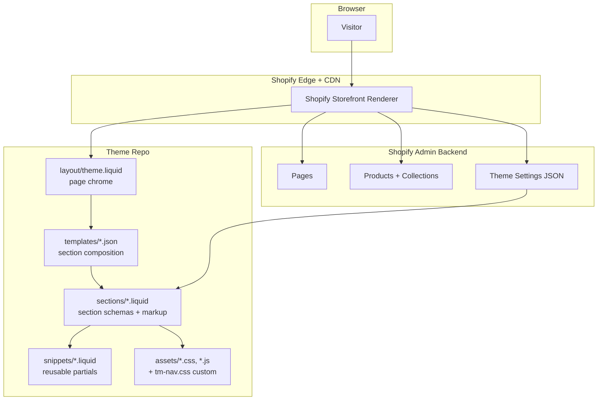

# Architecture

This is a Shopify theme repository customizing the stock Craft theme (v15.3.0) for Terra Moda, a Frederick MD boutique. The architecture is deliberately "Craft plus a thin layer of custom code" rather than a from-scratch rebuild. The interesting structural choices are about *where* to draw the line between configuration, JSON section composition, and custom Liquid.

## System Diagram

## Component descriptions

### `templates/index.json` (the homepage)
- **Purpose**: Composes the entire home page as an ordered list of six sections. The whole page is data, not markup.
- **Location**: `templates/index.json`
- **Key responsibilities**: Defines `hero`, `categories`, `new_arrivals`, `why`, `lasegreta`, `visit`. Each entry picks a section type (`image-banner`, `collection-list`, `featured-collection`, `multicolumn`, `custom-liquid`) and supplies its settings inline.

### `templates/page.our-story.json` and `templates/page.contact.json`
- **Purpose**: Custom page templates so the brand story and contact pages can use composed sections rather than the default body-only `page` template.
- **Location**: `templates/page.our-story.json`, `templates/page.contact.json`
- **Key responsibilities**: `page.our-story` composes a five-section narrative (founder copy, three image-with-text values, a "We Believe In" header). `page.contact` pairs a branded intro hero with the native `contact-form` section.
- **Note**: A Shopify page renders these templates only when the Page entity in admin selects them. They can also be previewed at request time with `?view=<suffix>` (e.g., `/pages/our-story?view=our-story`), which is how the rebuild is reviewed before the owner reassigns templates in admin.

### `sections/*.liquid`
- **Purpose**: Section schemas + Liquid markup. Mostly stock Craft. Two custom sections exist as `custom-liquid` instances inside `templates/index.json`: the La Segreta band (two-panel collection promo) and the Visit Us band (embedded Google Map plus address).
- **Location**: `sections/`
- **Note**: New Liquid section files were intentionally not added. Embedding the custom markup as `custom-liquid` keeps the new components inside the homepage JSON so a non-developer can rearrange them in the theme editor.

### `assets/tm-nav.css`
- **Purpose**: The only custom CSS asset in the repo. Overrides Craft's default `.mega-menu__list` grid (which was squeezing menu items into six columns) and styles a compact button-anchored dropdown.
- **Location**: `assets/tm-nav.css`, loaded from `sections/header.liquid`
- **Key responsibilities**: Single-purpose stylesheet so the nav customization is greppable and removable without touching the rest of Craft's CSS.

### `config/settings_data.json`
- **Purpose**: The live theme settings. Auto-generated and editable from the Shopify admin theme editor. Captures global type scale, color schemes, card styles, section spacing, and which logo and favicon are in use.
- **Location**: `config/settings_data.json`
- **Note**: Touching this file by hand is supported but discouraged, since it round-trips through the admin and gets rewritten.

## Data flow (a homepage request)

1. A visitor hits `theterramoda.com/`. Shopify routes the request to the published theme (or, for preview links, the theme matching `?preview_theme_id=`).
2. The storefront renderer loads `layout/theme.liquid` for the page chrome.
3. Inside the chrome, it loads `templates/index.json`, walks the `order` array, and for each entry instantiates a Liquid section from `sections/`.
4. Each section renders its own markup, pulling settings from the JSON template (block content, layout knobs, color schemes) and from `config/settings_data.json` (global type, spacing, colors).
5. Two of the six homepage sections are `custom-liquid` instances. Their Liquid template literals run through Shopify's `{{ collections[...] }}` and `{{ ... | image_url }}` filters at render time, so they pull live product imagery and collection links without being hard-coded.
6. Assets referenced by sections (including `tm-nav.css`) are concatenated by Shopify's bundler and served from the CDN.

## External integrations

| Service | Purpose | Notes |
|---|---|---|
| Shopify Storefront | Hosting, checkout, products, collections, pages, settings | Underlying platform. No alternative considered. |
| Google Maps Embed | The "Visit Us" map on the homepage and contact page | Iframe `?q=...&output=embed`. No API key required, no SDK loaded, no JS. |
| Shopify Customers | Newsletter email capture | Built-in customer-list signup. Avoids adding a paid email-marketing app. |

## Key architectural decisions

### Customize Craft in place rather than replace the theme
- **Context**: The store had two years of accumulated product metafields, redirects, app integrations, and Shopify-side detail tied to the existing theme. The owner needed a homepage rebuild and a polish pass, not a platform migration.
- **Decision**: Customize the existing Craft theme in this repo. Don't fork it into a separate "theme 2", don't switch to Dawn, don't introduce a paid theme.
- **Rationale**: Theme replacement on Shopify is non-trivial because every section ID, metafield reference, and admin-side template assignment is theme-coupled. A migration would have meant manually rewriting product templates and reassigning every page. The audit found Craft's section library is wide enough to compose the proposed home; only two genuinely new components (the La Segreta band, the Visit band) were needed, and both fit cleanly as `custom-liquid`. The cost of a fresh theme outweighed the friction of customizing Craft.

### Compose the homepage in JSON instead of writing a new `index.liquid`
- **Context**: The new homepage is six sections (hero, categories, products, value strip, brand band, visit). Each could be a hard-coded Liquid template, or each could be a configurable JSON section instance.
- **Decision**: Use JSON-template composition via `templates/index.json`, with built-in section types where possible.
- **Rationale**: JSON templates let the owner reorder, hide, and reconfigure sections in the theme editor without code changes. The category tile images, product collection, and value-strip copy all live in `templates/index.json` rather than in hard-coded Liquid, so a marketing edit is a JSON edit (or a click in the admin), not a code change. The escape hatch for components Craft doesn't ship (the La Segreta and Visit bands) is `custom-liquid`, which preserves admin-editability while letting the component render arbitrary HTML.

### Build verified reviews as custom code rather than adding a paid app
- **Context**: The redesign proposal flagged reviews as the single highest-impact addition (cited research lift: +270% to +380% purchase likelihood for higher-priced items). Shopify's built-in reviews app is retired. The market alternative is a paid app (Judge.me, Yotpo, Loox, all $15 to $100+/month).
- **Decision**: Build a custom reviews/ratings component in theme code as part of Phase 2.
- **Rationale**: The recurring cost of an app compounds against a small boutique's margin. A custom Liquid + JS implementation backed by Shopify's product metafields handles the storefront side with no monthly fee. The trade-off is no built-in review-collection email automation, which is solvable with a single Shopify Flow trigger.

### Use `custom-liquid` instead of authoring new section types
- **Context**: The La Segreta band and Visit band are two new components that don't match any stock Craft section.
- **Decision**: Embed them as `custom-liquid` section instances inside `templates/index.json` with their full HTML and inline scoped CSS, rather than creating `sections/lasegreta.liquid` and `sections/visit.liquid` files.
- **Rationale**: Keeps the new components discoverable from the theme editor (every homepage section is one click away). Avoids the schema-design overhead of new section types when the components only need to vary by image source and CTA destination, both of which the `{{ collections[...] }}` pattern handles dynamically. The trade-off is that the markup lives in a JSON string instead of a Liquid file, which is harder to syntax-highlight; that trade pays off because non-developers can still edit the visible copy from the admin.

### Single dedicated stylesheet (`tm-nav.css`) for custom CSS
- **Context**: The nav redesign needed to override several of Craft's default styles (mega-menu grid, dropdown sizing, mobile menu behaviors). The CSS could have been appended to one of the existing Craft stylesheets or split across many files.
- **Decision**: Put all custom navigation CSS in a single file, `assets/tm-nav.css`, loaded explicitly from `sections/header.liquid`.
- **Rationale**: When Craft ships a base-theme update in the future, the diff against the new vendor files stays clean because none of the vendor stylesheets were touched. Anything custom is greppable by filename. Removing the customization is `rm assets/tm-nav.css` plus one link tag, not a multi-file untangling.
