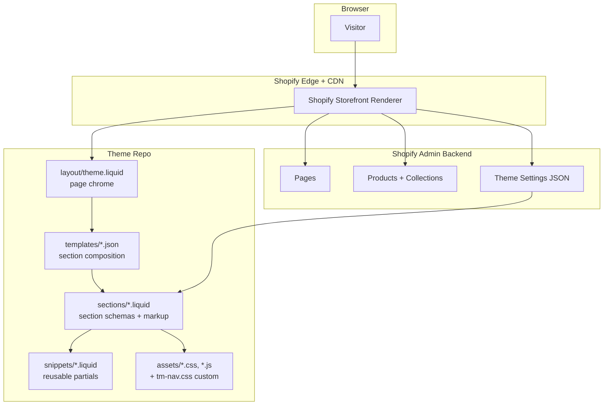

# Architecture

This is a Shopify theme repository customizing the stock Craft theme (v15.3.0) for Terra Moda, a family-owned sustainable boutique in Frederick, MD. We deliberately built it as "Craft plus a thin layer of custom code" rather than a from-scratch rebuild, because the audit found the code was clean — the problem was configuration, merchandising, and section composition, not the theme. The interesting structural choices are all about *where* we drew the line between admin configuration, JSON section composition, and custom Liquid.

## System diagram

## Component descriptions

### `templates/index.json` (the homepage)
- **Purpose**: Composes the entire home page as an ordered list of seven sections. The whole page is data, not markup — which is what lets the owner reorder or hide any section from the theme editor.
- **Location**: `templates/index.json`
- **Key responsibilities**: Defines `hero`, `categories`, `new_arrivals`, `why`, `testimonials`, `lasegreta`, `visit`. Each entry picks a section type (`image-banner`, `collection-list`, `featured-collection`, `multicolumn`, `testimonials`, `custom-liquid`) and supplies its settings inline. The `testimonials` section carries three named, location-tagged customer quotes — the first social proof the storefront has ever had — and the two `custom-liquid` bands (La Segreta, Visit Us) render arbitrary HTML while staying editor-visible.

### `templates/page.how-we-vet.json` (the transparency page)
- **Purpose**: Turns the brand's vendor-vetting story — the audit's strongest unused asset — into a standalone page, linked from the footer Company menu.
- **Location**: `templates/page.how-we-vet.json`
- **Key responsibilities**: Four sections — `intro` (rich-text framing the brand as "a curator, not a certifier"), `standards` (a `custom-liquid` three-item grid for Fair Trade / B-Corp / GOTS, each with what it verifies and a link to the certifying body), `applies` (a `custom-liquid` forest-green stat band quantifying the catalog: 100% of the baby line organic, 98% natural fibers, 9 credentialed vendors), and `spotlight` (an `image-with-text` vendor spotlight on Vustra). The standards grid was restyled to read as a reference, not a sales banner.

### `templates/page.our-story.json` and `templates/page.contact.json`
- **Purpose**: Custom page templates so the brand story and contact pages can use composed sections rather than the default body-only `page` template.
- **Location**: `templates/page.our-story.json`, `templates/page.contact.json`
- **Key responsibilities**: `page.our-story` composes a multi-section narrative (founder copy plus image-with-text values: Fair Labor, Sustainability, Premium Craftsmanship, Small Business Always). `page.contact` pairs a branded intro hero with the native `contact-form` section and drops the duplicate Formful app block.
- **Note**: A Shopify page renders these templates only when the Page entity in admin selects them. They can also be previewed at request time with `?view=<suffix>` (e.g., `/pages/our-story?view=our-story`), which is how we reviewed the rebuild before the owner reassigned templates in admin.

### Collection landing templates
- **Purpose**: Give each shopping path (men's, La Segreta) a consistent rebuilt header and card treatment instead of the default Craft collection layout.
- **Location**: `templates/collection.mens.json`, `templates/collection.la-segreta.json`, and the matching `page.men-s-collection.json`, `page.la-segreta-collection.json`, `page.collection-page.json`.
- **Note**: These are auto-generated by the Shopify admin theme editor (they carry the editor's "may be overwritten" header), so we treat them as editor-owned and avoid hand-editing.

### `snippets/card-product.liquid`
- **Purpose**: The shared product-card partial. We added a locale-aware "One Size" badge here so it applies everywhere products are listed.
- **Location**: `snippets/card-product.liquid`
- **Key responsibilities**: Iterates `options_with_values`, downcases each option name, and matches it against `size`, `taglia`, and `talla`. When a sizing option has exactly one value, the card renders a forest-green "One Size" badge in the same slot as the sale badge. Matching the localized names means the badge survives the store ever switching to Italian or Spanish without a code change.

### `sections/*.liquid`
- **Purpose**: Section schemas + Liquid markup. Mostly stock Craft. The homepage's two genuinely new components (the La Segreta band, the Visit Us band) live as `custom-liquid` instances inside `templates/index.json`, not as new section files; the testimonials and rich-text sections are stock Craft.
- **Location**: `sections/` (e.g. `testimonials.liquid`, `footer.liquid`, `header.liquid`)
- **Note**: We intentionally did not add new Liquid section files for the bands. Embedding the markup as `custom-liquid` keeps the new components inside the homepage JSON so a non-developer can rearrange them. We also removed the redundant standalone "Trust" block from `footer.liquid` once the "How we vet" page existed to carry that message.

### `assets/tm-nav.css`
- **Purpose**: The only custom CSS asset in the repo. Overrides Craft's default `.mega-menu__list` grid (which was squeezing menu items into six columns) and styles a compact button-anchored dropdown.
- **Location**: `assets/tm-nav.css`, loaded from `sections/header.liquid`
- **Key responsibilities**: Single-purpose stylesheet so the nav customization is greppable and removable without touching the rest of Craft's CSS.

### `config/settings_data.json`
- **Purpose**: The live theme settings. Auto-generated and editable from the Shopify admin theme editor. Captures global type scale, color schemes, card styles, section spacing, and which logo and favicon are in use.
- **Location**: `config/settings_data.json`
- **Note**: Touching this file by hand is supported but discouraged, since it round-trips through the admin and gets rewritten.

## Data flow (a homepage request)

1. A visitor hits `theterramoda.com/`. Shopify routes the request to the published theme (or, for preview links, the theme matching `?preview_theme_id=`).
2. The storefront renderer loads `layout/theme.liquid` for the page chrome.
3. Inside the chrome, it loads `templates/index.json`, walks the `order` array, and for each entry instantiates a Liquid section from `sections/`.
4. Each section renders its own markup, pulling settings from the JSON template (block content, layout knobs, color schemes) and from `config/settings_data.json` (global type, spacing, colors).
5. Two of the seven homepage sections are `custom-liquid` instances. Their Liquid template literals run through Shopify's `{{ collections[...] }}` and `{{ ... | image_url }}` filters at render time, so they pull live product imagery and collection links without being hard-coded.
6. Assets referenced by sections (including `tm-nav.css`) are concatenated by Shopify's bundler and served from the CDN.

## External integrations

| Service | Purpose | Notes |
|---|---|---|
| Shopify Storefront | Hosting, checkout, products, collections, pages, settings | Underlying platform. No alternative considered. |
| Google Maps Embed | The "Visit Us" map on the homepage and contact page | Iframe `?q=...&output=embed`. No API key required, no SDK loaded, no JS. |
| Shopify Customers | Newsletter email capture | Built-in customer-list signup. Avoids adding a paid email-marketing app. |

## Key architectural decisions

### Customize Craft in place rather than replace the theme
- **Context**: The store had two years of accumulated product metafields, redirects, app integrations, and Shopify-side detail tied to the existing theme. The owner needed a homepage rebuild and a polish pass, not a platform migration.
- **Decision**: Customize the existing Craft theme in this repo. Don't fork it into a separate "theme 2", don't switch to Dawn, don't introduce a paid theme.
- **Rationale**: Theme replacement on Shopify is non-trivial because every section ID, metafield reference, and admin-side template assignment is theme-coupled. A migration would have meant manually rewriting product templates and reassigning every page. The audit found Craft's section library is wide enough to compose the proposed home; only two genuinely new components (the La Segreta band, the Visit band) were needed, and both fit cleanly as `custom-liquid`. The cost of a fresh theme outweighed the friction of customizing Craft.

### Compose pages in JSON instead of hand-coding Liquid templates
- **Context**: The new homepage is seven sections (hero, categories, products, value strip, testimonials, brand band, visit), and the "How we vet" page is four. Each section could be a hard-coded Liquid template, or each could be a configurable JSON section instance.
- **Decision**: Use JSON-template composition via `templates/index.json` and `templates/page.how-we-vet.json`, with built-in section types where possible.
- **Rationale**: JSON templates let the owner reorder, hide, and reconfigure sections in the theme editor without code changes. The category tile images, product collection, testimonial quotes, and value-strip copy all live in the JSON rather than in hard-coded Liquid, so a marketing edit is a JSON edit (or a click in the admin), not a code change. The escape hatch for components Craft doesn't ship (the La Segreta band, the Visit band, the vetting standards grid) is `custom-liquid`, which preserves admin-editability while letting the component render arbitrary HTML.

### Ship curated testimonials now, build verified reviews as custom code later
- **Context**: The redesign proposal flagged social proof as the single highest-impact addition (cited research lift: +270% to +380% purchase likelihood for higher-priced items), and the audit found the storefront had none. Shopify's built-in reviews app is retired; the market alternative for verified per-product reviews is a paid app (Judge.me, Yotpo, Loox, all $15 to $100+/month).
- **Decision**: Add three curated customer testimonials to the homepage immediately using Craft's stock `testimonials` section, and build the verified per-product review/rating system in theme code as part of Phase 2.
- **Rationale**: The curated testimonials close the "zero social proof" gap today with no new dependency. The verified-review system is a bigger build, but doing it in custom Liquid + JS backed by Shopify metafields keeps the boutique off a permanent monthly subscription. The trade-off is no built-in review-collection email automation, which is solvable with a single Shopify Flow trigger.

### Make vendor vetting a destination, not a buried claim
- **Context**: The brand's credibility — vetting every vendor against Fair Trade, B-Corp, and GOTS — was its strongest differentiator and was invisible on the site. A scattered standalone "Trust" block in the footer wasn't doing the message justice.
- **Decision**: Build a dedicated `page.how-we-vet.json` page (standards grid + catalog stat band + vendor spotlight), link it from the footer Company menu, and remove the redundant inline Trust block from `footer.liquid`.
- **Rationale**: A single page can explain *what each standard verifies* and *where it applies in the catalog* with the depth a footer line can't. Consolidating the message into one linkable destination also means the owner can point partners and customers at one URL instead of hoping they notice a footer block.

### Use `custom-liquid` instead of authoring new section types
- **Context**: The La Segreta band, the Visit band, and the vetting standards grid are components that don't match any stock Craft section.
- **Decision**: Embed them as `custom-liquid` section instances inside their templates with full HTML and inline scoped CSS, rather than creating new `sections/*.liquid` files.
- **Rationale**: Keeps the new components discoverable from the theme editor (every section is one click away). Avoids the schema-design overhead of new section types when the components only need to vary by image source and CTA destination, both handled dynamically by the `{{ collections[...] }}` pattern. The trade-off is that the markup lives in a JSON string instead of a Liquid file, which is harder to syntax-highlight; that trade pays off because non-developers can still edit the visible copy from the admin.

### Single dedicated stylesheet (`tm-nav.css`) for custom CSS
- **Context**: The nav redesign needed to override several of Craft's default styles (mega-menu grid, dropdown sizing, mobile menu behaviors). The CSS could have been appended to one of the existing Craft stylesheets or split across many files.
- **Decision**: Put all custom navigation CSS in a single file, `assets/tm-nav.css`, loaded explicitly from `sections/header.liquid`. (Section-specific styling for the custom-liquid bands stays scoped inside each section's own `<style>` block.)
- **Rationale**: When Craft ships a base-theme update in the future, the diff against the new vendor files stays clean because none of the vendor stylesheets were touched. Anything custom is greppable by filename. Removing the nav customization is `rm assets/tm-nav.css` plus one link tag, not a multi-file untangling.
