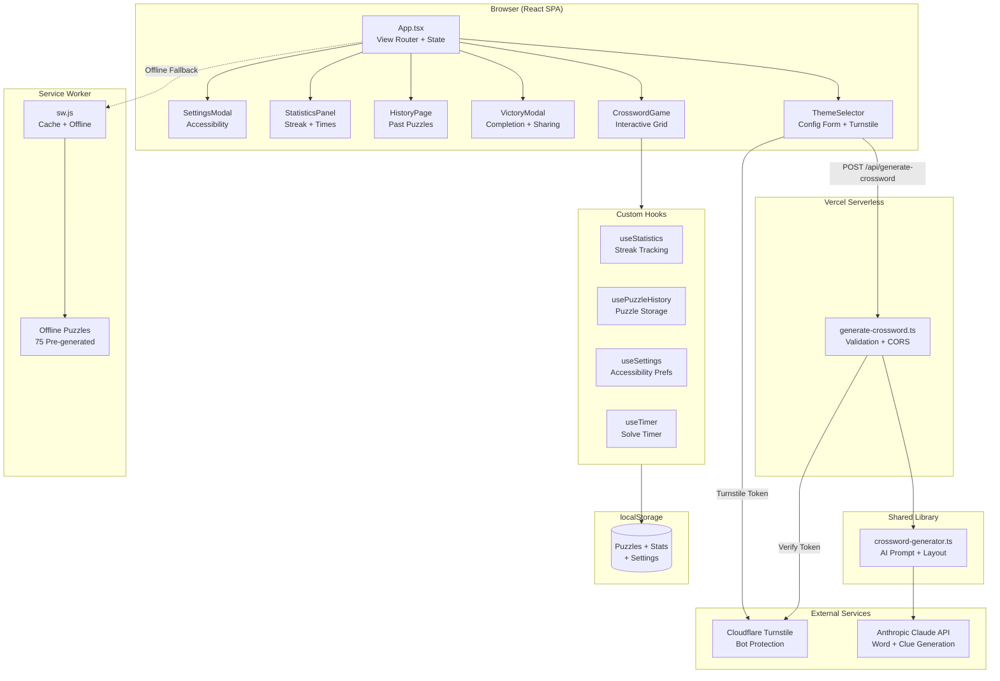

# Architecture Overview

## System Diagram

## Component Descriptions

### App.tsx
- **Purpose**: Root component managing view state and puzzle generation lifecycle
- **Location**: `src/App.tsx`
- **Key responsibilities**:
  - Three-view routing: `selector` → `game` → `history` (no router library)
  - Puzzle generation with exponential backoff retry (1s, 2s, 4s, max 3 retries)
  - Error categorization: `network`, `verification`, `generation`, `generic`
  - URL-based puzzle sharing (reads `?p=` param, decodes with lz-string)
  - Offline fallback to pre-generated puzzles when network fails
  - Dark mode toggle with localStorage persistence
  - PWA update banner via service worker events

### ThemeSelector.tsx
- **Purpose**: Puzzle configuration form with AI-powered theme suggestions
- **Location**: `src/components/ThemeSelector.tsx`
- **Key responsibilities**:
  - Theme input with 15 suggestion options and keyboard navigation
  - Grid size / word count / difficulty selection
  - Cloudflare Turnstile widget (invisible captcha, `interaction-only` mode)
  - Loading states with retry count display

### CrosswordGame.tsx
- **Purpose**: Core interactive crossword gameplay
- **Location**: `src/components/CrosswordGame.tsx`
- **Key responsibilities**:
  - Renders `@jaredreisinger/react-crossword` grid
  - Checker mode: SVG text element tracking with distance-based cell matching
  - Hint system (3 per puzzle, fills random unsolved cell)
  - Auto-save progress to localStorage on every change
  - Sticky controls header with IntersectionObserver
  - Share via compressed URL encoding

### VictoryModal.tsx
- **Purpose**: Puzzle completion celebration and sharing hub
- **Location**: `src/components/VictoryModal.tsx`
- **Key responsibilities**:
  - Canvas-confetti animation (3s, fired from both sides)
  - Performance-based messages (perfect solve, no hints, etc.)
  - Share options: puzzle URL, text results, PNG image card

### ShareResultsCard.tsx
- **Purpose**: Generates shareable PNG result images
- **Location**: `src/components/ShareResultsCard.tsx`
- **Key responsibilities**:
  - SVG template string generation with stats
  - SVG → Canvas → PNG Blob conversion pipeline
  - Native share API with download fallback

### StatisticsPanel.tsx
- **Purpose**: Displays performance tracking data
- **Location**: `src/components/StatisticsPanel.tsx`
- **Key responsibilities**:
  - Streak tracking (current + longest), average/best times by difficulty
  - Motivational messages based on performance milestones

### SettingsModal.tsx
- **Purpose**: Accessibility preferences
- **Location**: `src/components/SettingsModal.tsx`
- **Key responsibilities**:
  - High contrast mode, reduced motion, text size (normal/large/larger)
  - Applied to `document.documentElement` via CSS classes and data attributes

## Data Flow

### Puzzle Generation Flow

1. User enters theme, grid size, word count, and difficulty in `ThemeSelector`
2. Turnstile widget generates a bot-protection token
3. `App.tsx` sends POST to `/api/generate-crossword` with config + token
4. Serverless function verifies Turnstile token with Cloudflare
5. `crossword-generator.ts` sends themed prompt to Claude API
6. Claude returns JSON array of `{answer, clue}` pairs
7. `crossword-layout-generator` arranges words into a valid grid (up to 3 retries)
8. Grid data is returned to client, `CrosswordGame` renders the interactive puzzle
9. On failure, exponential backoff retry (up to 3 attempts), then offline fallback

### Puzzle Sharing Flow

1. Completed puzzle data is compressed with `lz-string`
2. Encoded string is appended as `?p=` URL parameter
3. Recipient opens URL, `App.tsx` detects param on mount
4. Puzzle data is decoded and rendered directly (no API call)

### Statistics Flow

1. On puzzle completion, `useStatistics` records timestamp + difficulty + time
2. Streak logic: same day = unchanged, yesterday = +1, else = reset to 1
3. Best/average times calculated per difficulty level
4. Up to 500 completion records stored in localStorage

## External Integrations

| Service | Purpose | Documentation |
|---------|---------|---------------|
| Anthropic Claude API | Generates themed words and clues | https://docs.anthropic.com |
| Cloudflare Turnstile | Bot protection for API endpoint | https://developers.cloudflare.com/turnstile |
| Vercel | Hosting (static + serverless) | https://vercel.com/docs |
| crossword-layout-generator | Arranges words into valid grid layouts | npm package |
| @jaredreisinger/react-crossword | Interactive crossword grid component | npm package |

## Key Architectural Decisions

### State-Based Routing Instead of React Router
- **Context**: App has only 3 views (selector, game, history)
- **Decision**: Simple `currentView` state variable with conditional rendering
- **Rationale**: Avoids adding a routing dependency for a small number of views. Framer Motion `AnimatePresence` handles transitions.

### Shared Generator Library
- **Context**: Puzzle generation logic needed by both dev server and Vercel function
- **Decision**: Extracted to `lib/crossword-generator.ts`, imported by both `server.dev.ts` and `api/generate-crossword.ts`
- **Rationale**: Prevents logic duplication and ensures dev/prod parity

### localStorage for All Persistence
- **Context**: Need to store puzzle history, statistics, settings, and in-progress game state
- **Decision**: All data stored in localStorage (no backend database)
- **Rationale**: Zero infrastructure cost, instant reads, works offline. Trade-off: data is device-local only, limited to ~5MB.

### SVG Element Tracking for Checker Mode
- **Context**: `@jaredreisinger/react-crossword` doesn't expose an API for cell-level styling
- **Decision**: Scan SVG DOM elements and match them to grid positions using a greedy distance-based algorithm
- **Rationale**: Allows real-time correct/incorrect coloring without forking the crossword library

### Fail-Open Turnstile Verification
- **Context**: Cloudflare API could be temporarily unreachable
- **Decision**: If Turnstile verification request fails (network error), allow the puzzle generation to proceed
- **Rationale**: Better user experience — a brief Cloudflare outage shouldn't block all users. Logged for monitoring.

### Offline-First with Pre-Generated Puzzles
- **Context**: PWA should work without network connectivity
- **Decision**: 75 pre-generated puzzles (5 per theme, 15 themes) bundled in `public/puzzles/`
- **Rationale**: Ensures the app is usable offline. Service worker caches these on install.
