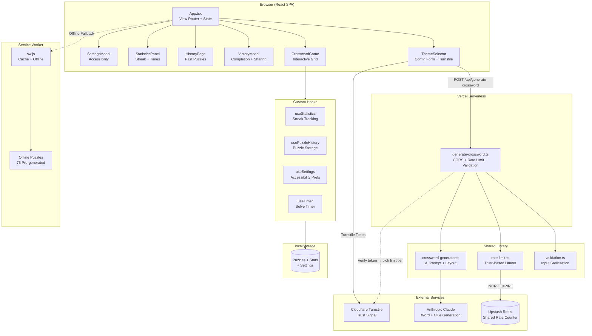

# Architecture Overview

## System Diagram

```mermaid
flowchart TD
    subgraph Client["Browser (React SPA)"]
        App[App.tsx<br/>View Router + State]
        TS[ThemeSelector<br/>Config Form + Turnstile]
        CG[CrosswordGame<br/>Interactive Grid]
        VM[VictoryModal<br/>Completion + Sharing]
        HP[HistoryPage<br/>Past Puzzles]
        SP[StatisticsPanel<br/>Streak + Times]
        SM[SettingsModal<br/>Accessibility]
    end

    subgraph Hooks["Custom Hooks"]
        UStats[useStatistics<br/>Streak Tracking]
        UHist[usePuzzleHistory<br/>Puzzle Storage]
        USet[useSettings<br/>Accessibility Prefs]
        UTmr[useTimer<br/>Solve Timer]
    end

    subgraph Storage["localStorage"]
        LS[(Puzzles + Stats<br/>+ Settings)]
    end

    subgraph API["Vercel Serverless"]
        GC[generate-crossword.ts<br/>CORS + Rate Limit + Validation]
    end

    subgraph Shared["Shared Library"]
        Gen[crossword-generator.ts<br/>AI Prompt + Layout]
        RL[rate-limit.ts<br/>Trust-Based Limiter]
        Val[validation.ts<br/>Input Sanitization]
    end

    subgraph External["External Services"]
        LLM[Anthropic Claude<br/>Word + Clue Generation]
        CF[Cloudflare Turnstile<br/>Trust Signal]
        UR[(Upstash Redis<br/>Shared Rate Counter)]
    end

    subgraph PWA["Service Worker"]
        SW[sw.js<br/>Cache + Offline]
        OP[Offline Puzzles<br/>75 Pre-generated]
    end

    App --> TS
    App --> CG
    App --> VM
    App --> HP
    App --> SP
    App --> SM

    CG --> Hooks
    Hooks --> LS

    TS -->|"POST /api/generate-crossword"| GC
    TS -->|"Turnstile Token"| CF
    GC --> Val
    GC --> RL
    GC --> Gen
    Gen --> LLM
    GC -.->|"Verify token → pick limit tier"| CF
    RL -->|"INCR / EXPIRE"| UR

    SW --> OP
    App -.->|"Offline Fallback"| SW
```

## Component Descriptions

### App.tsx
- **Purpose**: Root component managing view state and puzzle generation lifecycle
- **Location**: `src/App.tsx`
- **Key responsibilities**:
  - Three-view routing: `selector` → `game` → `history` (no router library)
  - Puzzle generation with exponential backoff retry (1s, 2s, 4s, max 3 retries)
  - Error categorization: `network`, `verification`, `generation`, `generic`
  - URL-based puzzle sharing (reads `?p=` param, decodes with lz-string)
  - Offline fallback to pre-generated puzzles when network fails
  - Dark mode toggle with localStorage persistence
  - PWA update banner via service worker events

### ThemeSelector.tsx
- **Purpose**: Puzzle configuration form with AI-powered theme suggestions
- **Location**: `src/components/ThemeSelector.tsx`
- **Key responsibilities**:
  - Theme input with 15 suggestion options and keyboard navigation
  - Grid size / word count / difficulty selection
  - Cloudflare Turnstile widget (`interaction-only` appearance) that emits a token used purely as a trust signal — if the script is blocked or never loads within 10s, the form still submits with an empty token and the server applies the stricter unverified rate limit
  - Widget lifecycle management: removes the widget on unmount to avoid detached-container polling and widget leaks across re-mounts
  - Loading states with retry count display

### CrosswordGame.tsx
- **Purpose**: Core interactive crossword gameplay
- **Location**: `src/components/CrosswordGame.tsx`
- **Key responsibilities**:
  - Renders `@jaredreisinger/react-crossword` grid
  - Checker mode: SVG text element tracking with distance-based cell matching
  - Hint system (3 per puzzle, fills random unsolved cell)
  - Auto-save progress to localStorage on every change
  - Sticky controls header with IntersectionObserver
  - Share via compressed URL encoding

### VictoryModal.tsx
- **Purpose**: Puzzle completion celebration and sharing hub
- **Location**: `src/components/VictoryModal.tsx`
- **Key responsibilities**:
  - Canvas-confetti animation (3s, fired from both sides)
  - Performance-based messages (perfect solve, no hints, etc.)
  - Share options: puzzle URL, text results, PNG image card

### ShareResultsCard.tsx
- **Purpose**: Generates shareable PNG result images
- **Location**: `src/components/ShareResultsCard.tsx`
- **Key responsibilities**:
  - SVG template string generation with stats
  - SVG → Canvas → PNG Blob conversion pipeline
  - Native share API with download fallback

### StatisticsPanel.tsx
- **Purpose**: Displays performance tracking data
- **Location**: `src/components/StatisticsPanel.tsx`
- **Key responsibilities**:
  - Streak tracking (current + longest), average/best times by difficulty
  - Motivational messages based on performance milestones

### SettingsModal.tsx
- **Purpose**: Accessibility preferences
- **Location**: `src/components/SettingsModal.tsx`
- **Key responsibilities**:
  - High contrast mode, reduced motion, text size (normal/large/larger)
  - Applied to `document.documentElement` via CSS classes and data attributes

## Data Flow

### Puzzle Generation Flow

1. User enters theme, grid size, word count, and difficulty in `ThemeSelector`
2. Turnstile widget produces a trust-signal token (or none, if blocked)
3. `App.tsx` sends POST to `/api/generate-crossword` with config + token
4. Serverless function keys the request by the edge-injected `x-real-ip` (never the client-controllable `x-forwarded-for`)
5. If a token is present, the function verifies it with Cloudflare to decide the rate-limit tier: verified → 10/min, unverified → 3/min
6. The rate limiter (`rate-limit.ts`) increments the per-IP counter in Upstash Redis; over the limit returns `429`, otherwise the request proceeds
7. `validation.ts` validates and sanitizes the request body (theme, grid bounds, word count, difficulty)
8. `crossword-generator.ts` sends the themed prompt to the LLM, which returns a JSON array of `{answer, clue}` pairs
9. `crossword-layout-generator` arranges words into a valid grid (up to 3 retries)
10. Grid data is returned to the client and `CrosswordGame` renders the interactive puzzle
11. On failure, exponential backoff retry (up to 3 attempts), then offline fallback

### Puzzle Sharing Flow

1. Completed puzzle data is compressed with `lz-string`
2. Encoded string is appended as `?p=` URL parameter
3. Recipient opens URL, `App.tsx` detects param on mount
4. Puzzle data is decoded and rendered directly (no API call)

### Statistics Flow

1. On puzzle completion, `useStatistics` records timestamp + difficulty + time
2. Streak logic: same day = unchanged, yesterday = +1, else = reset to 1
3. Best/average times calculated per difficulty level
4. Up to 500 completion records stored in localStorage

## External Integrations

| Service | Purpose | Documentation |
|---------|---------|---------------|
| Anthropic Claude (Sonnet 4) | Generates themed words and clues | https://docs.anthropic.com |
| Cloudflare Turnstile | Trust signal that selects the rate-limit tier | https://developers.cloudflare.com/turnstile |
| Upstash Redis | Shared per-IP rate-limit counter (in-memory fallback) | https://upstash.com/docs/redis |
| Vercel | Hosting (static + serverless) | https://vercel.com/docs |
| crossword-layout-generator | Arranges words into valid grid layouts | npm package |
| @jaredreisinger/react-crossword | Interactive crossword grid component | npm package |

## Key Architectural Decisions

### State-Based Routing Instead of React Router
- **Context**: App has only 3 views (selector, game, history)
- **Decision**: Simple `currentView` state variable with conditional rendering
- **Rationale**: Avoids adding a routing dependency for a small number of views. Framer Motion `AnimatePresence` handles transitions.

### Shared Generator Library
- **Context**: Puzzle generation logic needed by both dev server and Vercel function
- **Decision**: Extracted to `lib/crossword-generator.ts`, imported by both `server.dev.ts` and `api/generate-crossword.ts`
- **Rationale**: Prevents logic duplication and ensures dev/prod parity

### localStorage for All Persistence
- **Context**: Need to store puzzle history, statistics, settings, and in-progress game state
- **Decision**: All data stored in localStorage (no backend database)
- **Rationale**: Zero infrastructure cost, instant reads, works offline. Trade-off: data is device-local only, limited to ~5MB.

### SVG Element Tracking for Checker Mode
- **Context**: `@jaredreisinger/react-crossword` doesn't expose an API for cell-level styling
- **Decision**: Scan SVG DOM elements and match them to grid positions using a greedy distance-based algorithm
- **Rationale**: Allows real-time correct/incorrect coloring without forking the crossword library

### Trust-Based Rate Limiting Instead of Captcha Gating
- **Context**: A hard Turnstile gate punished legitimate users behind content blockers or during a Cloudflare outage, while the real cost to protect was the paid LLM endpoint
- **Decision**: Demote Turnstile to a trust signal. A valid token earns the normal quota (10 requests/min/IP); a missing or failing token still works but at a stricter cap (3/min). The request is never hard-rejected for lacking a token — the rate limiter is the only gate, and it keys on the edge-injected `x-real-ip` rather than the spoofable `x-forwarded-for`
- **Rationale**: Bounds abuse of the expensive endpoint without false-positives on real users. Tokenless requests also skip the `siteverify` round-trip, so they can't be used to spam Cloudflare. See `api/generate-crossword.ts`.

### Upstash Redis Limiter with In-Memory Fallback
- **Context**: Vercel serverless instances are ephemeral and independent, so a per-instance counter under-counts a distributed client across many cold starts
- **Decision**: Back the limiter with a shared Upstash Redis fixed-window counter (`INCR` + `EXPIRE`), falling back to the per-instance in-memory map if Redis is unconfigured or errors mid-request
- **Rationale**: Gives a consistent global limit when Redis is available, and degrades to a stricter local limit during an outage rather than failing open. The limiter re-asserts the TTL if an `EXPIRE` was lost, so a key can never lock an IP out permanently. See `lib/rate-limit.ts`.

### Offline-First with Pre-Generated Puzzles
- **Context**: PWA should work without network connectivity
- **Decision**: 75 pre-generated puzzles (5 per theme, 15 themes) bundled in `public/puzzles/`
- **Rationale**: Ensures the app is usable offline. Service worker caches these on install.
