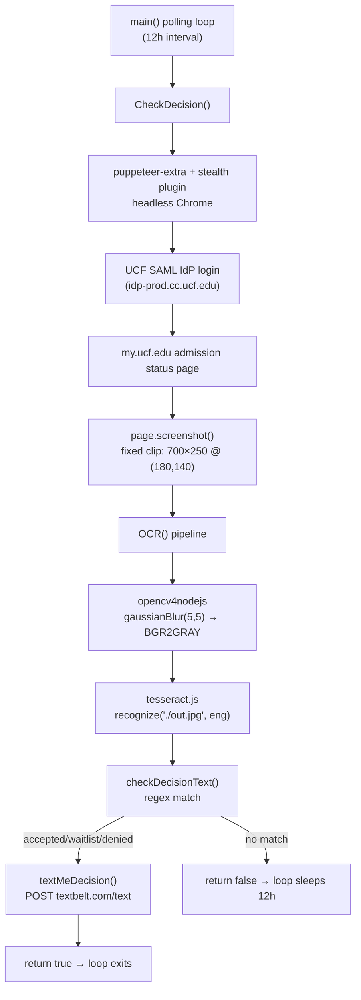

# Architecture

## System Diagram

## Component Descriptions

### Polling Loop
- **Purpose**: Drive a check every 12 hours until a decision is detected
- **Location**: `Checker.js:143-159` (the bottom IIFE)
- **Key responsibilities**: Instantiate Puppeteer with the stealth plugin once, then call `CheckDecision` repeatedly with a 43,200,000 ms delay between iterations

### `CheckDecision()`
- **Purpose**: Single end-to-end pass: log in, capture, OCR, classify, notify
- **Location**: `Checker.js:66-141`
- **Key responsibilities**: Launch a fresh headless Chrome, log in through UCF's SAML flow, navigate to the admission status PeopleSoft page, screenshot a hard-coded rectangle, and hand the image off to the OCR pipeline

### `OCR()`
- **Purpose**: Turn the screenshot into clean text
- **Location**: `Checker.js:10-20`
- **Key responsibilities**: Run a gaussian blur + greyscale conversion through OpenCV to denoise/desaturate the screenshot, write the cleaned image to `out.jpg`, then run Tesseract on it

### `checkDecisionText()`
- **Purpose**: Classify the OCR output
- **Location**: `Checker.js:45-64`
- **Key responsibilities**: Case-insensitive regex match on `congratulations` / `waitlist` / `denied`, with an "decision not out yet" fallback. Returns `true` only when a real decision is found, which is what tells the outer loop to stop

### `textMeDecision()`
- **Purpose**: Push the result to a phone
- **Location**: `Checker.js:22-43`
- **Key responsibilities**: POSTs a form to TextBelt's HTTP endpoint with the phone number, message body, and API key

## Data Flow

1. The IIFE starts the loop and instantiates `puppeteer-extra` with the stealth plugin
2. `CheckDecision` launches headless Chrome and opens `ucf.edu`
3. The script clicks the sign-in and "myUCF" links, types NID/password into the SAML form, and submits
4. A request-interception hook injects a `referer` header matching the SAML SSO redirect so the post-login navigation succeeds
5. After login, the page navigates to the admission status PeopleSoft URL
6. A 700×250 region at offset (180,140) is screenshotted — the area the decision text always lives in
7. OpenCV blurs and greyscales the image and writes `out.jpg`
8. Tesseract OCRs `out.jpg` with the English language model
9. `checkDecisionText` runs three regex matches against the recognized text and triggers the matching SMS branch
10. If no match, the loop sleeps 12 hours and starts over

## External Integrations

| Service | Purpose | Notes |
|---------|---------|-------|
| `my.ucf.edu` (PeopleSoft) | Source of the admission decision | No public API in 2019, hence the OCR approach |
| `idp-prod.cc.ucf.edu` (Shibboleth SAML IdP) | Authentication | Requires a custom `referer` header during the post-login redirect or the session is dropped |
| TextBelt (`textbelt.com/text`) | Outbound SMS | Chosen over Twilio for zero-setup, pay-per-text simplicity — no account, no phone-number provisioning |

## Key Architectural Decisions

### Screenshot + OCR instead of DOM scraping
- **Context**: The admission status page is a PeopleSoft view rendered inside nested iframes with auto-generated CSS class names. Selectors were fragile, and the layout changed enough between login session types that DOM scraping was unreliable.
- **Decision**: Take a fixed-pixel screenshot of the panel and OCR the image instead of parsing the DOM.
- **Rationale**: OCR is immune to markup churn. The page renders the decision text in a stable on-screen location, so a hard-coded clip rectangle captures it deterministically. The trade-off — needing OpenCV preprocessing and accepting OCR uncertainty — was worth it to avoid the selector-maintenance treadmill.

### OpenCV preprocessing in front of Tesseract
- **Context**: Raw Tesseract on a colored, anti-aliased PeopleSoft screenshot misreads characters routinely (especially the "C" in "Congratulations" against the page's red header band).
- **Decision**: Run `gaussianBlur(5,5,1.2)` then convert `BGR2GRAY` before handing the image to Tesseract.
- **Rationale**: Blurring dampens anti-aliasing artifacts, greyscaling removes the colored background bias. Together they lift Tesseract's character accuracy enough that the three regex branches reliably distinguish the three outcomes.

### `puppeteer-extra-plugin-stealth` + incognito context + manual referer header
- **Context**: UCF's SAML flow rejects requests that look like default headless Chrome (missing plugins, `HeadlessChrome` UA, missing referer on the SSO bounce).
- **Decision**: Use the stealth plugin to patch the headless fingerprint, run inside an incognito browser context to avoid cookie/cache leakage between attempts, and intercept navigation requests to inject the SAML IdP as the `referer`.
- **Rationale**: Each of the three was necessary on its own — none was sufficient. The stealth plugin handles the long tail of automation-detection signals; incognito ensures a failed attempt doesn't poison the next one; the referer injection is the specific thing that made the SSO redirect succeed.

### Polling loop over webhook/event-driven
- **Context**: There was no event source — UCF doesn't push notifications when a decision posts.
- **Decision**: Run an in-process `while` loop with a 12-hour `setTimeout`-based delay.
- **Rationale**: For a single-user, single-purpose script, a long-lived process is simpler than introducing a scheduler (cron, systemd timer, GitHub Actions). It's the cheapest tool that solves the problem.

### TextBelt over Twilio
- **Context**: I needed outbound SMS once or twice. Twilio requires sign-up, phone-number provisioning, and a trial-account verification dance.
- **Decision**: TextBelt's pay-per-text HTTP endpoint.
- **Rationale**: One POST with a key and a phone number. Zero setup time, and the total cost for this project was well under a dollar.
