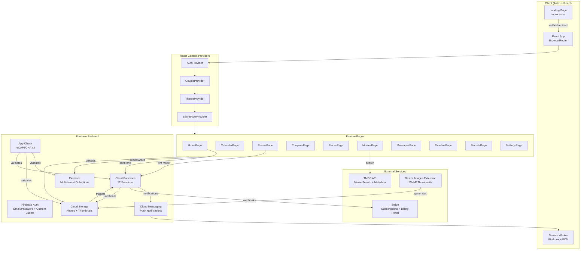

# Architecture Overview

## System Diagram

## Component Descriptions

### AuthProvider
- **Purpose**: Manages Firebase Auth state and session persistence
- **Location**: `src/lib/auth.tsx`
- **Key responsibilities**: Sign-in/sign-out, auth state listener, `authed` localStorage flag for instant landing page redirect

### CoupleProvider
- **Purpose**: Loads and provides couple data to the entire app
- **Location**: `src/lib/couple.tsx`
- **Key responsibilities**: Chains user doc -> couple doc realtime listeners, normalizes Timestamps, exposes `coupleId`, `couple`, `isComplete`, `loading`

### ThemeProvider
- **Purpose**: Applies dynamic CSS custom properties based on couple's theme and color preferences
- **Location**: `src/lib/theme.tsx`
- **Key responsibilities**: Sets all CSS vars on `:root`, caches to localStorage for flash-free initial load, lighten/darken color utilities

### useFirestore (Generic Hooks)
- **Purpose**: Centralized Firestore data access with automatic multi-tenant scoping
- **Location**: `src/lib/useFirestore.ts`
- **Key responsibilities**: Always injects `coupleId` filter on reads and writes, provides `useFirestoreCollection`, `useFirestoreDoc`, `useFirestoreMutation`

### Cloud Functions
- **Purpose**: Server-side logic for onboarding, billing, notifications, and thumbnail processing
- **Location**: `functions/src/index.ts`
- **Key responsibilities**: 12 functions covering couple creation, partner joining, Stripe webhooks, FCM notifications, scheduled tasks, and thumbnail backfill

## Data Flow

### Authentication & Tenant Resolution
1. User signs in via Firebase Auth (email/password)
2. `AuthProvider` receives auth state, sets `authed` flag in localStorage
3. `CoupleProvider` reads user doc to get `coupleId`, then subscribes to couple doc
4. `ThemeProvider` applies cached theme instantly, then updates from Firestore data
5. `ProtectedRoute` waits for both auth + couple loading before rendering page content

### Photo Upload Pipeline
1. Client validates file type/size, compresses via OffscreenCanvas
2. Upload to Storage at `photos/{coupleId}/{uid}/original/{filename}`
3. Firestore `photos` doc created with `url`, `storagePath`, `coupleId`
4. Firebase Resize Images extension generates `_200x200.webp` thumbnail
5. `onThumbnailCreated` Cloud Function matches thumbnail to doc via `storagePath` prefix query
6. Display components use `thumbnailUrl || url` for bandwidth optimization

### Stripe Billing Flow
1. `createCouple` Cloud Function creates Stripe customer + Checkout session with 14-day trial
2. User completes Stripe Checkout
3. `handleStripeWebhook` receives `checkout.session.completed` -> sets subscription active
4. Subsequent webhook events update `subscriptionStatus` on couple doc
5. Client `useSubscription()` derives access level from status + grace period

## External Integrations

| Service | Purpose |
|---------|---------|
| Firebase Auth | Email/password authentication with `coupleId` custom claims |
| Firestore | Primary database, all collections scoped by `coupleId` |
| Cloud Storage | Photo uploads with auto-generated WebP thumbnails |
| Cloud Messaging | Push notifications for love messages, coupons, events, film photos |
| App Check | reCAPTCHA v3 request attestation |
| Stripe | Subscription billing with trial period and customer portal |
| TMDB | Movie search, posters, and metadata |
| Resize Images Extension | Automatic thumbnail generation in WebP format |

## Key Architectural Decisions

### Multi-tenancy via Custom Claims (not Subcollections)
- **Context**: Needed complete data isolation between couples
- **Decision**: Use `coupleId` custom claim on auth tokens + top-level collections with `coupleId` field
- **Rationale**: Simpler query patterns, easier Firestore rules, avoids nested subcollection complexity. Security rules check `request.auth.token.coupleId` on every operation.

### Astro + React Islands
- **Context**: Need both a public marketing landing page and an interactive authenticated app
- **Decision**: Astro for page routing and static content, React (`client:only`) for all interactive features
- **Rationale**: Landing page is pure HTML (fast, SEO-friendly). App pages are fully client-rendered React with BrowserRouter for SPA navigation.

### Theme Caching in localStorage
- **Context**: Dynamic CSS vars applied via React `useEffect` caused a visible color flash on page load
- **Decision**: Cache all computed theme values in localStorage, apply via blocking inline `<script>` before first paint
- **Rationale**: Eliminates FOUC for returning users. First visit still has a brief flash (no cache yet), but subsequent loads are seamless.

### Film Camera Developing Period
- **Context**: Wanted a nostalgic film camera experience
- **Decision**: Upload locks photos behind a 3-5 day developing period with progressive blur/sepia CSS effects
- **Rationale**: Creates anticipation and a unique shared experience. Hourly Cloud Function notifies when photos are ready.
