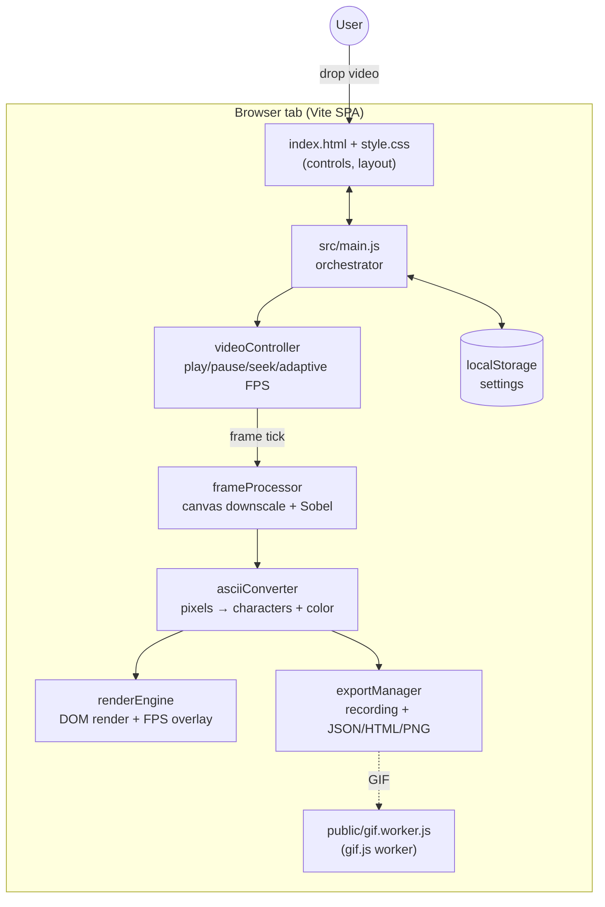

# Architecture Overview

A browser-first, single-page video → ASCII converter. The decoding, downscaling,
character mapping, and rendering all happen in the user's tab. The deployed
artifact is a static SPA on Vercel — no server-side code paths.

## System Diagram

## Component Descriptions

### `src/main.js` — Orchestrator
- **Purpose**: Wires every module together. Owns all DOM event listeners, the
  active settings object, the playback/render loop kickoff, and the export
  button flow.
- **Location**: `src/main.js`
- **Key responsibilities**: settings persistence (localStorage), preset
  application (`applyPreset`), UI sync (sliders → processor config), and
  invoking `exportManager` for downloads.

### `videoController` — Playback & adaptive frame loop
- **Purpose**: Owns the `<video>` element and the per-frame `requestAnimationFrame`
  loop. Provides play/pause/stop/seek/skip/speed.
- **Location**: `src/modules/videoController.js`
- **Key responsibilities**: adaptive FPS (auto-throttles when the loop falls
  behind, 10–60 fps in ±5 steps), wait-for-seek before play, first-frame-on-load
  behavior.

### `frameProcessor` — Canvas pipeline
- **Purpose**: Each tick, draws the current video frame to an offscreen canvas
  at the chosen resolution, applies brightness/contrast/invert, optionally runs
  Sobel edge detection, and exposes a typed-array of luminance + RGB.
- **Location**: `src/modules/frameProcessor.js`

### `asciiConverter` — Pixels → characters + color
- **Purpose**: Maps each downscaled pixel to a character from the selected
  charset, then wraps it for the requested color mode (grayscale, ANSI cube,
  RGB, full-RGB). Output is both a plain-text string and a structured
  per-cell colors array.
- **Location**: `src/modules/asciiConverter.js`

### `renderEngine` — DOM render + FPS overlay
- **Purpose**: Single-pass DOM update of the ASCII display. Tracks frame
  timings to drive an FPS overlay positioned in the top-right of the ASCII
  area (`aria-hidden`).
- **Location**: `src/modules/renderEngine.js`
- **Note**: The FPS overlay is appended to a `.ascii-stage` wrapper that
  surrounds `#ascii-output`, not to the output element itself. The output's
  `innerHTML`/`textContent` is rewritten every frame; a child element would
  be wiped on the first render. See the "Overlay-safe wrapper" decision below.

### `exportManager` — Recording + exports
- **Purpose**: Buffers frames during playback (hard cap of 1,800 frames to
  prevent tab OOM), then exports them as JSON, a self-contained HTML player,
  animated GIF, or a PNG screenshot. GIF export samples down to ≤120 frames
  and emits drawing/encoding progress through an `onProgress` callback.
- **Location**: `src/modules/exportManager.js`

## Data Flow

### Real-time conversion (every frame)
1. `videoController` fires its adaptive loop.
2. `frameProcessor` draws `<video>` → offscreen canvas at the chosen
   resolution, applies image adjustments + optional Sobel.
3. `asciiConverter` maps the pixel buffer to characters + colors per the
   active charset and color mode.
4. `renderEngine` writes the spans into the live DOM display.
5. `exportManager` (if recording) pushes the frame snapshot into its buffer.

### GIF export
1. User clicks GIF after a recording exists.
2. `exportManager.exportAsGif` samples the buffer down to ≤120 frames,
   sizes a canvas from the first frame's text dimensions, and iterates the
   sampled frames drawing each character (honoring per-cell colors).
3. Progress is reported via `onProgress('drawing', pct)` during the draw
   loop and `onProgress('encoding', pct)` from gif.js's `progress` event
   while the worker encodes.
4. On `finished`, the resulting Blob is downloaded.

## External Integrations

| Service | Purpose | Notes |
|---------|---------|-------|
| Vercel | Static hosting (no server code) | Build: `npm run build`; output `dist/`. No env vars required. |
| `gif.js` | Off-main-thread GIF encoding | Worker bundled in `public/gif.worker.js`. |

## Key Architectural Decisions

### Vanilla ES modules, no framework
- **Context**: A single-page tool with one canvas-heavy pipeline. The DOM
  surface is small and the hot path is the per-frame loop.
- **Decision**: No React/Vue/Svelte. Plain modules, plain DOM.
- **Rationale**: A framework would add bundle weight and a reconciliation
  layer between me and the render hot path. Keeping it vanilla means I write
  one render function and know exactly what hits the DOM each frame.

### Adaptive frame rate instead of fixed FPS
- **Context**: Targeting 60 fps everywhere produces a bad experience on
  modest hardware — the loop falls behind, audio drifts, the browser
  jank-warns.
- **Decision**: `videoController` measures actual frame time and throttles
  the target FPS down when it lags, then ratchets back up when slack appears
  (floor 10, ceiling 60, ±5 step).
- **Rationale**: Better to render a smooth 30 fps than a stuttery 60.

### Hard recording cap (1,800 frames) and GIF sub-sample (120 frames)
- **Context**: Recording is unbounded by default — a long video at 30 fps
  could OOM the tab because each frame stores `{ text, html, colors }` (the
  `colors` array is roughly `width × height` per frame). GIF encoding the
  full buffer at retina text size would also take minutes per export.
- **Decision**: `ExportManager` enforces a fixed 1,800-frame cap and
  auto-stops; the GIF path additionally samples down to ≤120 frames before
  encoding and reports progress via a sticky toast.
- **Rationale**: Predictable memory ceiling, and GIF exports finish in
  seconds-to-tens-of-seconds with visible progress instead of appearing
  to hang.

### Overlay-safe wrapper for the FPS badge
- **Context**: The FPS overlay needs to visually sit over the ASCII output,
  but the output element's `innerHTML`/`textContent` is rewritten on every
  frame. Any element appended directly into `#ascii-output` is detached on
  the first render — the badge appears for one frame then disappears. The
  previous attempt (anchoring to `document.body` via `position: fixed`) put
  the badge in viewport space, where it inevitably collided with either the
  export toolbar (top-right) or the playback bar (bottom-right).
- **Decision**: Wrap `#ascii-output` in a `.ascii-stage` div
  (`position: relative; flex: 1; display: flex; min-height: 0`). The
  rendered ASCII text fills `#ascii-output` as before; the FPS overlay is
  appended to `.ascii-stage` as a *sibling* of `#ascii-output` with
  `position: absolute; top: 8px; right: 8px`.
- **Rationale**: The stage is never touched by the render loop, so the
  overlay persists. Because the overlay isn't a descendant of the output
  element, it doesn't pollute `textContent` reads (e.g. the screenshot
  fallback path). Same visual result, structurally robust.
