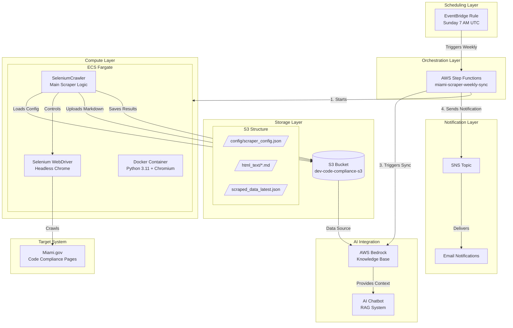
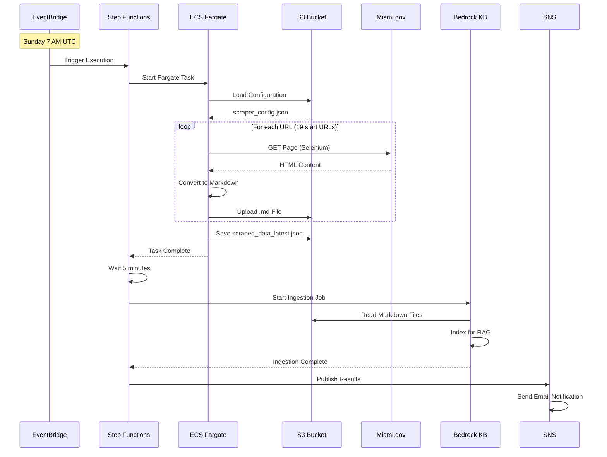
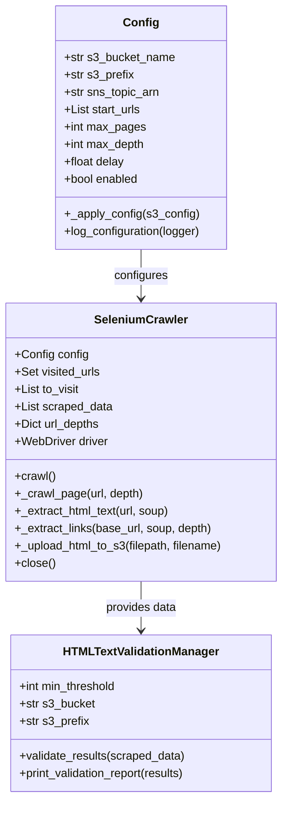

# Architecture Overview

## System Architecture Diagram

## Data Flow Diagram

## Component Architecture

## Key Architectural Decisions

### 1. Selenium over Simple HTTP Requests

I chose Selenium with headless Chrome over simple HTTP libraries (requests, httpx) because:

- **JavaScript Rendering**: Miami.gov uses dynamic content loading that requires JavaScript execution
- **Anti-Bot Bypass**: The site has CloudFlare protection and bot detection that Selenium can evade with proper stealth configuration
- **Accordion Content**: Many pages have expandable sections that need to be rendered to capture all content

### 2. Serverless Architecture (ECS Fargate)

I selected ECS Fargate over EC2 or Lambda because:

- **No Server Management**: Fargate handles all infrastructure provisioning and scaling
- **Cost Efficiency**: Only pay for the 2-3 minutes of actual execution time weekly
- **Container Support**: Selenium requires a full Chrome browser which exceeds Lambda's constraints
- **Predictable Resources**: 2 vCPU and 4 GB memory allocation ensures consistent performance

### 3. Step Functions for Orchestration

I implemented AWS Step Functions instead of a monolithic script because:

- **Sequential Dependencies**: The workflow requires waiting for Fargate completion before Bedrock sync
- **Built-in Retry Logic**: Automatic handling of transient failures
- **Visual Monitoring**: AWS Console provides clear execution visualization
- **Decoupled Components**: Each step can be updated independently

### 4. S3-Based Configuration

I designed the configuration system to load from S3 rather than environment variables because:

- **No Redeployment Required**: Configuration changes don't require Docker rebuilds
- **Kill Switch**: The `enabled` flag allows immediate disabling without infrastructure changes
- **URL Management**: Adding or removing scrape targets is a simple JSON edit
- **Audit Trail**: S3 versioning tracks configuration changes over time

### 5. Markdown Output Format

I chose Markdown with YAML frontmatter over raw HTML or plain text because:

- **LLM Optimization**: Markdown preserves document structure that helps RAG systems understand content hierarchy
- **Metadata Preservation**: YAML frontmatter provides source URL, title, and scrape date for attribution
- **Human Readable**: Easy to inspect and debug extracted content
- **Bedrock Compatibility**: AWS Bedrock Knowledge Base works optimally with structured Markdown

### 6. Per-URL Depth Control

I implemented individual depth limits for each start URL rather than a global setting because:

- **Targeted Crawling**: Some pages need child page discovery (depth=1), others are standalone (depth=0)
- **Efficiency**: Prevents over-crawling unrelated content
- **Predictable Results**: Consistently extracts the same 22 pages each week

## Infrastructure Components

| Component | AWS Service | Purpose |
|-----------|-------------|---------|
| Scheduling | EventBridge | Weekly cron trigger |
| Orchestration | Step Functions | Workflow management |
| Compute | ECS Fargate | Container execution |
| Container Registry | ECR | Docker image storage |
| Storage | S3 | Markdown files + config |
| AI/ML | Bedrock Knowledge Base | RAG indexing |
| Notifications | SNS | Email alerts |
| Logging | CloudWatch Logs | Execution monitoring |
| Security | IAM | Role-based access control |

## Security Architecture

- **Non-Root Container**: Scraper runs as unprivileged user (UID 1000)
- **VPC Isolation**: Fargate tasks run in private subnets with NAT gateway
- **Least Privilege IAM**: Task role only has permissions for specific S3 paths and SNS topic
- **No Hardcoded Secrets**: All credentials passed via environment variables or IAM roles
- **S3 Bucket Policy**: Not publicly accessible, only accessible via IAM roles
