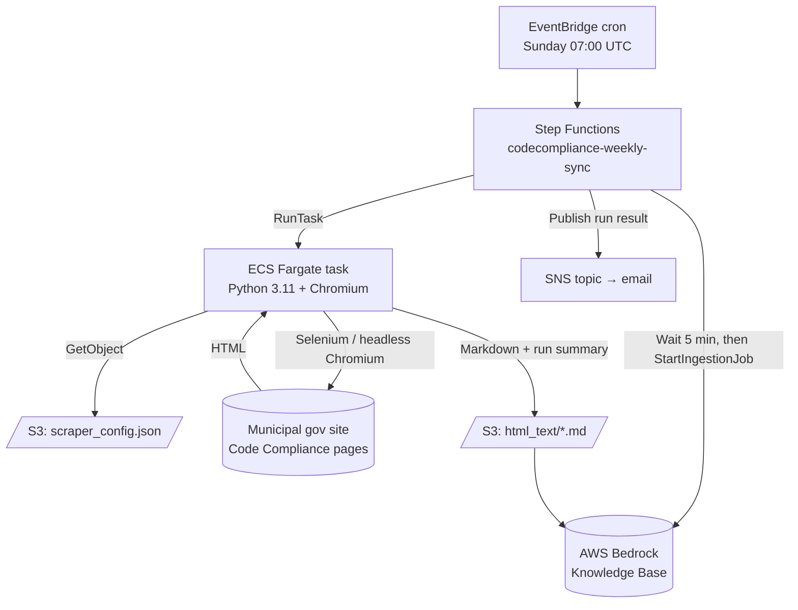

# Architecture

## System Diagram

```mermaid
flowchart TD
    EB[EventBridge cron<br/>Sunday 07:00 UTC]
    SF[Step Functions<br/>codecompliance-weekly-sync]
    ECS[ECS Fargate task<br/>Python 3.11 + Chromium]
    Cfg[/S3: scraper_config.json/]
    Site[(Municipal gov site<br/>Code Compliance pages)]
    MD[/S3: html_text/*.md/]
    KB[(AWS Bedrock<br/>Knowledge Base)]
    SNS[SNS topic → email]

    EB --> SF
    SF -->|RunTask| ECS
    ECS -->|GetObject| Cfg
    ECS -->|Selenium / headless Chromium| Site
    Site -->|HTML| ECS
    ECS -->|Markdown + run summary| MD
    SF -->|Wait 5 min, then StartIngestionJob| KB
    MD --> KB
    SF -->|Publish run result| SNS
```

## Component Descriptions

### `Config` (`standalone_selenium/`)
- **Purpose**: Carry all runtime knobs (start URLs, per-URL depth, delay, page cap, kill switch).
- **Key responsibilities**: Hydrate defaults, then overlay values from the S3-loaded JSON via `_apply_config()`; log the effective configuration at startup so CloudWatch shows exactly what ran.

### `SeleniumCrawler` (`standalone_selenium/`)
- **Purpose**: Drive Chromium through each start URL, extract content, and ship Markdown to S3.
- **Key responsibilities**: Maintain `visited_urls` + `to_visit` BFS state; resolve each link's depth budget by longest-prefix match against the originating start URL (`start_url_depths`) so seeds obey their own `max_depth`; render pages; run the HTML-to-Markdown extractor and flag a page as extracted only when its body clears `min_content_chars`; upload one file per page; and quit the driver if initialization fails after the browser launches.

### `HTMLTextValidationManager`
- **Purpose**: Post-run sanity check that produces an honest success/failure signal.
- **Key responsibilities**: Compare the extracted-page count against a minimum threshold and confirm S3 Markdown objects are dated today — paging through `list_objects_v2` so the freshness check holds beyond the 1,000-object response cap; produce the report that the SNS notification embeds.

### S3 layout
- `{prefix}config/scraper_config.json` — runtime config
- `{prefix}html_text/YYYY-MM-DD/*.md` — one Markdown file per page
- `{prefix}results/scraped_data_latest.json` — most recent run summary

### Step Functions state machine
- **Purpose**: Sequence the run.
- **Key responsibilities**: `RunTask` against Fargate, `Wait` 5 minutes for S3 consistency, `StartIngestionJob` against the Bedrock data source, then `Publish` to SNS with the outcome.

## Data Flow

1. EventBridge fires the state machine on the weekly cron.
2. Step Functions starts a Fargate task using the pinned task-definition revision.
3. The task pulls the latest `scraper_config.json` from S3 and merges it onto code defaults.
4. The crawler walks each start URL with its own depth budget, executing JavaScript via headless Chromium and parsing with BeautifulSoup.
5. Each page is converted to Markdown with YAML frontmatter and uploaded to S3.
6. The task writes a JSON run summary and exits.
7. Step Functions waits 5 minutes, then triggers a Bedrock Knowledge Base ingestion job that reads the new Markdown.
8. Step Functions publishes the result (page count, failures, ingestion job id) to SNS, which emails the operator.

## External Integrations

| Service | Purpose | Notes |
|---|---|---|
| Municipal gov site | Source of the content being indexed | Public site, CloudFlare-protected; stealth Chromium options are used to render JS and avoid bot blocks |
| AWS S3 | Config input + Markdown output | One bucket, separate prefixes for config / html_text / results |
| AWS Bedrock Knowledge Base | Vector index for the downstream chatbot | Triggered as an ingestion job; the chatbot itself lives outside this repo |
| AWS SNS | Notification fan-out | Plain email subscription for the run summary |

## Key Architectural Decisions

### Selenium + headless Chromium over plain HTTP
- **Context**: Many target pages are JavaScript-rendered and the site has CloudFlare bot mitigation; `requests` and `httpx` returned partial or blocked responses.
- **Decision**: Drive a real Chromium browser with stealth flags (`--disable-blink-features=AutomationControlled`, navigator.webdriver shimmed, realistic UA and window size).
- **Rationale**: Cheaper to maintain one rendering path than to keep chasing the site's anti-bot rules with TLS-fingerprint and CF-bypass libraries. The downside (heavier container) is acceptable on a weekly job.

### ECS Fargate over Lambda
- **Context**: The browser + ChromeDriver image is large and run-time is bursty (2–3 minutes, once a week).
- **Decision**: Run on Fargate (2 vCPU, 4 GB) instead of Lambda.
- **Rationale**: Lambda's 10 GB image and 15-minute caps are tight for Chromium and leave no margin for retries; Fargate has neither limit and costs roughly the same at this cadence.

### Step Functions for orchestration instead of a monolithic script
- **Context**: The scrape must finish, S3 must settle, then a separate Bedrock ingestion job must succeed before notifying.
- **Decision**: Express the sequence as a Step Functions state machine with built-in `Wait` and `Retry`.
- **Rationale**: Each step can be re-run or replaced in isolation, the AWS Console gives a free visual log of every weekly run, and transient Bedrock failures retry without bringing the container back up.

### S3-loaded JSON configuration with a kill switch
- **Context**: URLs and crawl parameters change more often than the code does, and any production run needs an emergency stop.
- **Decision**: Load `scraper_config.json` from S3 at task start and check an `enabled` boolean; if it's false the task logs and exits 0.
- **Rationale**: Operators can edit a JSON file (or flip the kill switch) without an ECR push, image rebuild, or task-definition revision. S3 object versioning provides a free audit trail.

### Markdown with YAML frontmatter as the output format
- **Context**: The output is consumed by an LLM via a Bedrock Knowledge Base, not by humans.
- **Decision**: Emit one Markdown file per page with `title`, `source_url`, `description`, and `scraped_date` frontmatter.
- **Rationale**: Markdown keeps headings/lists/tables intact so retrieval chunks stay coherent, and the frontmatter gives the chatbot the source URL it needs for citations.

### Per-URL depth limits instead of a global one
- **Context**: Some seed pages are standalone, others have a small set of meaningful children, and unlimited depth would explore irrelevant CMS sections.
- **Decision**: Each entry in `start_urls` carries its own `max_depth`.
- **Rationale**: Produces the same ~22 pages each week (stable for the knowledge base) without hand-listing every child URL.

## Infrastructure Components

| Component | AWS Service | Purpose |
|---|---|---|
| Schedule | EventBridge | Weekly cron |
| Orchestration | Step Functions | Run task → wait → ingest → notify |
| Compute | ECS Fargate | Container execution |
| Image registry | ECR | Scraper image |
| Storage | S3 | Config in, Markdown out |
| Index | Bedrock Knowledge Base | RAG ingestion target |
| Notifications | SNS | Email summary |
| Logs | CloudWatch Logs | Task and state-machine logs |
| Auth | IAM | Task and execution roles |

## Security Notes

- Container runs as a non-root user (UID 1000).
- Fargate tasks sit in private subnets and reach the internet through a NAT gateway.
- Task role grants only the specific S3 prefixes and SNS topic the script touches.
- No secrets in the image; all credentials come from the task role.
- S3 bucket is private with no public ACLs.
