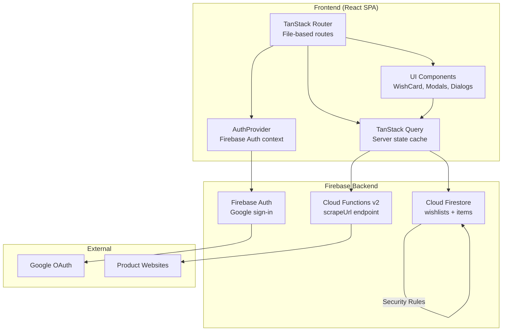

# Architecture Overview

## System Diagram

## Component Descriptions

### TanStack Router (File-based Routes)
- **Purpose**: Client-side routing with type-safe params
- **Location**: `src/routes/`
- **Key responsibilities**: Page rendering, route guards via AuthGuard, URL param extraction ($listId, $shareSlug)

### TanStack Query (Server State)
- **Purpose**: Async data fetching, caching, and mutation with automatic invalidation
- **Location**: `src/hooks/`
- **Key responsibilities**: Firestore reads via query hooks, write operations via mutations, optimistic cache invalidation on create/update/delete

### AuthProvider
- **Purpose**: Wraps the app in Firebase Auth context, exposes user state and signInWithGoogle
- **Location**: `src/lib/auth.tsx`
- **Key responsibilities**: `onAuthStateChanged` listener, Google popup sign-in with error handling, user object distribution via React context

### Firestore CRUD Helpers
- **Purpose**: Thin abstraction over Firestore SDK calls
- **Location**: `src/lib/firestore.ts`
- **Key responsibilities**: 8 functions — createWishlist, getUserWishlists, getWishlistBySlug, updateWishlist, deleteWishlist, addItemToWishlist, getWishlistItems, updateItem, deleteItem

### Cloud Function — scrapeUrl
- **Purpose**: Server-side HTML scraping to extract product metadata from any URL
- **Location**: `functions/src/index.ts` + `functions/src/scraper.ts`
- **Key responsibilities**: URL validation, fetch with browser User-Agent, HTML parsing via Cheerio (JSON-LD > OG tags > meta tags > URL fallback)

### UI Components
- **Purpose**: Reusable presentation components
- **Location**: `src/components/`
- **Key components**: WishCard (product card), AddItemModal (URL input + scrape), ShareDialog (public toggle + copy link), CreateListDialog, Navbar, EmptyState, AuthGuard

## Data Flow

### Adding an Item
1. User pastes a product URL into AddItemModal
2. `useScrapeUrl` mutation calls the `scrapeUrl` Cloud Function via `httpsCallable`
3. Cloud Function fetches the page HTML, parses it with Cheerio, returns ScrapedData
4. Modal displays scraped preview; user confirms
5. `useAddItem` mutation calls `addItemToWishlist` which writes to Firestore subcollection `wishlists/{id}/items`
6. TanStack Query invalidates the items cache, triggering a re-fetch

### Sharing a List
1. Owner toggles `isPublic` via ShareDialog, which calls `updateWishlist`
2. Dialog shows the shareable URL: `/shared/{shareSlug}`
3. Visitors hit the shared route, which calls `getWishlistBySlug`
4. Firestore security rules allow read access when `isPublic == true`

### Purchase Tracking (Gift Surprise)
1. Viewer on shared page clicks "I'll buy this" on an item
2. `updateItem` writes `isPurchased: true` and `purchasedBy: viewerUid`
3. Security rules restrict shared viewers to only updating `isPurchased` and `purchasedBy` fields
4. The list owner's view does NOT show purchase status — preserving the surprise

## External Integrations

| Service | Purpose |
|---------|---------|
| Firebase Auth | Google OAuth sign-in |
| Cloud Firestore | Document database for wishlists and items |
| Cloud Functions v2 | Server-side link scraping |
| Vercel | Frontend hosting with SPA rewrites |
| Google Fonts | Playfair Display + DM Sans |

## Key Architectural Decisions

### Subcollection for Items
- **Context**: Items belong to a specific wishlist
- **Decision**: Store items as a subcollection (`wishlists/{id}/items`) rather than a top-level collection
- **Rationale**: Natural hierarchy, simpler security rules, queries scoped to parent automatically

### Server-Side Scraping
- **Context**: Need to extract product info from arbitrary URLs
- **Decision**: Cloud Function with Cheerio instead of client-side fetching
- **Rationale**: Avoids CORS issues, can set custom User-Agent headers, keeps scraping logic server-side where it's maintainable

### Share Slug Instead of Document ID
- **Context**: Need shareable URLs for public wishlists
- **Decision**: Generate a random 8-character slug stored on the wishlist document
- **Rationale**: Short, human-friendly URLs; doesn't expose Firestore document IDs; easy to query by slug

### Three-Tier Scraping Fallback
- **Context**: Product pages have inconsistent metadata formats
- **Decision**: JSON-LD structured data > Open Graph tags > standard meta tags > URL hostname heuristic
- **Rationale**: JSON-LD is the richest source when available; OG is widely supported; meta tags and URL parsing provide a baseline for any page
