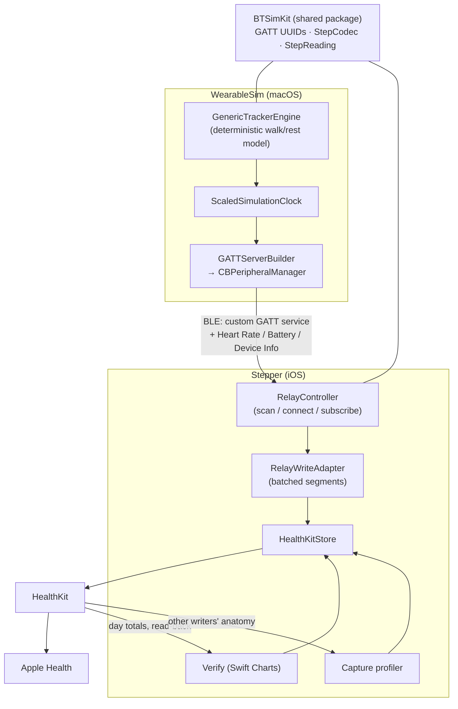

# Architecture

## System Diagram

## Component Descriptions

### BTSimKit (shared Swift package)
- **Purpose**: the wire contract and simulation core used by both apps, so the peripheral and the relay can never disagree about byte layouts
- **Location**: `Packages/BTSimKit/Sources/BTSimKit/`
- **Key responsibilities**: GATT UUID constants (`GATTUUIDs.swift`), strict little-endian codecs (`StepCodec.swift`), the deterministic tracker simulation (`GenericTrackerEngine.swift`), declarative service blueprints, and the profile factory

### WearableSim (macOS peripheral)
- **Purpose**: impersonates a fitness band — publishes the GATT surface, answers reads, and streams notifications
- **Location**: `Apps/WearableSim/Sources/Peripheral/`
- **Key responsibilities**: `PeripheralSessionController` (radio state machine, subscription tracking, 1 Hz notify ticks), `GATTServerBuilder` (the single choke point that turns blueprints into `CBMutableService`s), `RadioActivityMonitor` (anti-App-Nap assertion), teardown on scene phase *and* `willTerminate`

### Stepper — Relay
- **Purpose**: the BLE central half; turns a streamed counter into HealthKit samples
- **Location**: `Apps/StepTester/Sources/Features/Relay/`
- **Key responsibilities**: filtered scanning, bounded reconnect with backoff, counter-reset detection (`StepReading.delta` returning nil re-baselines instead of writing garbage), and `RelayWriteAdapter` — which accumulates ~3-minute windows before flushing, matching the iPhone pedometer's own sample shape

### Stepper — HealthKit domain
- **Purpose**: all HealthKit I/O behind one MainActor-isolated store
- **Location**: `Apps/StepTester/Sources/HealthKit/HealthKitStore.swift`
- **Key responsibilities**: authorization, writes with attribution (device descriptor, `wasUserEntered`, sync-upsert keys), read-back filtered to both of the app's bundle identities, per-source day totals via statistics query, and the Capture profiler that reads *other* writers' anatomy

### Stepper — UI (SwiftUI)
- **Purpose**: four tabs — Write (direct writes), Verify (read-back + per-source week chart), Capture (anatomy profiling + shape replay), Relay (live BLE view)
- **Location**: `Apps/StepTester/Sources/Features/` and `RootView.swift`
- **Key responsibilities**: preset-free form that launches at the baseline state, stacked per-source Swift Charts visualization, swipe-to-delete with confirmation

## Data Flow

1. The simulation engine computes payloads as a pure function of time — cadence is zero during rest phases, heart rate ramps while walking and decays after
2. WearableSim publishes four services and notifies subscribed centrals every tick
3. Stepper's relay decodes each counter notification, computes the delta against the previous reading, and accumulates segments
4. When a batch window reaches ~3 minutes (or the counter resets, the link drops, or the user stops), one HealthKit sample is written spanning exactly the accumulated window
5. Apple Health merges the new samples with every other writer according to the user's Data Sources & Access priority order; Verify's chart and read-back show the result from both sides

## External Integrations

| Service | Purpose | Notes |
|---------|---------|-------|
| HealthKit | write/read step samples; read distance for capture | Entitlement-gated; share scope is steps only (distance is read-only by design) |
| CoreBluetooth | the entire BLE pipeline | Peripheral mode on macOS, central mode on iOS; no encryption-required attributes, so no pairing dialogs |
| — | Everything else | Deliberately nothing: no network access, no analytics, no third-party packages. Health data never leaves the device |

## Key Architectural Decisions

### Custom 128-bit GATT service instead of a standard step profile
- **Context**: the Bluetooth SIG has no widely implemented step-count characteristic, and macOS refuses third-party publication of some SIG-assigned services outright (Battery `0x180F` and Device Information `0x180A` fail `add(_:)` with "UUID not allowed")
- **Decision**: steps live in a custom 128-bit service; battery and device-info ride sibling twin UUIDs (`F5A3B0xx`/`F5A3C0xx`) rather than their SIG assignments; Heart Rate keeps its official `0x180D` because macOS publishes it fine
- **Rationale**: real trackers carry steps in vendor services anyway, so the custom service is *more* realistic than a fictional standard one — and the twin-UUID fallback means the data path survives on every Mac

### The simulation is a pure function of time
- **Context**: a simulator with hidden mutable state is impossible to test and drifts across restarts
- **Decision**: `GenericTrackerEngine` computes cadence and heart rate as pure functions of the passed timestamp, with all variation from a SplitMix64 hash of the cycle index — no system randomness
- **Rationale**: any moment replays identically, so tests pin exact values; the same purity lets the Mac UI draw 5-minute sparklines by sampling the past without mutating the step counter (locked by the `historyLeavesStepCounterUntouched` test)

### Batched relay writes instead of per-tick writes
- **Context**: writing one sample per second is a robot tell — the iPhone's own pedometer coalesces minutes of walking into single multi-minute samples
- **Decision**: `RelayWriteAdapter` accumulates stream segments and flushes one HealthKit sample per ~3-minute window, on interval expiry, counter reset, disconnect, or stop
- **Rationale**: captured real-world data (Apple's distance samples: ~318 s typical duration; Oura's steps: 60 s windows) defines the target shapes, and windows derive strictly from stream segment timestamps so writes can never overlap

### Dual-identity read-back
- **Context**: HealthKit locks a source's display name to the bundle ID it first saw — renaming the app's display name never changes the source, so the rebrand to "Stepper" required a new bundle ID
- **Decision**: the read-back filter accepts both bundle identities, keeping the full experiment history visible while new writes carry the new name
- **Rationale**: history stays intact without freezing the app's identity forever; the trade-off (two sources in Apple Health) is documented in `docs/gotchas.md`

### Single-profile consolidation over emulation breadth
- **Context**: BLE-level emulation of real bands (Whoop, Oura) was researched and proven feasible, but experiments showed consumer intake is shape-only — the radio layer is not load-bearing for what this tool tests, and the faithful Oura *shape* replay already exists in the Capture tab
- **Decision**: ship one profile (the generic tracker) and keep the vendored Whoop protocol research as a document rather than as code
- **Rationale**: a research instrument should be exactly as large as its purpose; the deleted code is recoverable from git history if that ever changes
