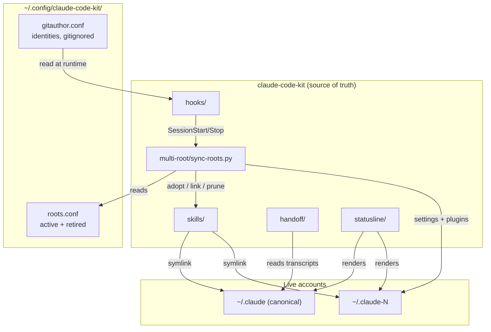

# Architecture

## System Diagram

## Component Descriptions

### Reconciler
- **Purpose**: keeps every account identical, and manages account lifecycle
- **Location**: `multi-root/sync-roots.py`
- **Key responsibilities**: `--check` (report drift), `--add` (stand up an account), `--retire` (decommission one), and six drift classes — adopt, link, prune, settings, plugins, orphaned credentials

### Session handoff
- **Purpose**: rescue a conversation when an account hits its usage limit
- **Location**: `handoff/handoff-brief.py`, `handoff/resume-locate.sh`, `handoff/resume-search.py`
- **Key responsibilities**: build a brief from a transcript with no model involvement; locate a session by id, by content search, or by "newest here"

### Identity gate
- **Purpose**: stop a commit going out under the wrong git identity
- **Location**: `hooks/gitauthor.sh`
- **Key responsibilities**: path-aware, bidirectional allowlist; parses both `--author=` and `-c user.email=`; fails open when unconfigured

### Status bar
- **Purpose**: render context and quota for whichever account a session belongs to
- **Location**: `statusline/statusline.py` (+ `guardlib.py`, `renderer.py`)
- **Key responsibilities**: format the payload the host hands it; never write shared state

## Data Flow

1. A session ends. A `Stop` hook runs the reconciler in adopt-only mode.
2. Any skill created directly in the live skills directory is moved into this repo and symlinked back, so it becomes version-controlled without the author doing anything.
3. At the next session start, the full reconciler runs: it links any skill added to the repo, prunes dangling links, pushes shared settings from the canonical account, installs missing plugins, and reports orphaned credentials.
4. When an account hits its limit, `resume-locate.sh` finds the session and builds a brief; a fresh account reads the brief plus the files it points at, and continues.

## External Integrations

| Service | Purpose | Notes |
|---|---|---|
| macOS Keychain | reads the OAuth token per account | Service name is `Claude Code-credentials` for the default root, `Claude Code-credentials-<first 8 hex of sha256(path)>` otherwise. Read-only; never written. |
| Anthropic OAuth usage endpoint | per-account quota | `GET /api/oauth/usage`. Reports 1% integer resolution; an expired token returns 429, not 401. |
| Plugin marketplaces | plugin installation per account | Must be cloned locally per account; declaring one in settings is not sufficient. |

## Key Architectural Decisions

### The repo is canonical; the live directories are symlinks
- **Context**: config was duplicated between a working directory and a repo.
- **Decision**: real files live here; `~/.claude` holds symlinks.
- **Rationale**: I tried vendoring copies first. Within an hour the checked-in status bar was a file that no longer ran anywhere. Copies drift silently; a symlink cannot. The rejected alternative — a sync step that pushes copies both ways — keeps the drift and adds a step to forget.

### Configuration has three transport classes, not one
- **Context**: plugins never propagated between accounts while skills always did.
- **Decision**: treat *shared* (symlinked), *generated* (settings) and *installed* (plugins) as separate mechanisms.
- **Rationale**: they had been handled as one thing, which is why plugins silently diverged. Enabling a plugin writes a settings flag and downloads nothing — a settings-only sync produces accounts that look configured and have none.

### The brief is mechanical, not summarised
- **Context**: rescuing a session at 100% usage means the source account cannot answer.
- **Decision**: build the handoff artifact by parsing the transcript — no model call.
- **Rationale**: anything needing a working turn is unavailable exactly when it is needed. Measured across a session, user messages are ~1% of the volume and copy verbatim; ~86% is tool output that is mostly re-readable from disk. Median compression is 90×.

### Grounding is ranked by "early and often", never by recency
- **Context**: a resumed session needs the files that shaped the work.
- **Decision**: rank referenced files by first-seen turn and frequency.
- **Rationale**: the obvious heuristic — most recently used — returns scratch artifacts. The architecture read at turn 8 is the least-recently-touched thing by the end, and it is the thing that mattered.

### Identities live in config, never in the committed script
- **Context**: the identity gate needs real addresses and real client directory paths.
- **Decision**: read them from a gitignored runtime file; fail open when absent.
- **Rationale**: an engagement's directory name is as sensitive as the address. Failing open matters too — a gate with an empty allowlist denies every commit on the machine, which is how a safety tool gets uninstalled instead of fixed.
