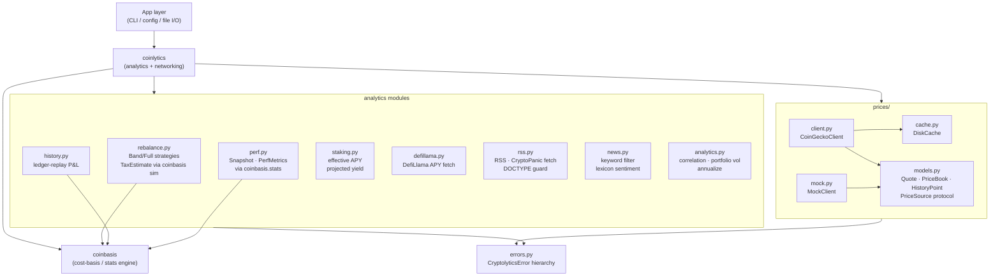

# Architecture — coinlytics

## Module Structure



## Component Descriptions

| Component | File | Responsibility |
|---|---|---|
| `CoinGeckoClient` | `prices/client.py` | Keyless-first price fetcher; 429→keyed fallback; exponential backoff; TTL cache; offline last-good |
| `DiskCache` | `prices/cache.py` | SHA-256-keyed TTL on-disk JSON cache; atomic writes via `os.replace` |
| `MockClient` | `prices/mock.py` | Deterministic `PriceSource` for tests; no network; `fail_ids` exercises error paths |
| `Quote / PriceBook / HistoryPoint / PriceSource` | `prices/models.py` | Typed data models and structural protocol for the price layer |
| `CoinGeckoConfig` | `prices/client.py` | Frozen dataclass holding API key, plan, cache settings, retry parameters |
| `rebalance` | `rebalance.py` | Band/Full rebalance strategies; HIFO realized-gain estimate via `coinbasis` simulation |
| `history` | `history.py` | `holdings_as_of` and `reconstruct_series` — ledger-replay P&L using `coinbasis.Portfolio` |
| `perf` | `perf.py` | `Snapshot` accumulation; delegates all metrics to `coinbasis.stats` |
| `staking` | `staking.py` | Effective APY (API vs. manual preference), projected yield, rewards summary |
| `defillama` | `defillama.py` | DefiLlama `/pools` fetch; selects highest-TVL exact-match pool per symbol |
| `rss` | `rss.py` | `fetch_rss` and `fetch_cryptopanic`; DOCTYPE entity-expansion guard |
| `news` | `news.py` | Whole-word keyword filter; naive lexicon sentiment classification |
| `analytics` | `analytics.py` | Pearson correlation, correlation matrix, portfolio volatility, annualize |
| `errors` | `errors.py` | `CryptolyticsError` hierarchy: `PriceSourceError`, `RateLimitedError`, `CacheError`, `FeedError`, `StakingError` |

## Data Flow

```
CoinGecko API
    │
    ▼
CoinGeckoClient._request()
    ├─ [cache hit, fresh] ──────────────────────────────► return PriceBook
    ├─ [keyless 200] → DiskCache.write() ──────────────► return PriceBook
    ├─ [keyless 429 + key configured] → keyed phase
    │       └─ [keyed 200] → DiskCache.write() ────────► return PriceBook
    │       └─ [keyed 429/fail] → backoff → …
    └─ [exhausted] → stale cache? ──────────────────────► PriceBook(stale=True)
                   → no cache → raise RateLimitedError / PriceSourceError

PriceBook.prices_map()          dict[str, Decimal]
    │                               │
    ▼                               ▼
rebalance.compute_trades()   coinbasis.Portfolio.valuation()
    │
    ├─ HIFO TaxEstimate: coinbasis.Portfolio(txs + sim Sell).realized_gains()
    │
    ▼
RebalancePlan → app displays trade list + gain estimates

history.reconstruct_series(txs, price_by_coin_date, dates)
    │
    ├─ per date: coinbasis.Portfolio.from_transactions(filtered_txs).holdings()
    └─ value at historical price → [{date, value, cost, pl}]

perf.metrics(snapshots)
    └─ coinbasis.stats.{returns_from_values, volatility, sharpe_ratio,
                        max_drawdown, cumulative_return}
```

## External Integrations

| Service | Module | Purpose | Auth model | Rate limits |
|---|---|---|---|---|
| CoinGecko Public API | `prices/client.py` | Current prices, market caps, historical charts | None (keyless) | ~10–30 req/min; 429 triggers keyed fallback |
| CoinGecko Demo API | `prices/client.py` | Same endpoints, higher limit | `x-cg-demo-api-key` header | ~30 req/min (Demo plan) |
| CoinGecko Pro API | `prices/client.py` | Same endpoints, pro endpoint | `x-cg-pro-api-key` header, `pro-api.coingecko.com` | Varies by plan |
| DefiLlama Yields | `defillama.py` | Staking pool APYs | None (public) | Generous; no auth required |
| CryptoPanic API | `rss.py` | Crypto news headlines | `auth_token` query param | Per-plan limit |
| RSS feeds | `rss.py` | News headlines (e.g. CoinTelegraph) | None | Feed-dependent |

## Key Architectural Decisions

**1. Keyless-first with automatic keyed fallback on 429**
I chose to attempt the public CoinGecko endpoint without a key first. This means the library works out of the box with no configuration. Only when the public endpoint returns HTTP 429 does the client switch base URL and auth header based on the configured `plan` field (`demo` vs. `pro`). This keeps simple use cases frictionless while supporting production deployments with rate-limit tolerance.

**2. TTL on-disk cache with offline last-good fallback**
`DiskCache` hashes each cache key with SHA-256 to produce a stable filename, writes atomically via temp-file-then-`os.replace`, and records a `fetched_at` UTC timestamp. On request, a fresh entry skips the network entirely. After all retries are exhausted, a stale entry is returned with `PriceBook.stale=True` rather than raising an exception. This keeps the app functional in degraded network conditions — a common scenario for a local portfolio tracker.

**3. Delegating cost-basis math to `coinbasis` instead of reimplementing**
All lot selection, HIFO/FIFO/LIFO gain calculation, and holdings arithmetic lives in `coinbasis`. The rebalance tax estimate works by appending a simulated `Sell` transaction to a throwaway `coinbasis.Portfolio` and reading the gain delta — two lines of domain logic, zero lot-tracking code. The history module filters transactions by date and calls `Portfolio.from_transactions` directly. I chose this approach to eliminate an entire class of bugs (off-by-one lot matching, rounding in Decimal arithmetic) by never duplicating the engine.

**4. XML DOCTYPE guard instead of a `defusedxml` dependency**
`xml.etree.ElementTree` does not resolve external entities (no XXE/SSRF risk), but it can be made to expand internal entities defined in a DOCTYPE, which enables "billion laughs" DoS. RSS feeds never legitimately contain a DOCTYPE declaration, so `fetch_rss` refuses any document whose text contains `<!DOCTYPE` (case-insensitive) and raises `FeedError`. This closes the vector with a two-line guard and keeps the package's dependency surface to `requests` + `coinbasis` only.

**5. Naive keyword-lexicon sentiment rather than an NLP library**
The sentiment classifier tokenizes headline text and counts hits against fixed `BULLISH` and `BEARISH` word sets. It uses `\bword\b` regex to prevent substring matches (e.g. `ban` should not match `banana`). I chose a lexicon approach deliberately: it is transparent, auditable, has no dependencies, and is entirely sufficient for a "bullish/bearish/neutral" triage of crypto news headlines. Adding an NLP library for marginal accuracy on this use case would be engineering overreach.

**6. All network mocked in tests; `MockClient` satisfies the `PriceSource` protocol**
No test in the suite makes a real network call. The `CoinGeckoClient` test suite patches `requests.get` directly. For higher-level tests (rebalance, history, perf, staking), `MockClient` provides deterministic responses without any mocking machinery. `MockClient` satisfies the structural `PriceSource` protocol, which means it is a drop-in substitute anywhere the real client is used — this decouples the analytics test suite completely from network concerns.
