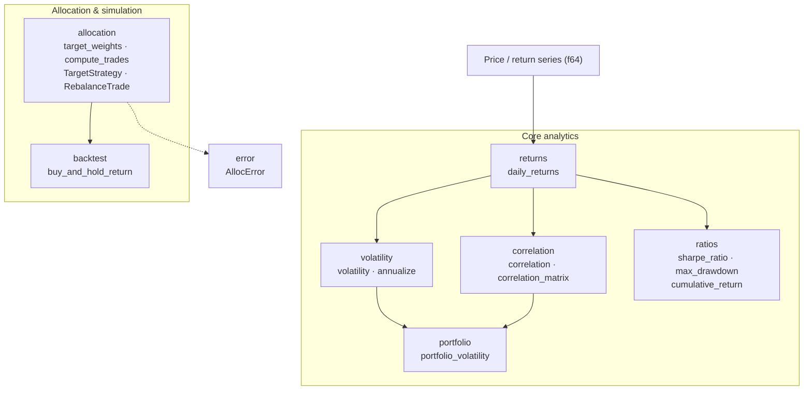

# cryptolytics — Architecture

## Module Structure



## Component Descriptions

| Module | File | Public surface |
|---|---|---|
| `returns` | `src/returns.rs` | `daily_returns(&[f64]) -> Vec<f64>` — converts a price series to period-over-period returns |
| `volatility` | `src/volatility.rs` | `volatility(&[f64]) -> Option<f64>` (population stdev); `annualize(f64, f64) -> f64` |
| `correlation` | `src/correlation.rs` | `correlation(&[f64], &[f64]) -> Option<f64>` (Pearson); `correlation_matrix(&BTreeMap<String, Vec<f64>>) -> BTreeMap<(String,String), f64>` |
| `portfolio` | `src/portfolio.rs` | `portfolio_volatility(weights, vols, corr) -> f64` — quadratic form `sqrt(Σᵢ Σⱼ wᵢ wⱼ σᵢ σⱼ ρᵢⱼ)` |
| `ratios` | `src/ratios.rs` | `sharpe_ratio`, `max_drawdown`, `cumulative_return` — all return `Option<f64>` |
| `allocation` | `src/allocation.rs` | `TargetStrategy` enum (Equal / MarketCap / Custom); `target_weights` → `Result<BTreeMap, AllocError>`; `compute_trades` → `Vec<RebalanceTrade>` |
| `backtest` | `src/backtest.rs` | `buy_and_hold_return(history, weights) -> f64` — renormalizes weights across usable assets |
| `error` | `src/error.rs` | `AllocError` — four variants covering empty assets, missing market-cap data, missing custom weights, and weights not summing to 1.0 |

## Data Flow

```
Price series (Vec<f64>)
    └─► returns::daily_returns
            ├─► volatility::volatility  ──────────────────────────────┐
            │       └─► volatility::annualize                         │
            ├─► correlation::correlation_matrix  ─────────────────────┼─► portfolio::portfolio_volatility
            └─► ratios::{sharpe_ratio, max_drawdown, cumulative_return}│
                                                                       │
BTreeMap<String, f64> (market caps / custom weights)                   │
    └─► allocation::target_weights  ──────────────────────────────────┘
            └─► allocation::compute_trades ──► Vec<RebalanceTrade>

BTreeMap<String, Vec<f64>> (price history per asset)
    └─► backtest::buy_and_hold_return ──► f64
```

**Inputs**: raw `f64` slices or `BTreeMap` containers; callers are responsible for data quality.

**Outputs**: plain Rust values (`f64`, `Option<f64>`, `Vec<RebalanceTrade>`, `BTreeMap`) — no domain objects that leak across module boundaries except the three re-exported types (`TargetStrategy`, `TradeAction`, `RebalanceTrade`) and `AllocError`.

## Key Architectural Decisions

### 1. `f64` rather than a decimal type for risk math

Portfolio analytics — standard deviation, Pearson correlation, quadratic form variance — involve square roots, divisions, and accumulated floating-point sums. A decimal type (e.g. `rust_decimal`) does not provide `sqrt` natively and adds significant overhead with no accuracy benefit for statistical estimation. `f64` is the standard for numerical finance and statistical estimation.

### 2. Self-contained crate, no dependency on `coinbasis`

`coinbasis` answers *what did I pay and what did I realize* (accounting, tax lots). `cryptolytics` answers *how is my portfolio behaving* (volatility, correlation, rebalancing). Keeping them independent means either crate can be used without the other, tested in isolation, and published separately. The separation is intentional: mixing accounting correctness concerns with statistical estimation concerns would complicate both.

### 3. `BTreeMap` for deterministic multi-asset ordering

All multi-asset inputs and outputs use `BTreeMap<String, …>` rather than `HashMap`. Iteration over a `BTreeMap` is sorted by key, so `correlation_matrix`, `compute_trades`, and `buy_and_hold_return` produce deterministic output regardless of insertion order. This makes tests reproducible and makes serialized output stable across runs.

### 4. `Option` returns for under-2-sample and degenerate inputs

Functions like `volatility`, `correlation`, `sharpe_ratio`, `max_drawdown`, and `cumulative_return` return `Option<f64>` instead of panicking or returning `NaN`. A single-element series is a legitimate caller state (e.g. a new asset with one price point), not a programming error. Returning `None` lets callers handle it explicitly without needing to guard against `NaN` propagation downstream.

### 5. MarketCap strategy silently drops zero-cap assets and renormalizes

Rather than erroring when some assets in the list have zero or missing market caps, `target_weights(MarketCap, …)` filters them out and renormalizes over the remaining assets. This matches real-world usage where a portfolio list may include assets not yet priced or newly listed. An error is only returned when *no* usable caps remain. The filtered assets simply do not appear in the output `BTreeMap`.

### 6. Separation of accounting (`coinbasis`) and behavior (`cryptolytics`)

Cost-basis and tax-lot logic requires exact decimal arithmetic and per-lot tracking — concerns that are orthogonal to statistical estimation. Merging them would force statistical functions to carry accounting types (and vice versa). The two-crate split keeps each API surface focused and avoids bloating compile times for users who only need one concern.
