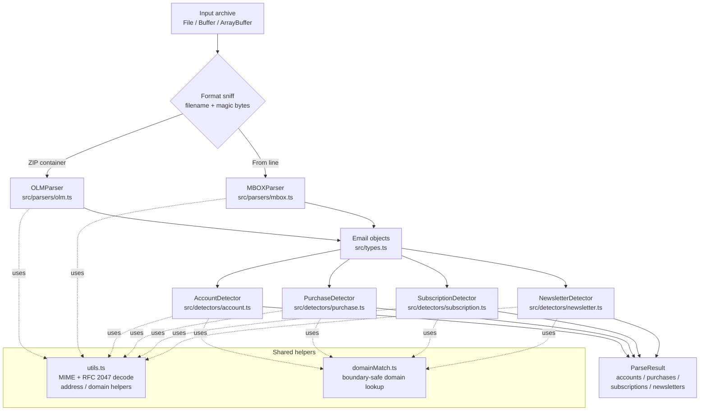

# Architecture

I designed this library as two clean layers — a **parser layer** that turns raw archive bytes into typed `Email` objects, and a **detector layer** that mines those objects for accounts, purchases, subscriptions, and newsletters. The two layers share a small set of stateless helpers (MIME decoding, address/domain utilities, and a boundary-safe domain matcher). Keeping them separate means the parsers know nothing about detection and the detectors know nothing about archive formats.

## System Diagram

## Component Descriptions

### Entry point — `src/index.ts`
The public surface. Re-exports the two parsers, four detectors, the type definitions, and the utility functions. It also provides `parseArchive()`, a convenience function that sniffs the input format (filename for a `File`, leading bytes otherwise — ZIP magic `PK\x03\x04` for OLM, `From ` for MBOX), dispatches to the right parser, and optionally runs detectors based on `ParseOptions` flags.

### MBOX parser — `src/parsers/mbox.ts`
Parses the line-oriented MBOX format used by Gmail Takeout, Thunderbird, and Apple Mail. Key responsibilities:
- **Message splitting** on `From ` separator lines, validated by requiring a three-letter weekday token immediately after the sender so prose lines like "From Bob, see you Friday" are not mistaken for message boundaries. Both the ctime form (`Mon Jan  1`) and the RFC 2822 form (`Thu, 15 Jan`) are accepted.
- **mboxrd unescaping** — a leading `>` is stripped from `>From ` body lines.
- **Streaming** — three code paths (browser `File` slicing, Node file-path read streams, and large-`Buffer` chunking) all process the archive in chunks while carrying over a "leftover" tail so a message split across a chunk boundary is never lost.
- **MIME handling** — multipart bodies are split on their boundary (including nested multipart), and parts are decoded per their `Content-Transfer-Encoding` (base64 / quoted-printable).
- **Gmail labels** — `X-Gmail-Labels` is parsed into folder assignment plus read/starred flags.
- **Noise rejection** — bodies that look like binary/base64 image payloads or are mostly non-printable are dropped.

### OLM parser — `src/parsers/olm.ts`
Parses Outlook for Mac `.olm` archives, which are ZIP containers of XML. Uses JSZip to extract entries, then reads emails, contacts, and calendar events out of the archive's XML structure into the same typed model the MBOX parser produces.

### Shared utilities — `src/utils.ts`
Stateless helpers used by both layers. The notable ones:
- `decodeQuotedPrintable` and `decodeHeaderValue` — charset-aware MIME and RFC 2047 (`=?charset?B/Q?text?=`) decoding. Bytes are accumulated and decoded together through `TextDecoder` so multi-byte UTF-8 sequences and surrogate-pair emoji decode correctly, with a UTF-8 fallback when a charset label is unknown.
- `cleanEmailAddress`, `extractDomain`, `formatDomainAsName` — address and domain normalization.
- `stripHtml`, `normalizeSubject` — body and subject cleanup, with a DOM path in the browser and a regex fallback in Node.

### Domain matcher — `src/detectors/domainMatch.ts`
A single generic helper, `matchKnownDomain`, that all four detectors use to look up a sender domain in a registry. It matches only on exact equality or a true subdomain suffix (`domain === key` or `domain.endsWith('.' + key)`), guarded by a `hasOwnProperty` check — never on a bare substring.

### Detectors — `src/detectors/*.ts`
Four stateless classes, each exposing `detect(email)` for a single email and `detectBatch(emails)` for deduplicated aggregate results:
- **AccountDetector** — scores known-service domains plus subject/body signup patterns; `detectBatch` deduplicates by service name and keeps the earliest signup date.
- **PurchaseDetector** — scores receipt/invoice patterns, penalizes promotional anti-patterns, and extracts a locale-aware amount and order number; `detectBatch` emits one `Purchase` per qualifying email.
- **SubscriptionDetector** — recognizes recurring-billing patterns, infers frequency, and normalizes the price to a monthly figure; `detectBatch` groups by service.
- **NewsletterDetector** — scores newsletter vs. promotional signals, extracts unsubscribe links, and estimates frequency; `detectBatch` groups by sender.

## Data Flow

1. The caller hands an archive (`File`, `Buffer`, or `ArrayBuffer`) to `parseArchive`, or instantiates a parser directly.
2. The format is determined — filename suffix for a browser `File`, otherwise the leading magic bytes.
3. The chosen parser walks the archive: MBOX splits on validated `From ` lines and streams in chunks; OLM extracts the ZIP and reads its XML entries.
4. For each message, headers are parsed, the body is decoded per its content type and transfer encoding (multipart parts are walked recursively), and MIME/RFC 2047 encoded headers are decoded with the declared charset.
5. Each message becomes a typed `Email`; the parser assigns a stable sequential `id` so detection results can point back to their source email.
6. Contacts are aggregated from senders, and the parser returns a `ParseResult` with `emails`, `contacts`, `calendarEvents`, and summary `stats`.
7. If any detection flag is set, each requested detector runs `detectBatch` over the parsed emails and attaches its deduplicated results (`accounts`, `purchases`, `subscriptions`, `newsletters`) to the same `ParseResult`.

## External Integrations

| Integration | Purpose | Notes |
|-------------|---------|-------|
| JSZip (`^3.10`) | Extracts the ZIP container that backs an `.olm` archive | The only runtime dependency. Works in both Node and the browser. |

The library is intentionally dependency-light. Everything else — MIME decoding, charset handling, base64 — is built on platform primitives (`TextDecoder`, `TextEncoder`, `atob`) with `Buffer` fallbacks, so the same code runs in Node and the browser with no extra packages.

## Key Architectural Decisions

### Separate parsing from detection
**Decision:** Parsers produce plain `Email` objects; detectors are stateless classes that consume them. `detectBatch` handles deduplication and aggregation separately from `detect`.
**Rejected alternative:** Detecting inline while parsing. That would couple every format parser to detection logic, make detectors impossible to run standalone on already-parsed emails, and force the dedup/grouping concerns into the parse loop. Keeping them apart means I can run a single detector over an arbitrary email list, and a new format only needs to produce `Email` objects to get all detection for free.

### Boundary-safe domain matching
**Decision:** `matchKnownDomain` matches a sender domain only on exact equality or a true subdomain suffix (`domain.endsWith('.' + key)`), with a `hasOwnProperty` guard.
**Rejected alternative:** Substring checks like `domain.includes(key)`. Those produce false positives — `fedex.com` contains `x.com`, `amazonaws.com` contains `amazon.com`, and a naive `domain.includes('mail.')` flagged `gmail.com`/`hotmail.com` as promotional. Anchoring on the label boundary eliminates that whole class of bug.

### Charset-aware MIME decoding instead of assuming UTF-8
**Decision:** Quoted-printable and RFC 2047 payloads accumulate raw bytes and decode them through `TextDecoder` using the declared charset, falling back to UTF-8 when the label is unknown. Surrogate pairs are encoded together so astral code points (emoji) survive.
**Rejected alternative:** Assuming UTF-8 and masking each character with `& 0xff`. That corrupts any non-UTF-8 body and mangles multi-byte sequences and emoji. Honoring the declared charset keeps international mail readable.

### Locale-aware amount parsing by separator position
**Decision:** `parseAmount` resolves which of `.`, `,`, and `'` is the decimal separator from its position (the last separator before a 1–2 digit tail is the decimal), so `1.234,56`, `1,234.56`, and `1'234.56` all parse correctly.
**Rejected alternative:** Stripping commas and calling `parseFloat`. That works only for US formatting and silently misreads European and Swiss amounts (`1.234,56` would become `1.234`). Position-based resolution handles the real spread of formats across the supported currencies.

### Streaming with carried-over leftovers for large archives
**Decision:** MBOX input is read in chunks, and any partial message at the end of a chunk is carried into the next chunk before splitting on `From ` lines.
**Rejected alternative:** Reading the whole file into one string. Multi-gigabyte exports exceed Node's string-size limit and blow up browser memory. Chunked reads with a leftover tail keep memory flat while guaranteeing no message is split or dropped at a chunk boundary.

### Dual CJS + ESM build via tsup
**Decision:** The package ships both CommonJS and ESM bundles plus `.d.ts` declarations, built with tsup from a single entry point.
**Rejected alternative:** Shipping ESM only, or hand-maintaining two build configs. Dual output via one tsup command means the library imports cleanly from modern ESM projects and legacy `require`-based Node code without me maintaining parallel toolchains.
