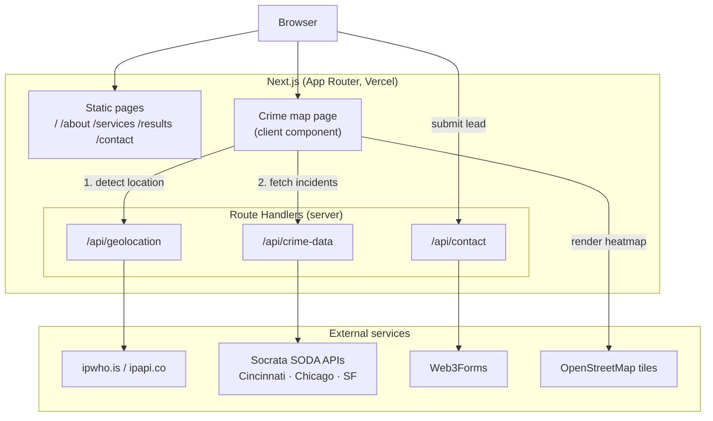

# Architecture

## System Diagram

## Component Descriptions

### Crime map page
- **Purpose**: Detect the visitor's location and render a heatmap of nearby incidents.
- **Location**: `src/app/crime-map/page.tsx`, `src/components/crime/CrimeMap.tsx`
- **Key responsibilities**: Orchestrates the two-step geolocation → crime-data fetch, manages the crimes/calls layer toggle, memoizes the map center, and dynamically imports the Leaflet map client-side only.

### Geolocation route
- **Purpose**: Turn the request's client IP into an approximate location.
- **Location**: `src/app/api/geolocation/route.ts`, `src/lib/client-ip.ts`
- **Key responsibilities**: Extract a trusted client IP, validate it, short-circuit private/loopback addresses to a default location, and resolve real IPs through a primary→secondary provider fallback.

### Crime-data route
- **Purpose**: Aggregate and normalize public-safety records into a single heatmap shape.
- **Location**: `src/app/api/crime-data/route.ts`
- **Key responsibilities**: Pick the right city dataset(s) for the coordinates, build a per-dataset spatial query, transform heterogeneous records into `{ lat, lng, intensity, type, date }`, and apply a radius safety filter.

### Contact route + assessment form
- **Purpose**: Capture and deliver security-assessment leads.
- **Location**: `src/app/api/contact/route.ts`, `src/components/contact/AssessmentForm.tsx`, `src/lib/validations.ts`
- **Key responsibilities**: Rate-limit by IP, trap bots with a honeypot, validate with a shared Zod schema, and forward to Web3Forms (degrading honestly when no key is configured).

### Intro animation
- **Purpose**: Brand moment on first visit.
- **Location**: `src/components/intro/IntroAnimation.tsx`, `src/app/page.tsx`
- **Key responsibilities**: Build a viewport-sized "digital camo" grid that dissolves, capping node count on large screens, skipping entirely for reduced-motion users, and showing only once per session.

### UI primitives & design system
- **Purpose**: Consistent, themeable building blocks.
- **Location**: `src/components/ui/`, `src/lib/utils.ts`, `globals.css`
- **Key responsibilities**: CVA-based variants merged via `cn()` (clsx + tailwind-merge); brand palette exposed as CSS custom properties and mapped to Tailwind through `@theme inline`.

## Data Flow

1. A visitor opens `/crime-map`; the client calls `/api/geolocation`.
2. The geolocation route reads the trusted client IP, validates it, and resolves a location (provider → fallback provider → default Cincinnati).
3. The client calls `/api/crime-data` with the resolved coordinates and city.
4. The crime-data route selects the matching city dataset, builds a spatial query, fetches from the SODA API, normalizes records, and returns the points plus a coverage/message payload.
5. `CrimeMap` renders the points as a Leaflet heat layer over OpenStreetMap tiles; toggling the layer re-runs step 4 for the other dataset.
6. Separately, submitting the assessment form POSTs to `/api/contact`, which rate-limits, screens the honeypot, validates, and forwards to Web3Forms.

## External Integrations

| Service | Purpose | Notes |
|---------|---------|-------|
| Socrata SODA (Cincinnati, Chicago, SF) | Live crime / calls-for-service records | Public, no auth; queried with SoQL `$where`, 8s request timeout, 1000-row cap |
| ipwho.is / ipapi.co | IP→location resolution | Primary + fallback; 5s timeout; private IPs short-circuited |
| Web3Forms | Email delivery of contact leads | Server-side, env-keyed; honest 503 in prod when unconfigured |
| OpenStreetMap | Map raster tiles | Client-side via Leaflet |

## Key Architectural Decisions

### Server-side proxy for all third-party data
- **Context**: The map needs IP geolocation and city crime data, and the contact form needs email delivery — all from third parties.
- **Decision**: Every external call lives in a Next.js Route Handler, never the browser.
- **Rationale**: Keeps the Web3Forms key server-only, lets me normalize three different open-data schemas in one place, and keeps the browser's network surface to same-origin `/api/*` — which in turn lets the CSP `connect-src` stay tight.

### Push spatial filtering into the query, per dataset
- **Context**: Each SODA dataset caps a response at 1000 rows. Fetching 1000 *citywide* rows and filtering to a radius in JavaScript leaves the heatmap sparse and unrepresentative of the visitor's actual neighborhood.
- **Decision**: Filter server-side in the SoQL query, choosing the technique per dataset — `within_circle()` on the geo column for Chicago and San Francisco, a numeric bounding box for Cincinnati calls-for-service.
- **Rationale**: Spends the 1000-row budget on nearby incidents. The datasets are not uniform: some store latitude/longitude as text (where a SoQL `between` would compare lexicographically and break on negative longitudes) and one has no geo column at all, so a one-size query was wrong. Where a correct server-side filter isn't possible, that dataset keeps a recency-ordered citywide pull plus a JavaScript radius filter, which is retained everywhere as a safety net.

### Bound every outbound request
- **Context**: A slow or hanging open-data portal would otherwise tie up a serverless invocation until the platform's hard timeout.
- **Decision**: A small `fetchWithTimeout` helper (AbortController + timer) wraps every external call — 5s for geolocation, 8s for SODA and Web3Forms.
- **Rationale**: A dead upstream degrades to the existing fallback (default location, empty layer) in seconds instead of stalling the page.

### Leaflet initialized once, then panned in place
- **Context**: React 19 Strict Mode mounts effects twice, and the page re-renders on loading/layer changes; a naive Leaflet setup re-creates the whole map and leaks instances.
- **Decision**: Initialize the map exactly once (guarded against the Strict-Mode remount), then update view and markers imperatively; manage the heat layer's lifecycle explicitly so it clears even when a layer switch returns zero points.
- **Rationale**: Avoids the "container is already initialized" class of Leaflet bugs and keeps the map smooth when the data behind it changes.

### Trust the platform's client IP, not the raw header
- **Context**: `X-Forwarded-For` is client-supplied; its left-most entry is trivially spoofable, and that value is both used for geolocation and interpolated into an outbound request.
- **Decision**: Resolve the client IP from the platform header (`x-vercel-forwarded-for` / `x-real-ip`), falling back to the right-most (trusted) `X-Forwarded-For` hop.
- **Rationale**: Removes a spoofing vector and a small SSRF-adjacent surface, and doubles as a sound rate-limit key.
