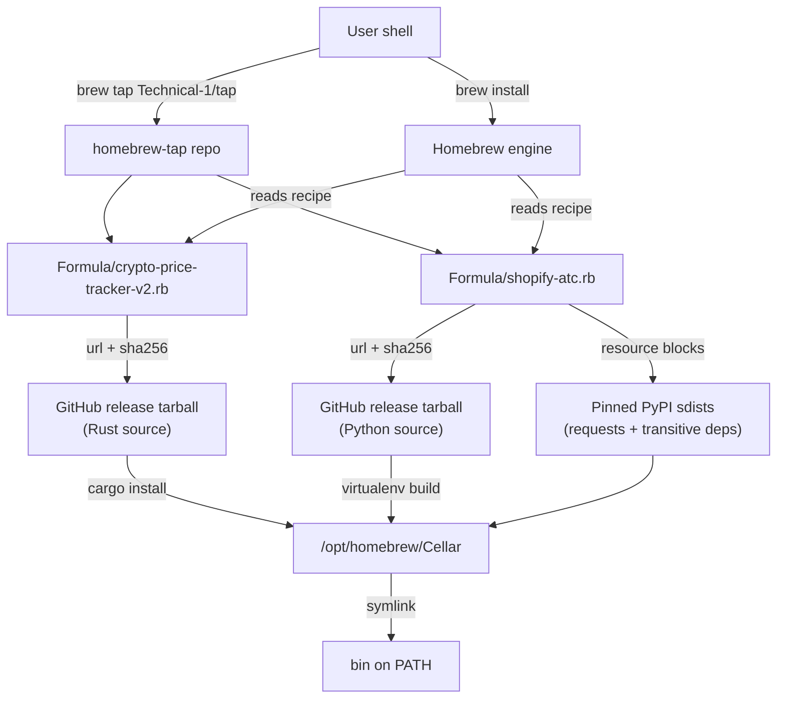

# Architecture

## System Diagram

## Component Descriptions

### The tap repository
- **Purpose**: A Homebrew *tap* — a third-party formula repository that lets anyone install my CLI tools with `brew install Technical-1/tap/<formula>` instead of distributing raw binaries or asking users to set up a language toolchain by hand.
- **Location**: repository root; formulae live under `Formula/`.
- **Key responsibilities**: Hold one Ruby formula per tool; each formula is a self-contained build-and-install recipe that Homebrew executes.

### Rust formula — `crypto-price-tracker-v2`
- **Purpose**: Builds a Rust terminal UI from source and installs the resulting binary.
- **Location**: `Formula/crypto-price-tracker-v2.rb`
- **Key responsibilities**: Declare a `rust` build dependency, fetch the tagged source tarball, and delegate the build to `cargo install` via Homebrew's `std_cargo_args` helper.

### Python formula — `shopify-atc`
- **Purpose**: Installs a Python CLI into an isolated virtualenv so its dependencies never collide with the system interpreter or other tools.
- **Location**: `Formula/shopify-atc.rb`
- **Key responsibilities**: Pin the tool's full dependency closure (`requests` plus its transitive `certifi`, `charset-normalizer`, `idna`, `urllib3`) as checksummed `resource` blocks, then build everything into a private venv with `virtualenv_install_with_resources`.

## Data Flow

1. A user runs `brew tap Technical-1/tap`, which clones this repository into Homebrew's tap directory.
2. `brew install Technical-1/tap/shopify-atc` reads the matching formula and downloads the source tarball named in `url`, verifying it against the recorded `sha256`.
3. For the Python formula, Homebrew also downloads each pinned `resource` sdist and verifies its checksum.
4. The formula's `install` block runs the language-appropriate build (`cargo install` or a virtualenv build) into a versioned directory in the Cellar.
5. Homebrew symlinks the built executable onto the user's `PATH`, and the formula's `test` block runs the binary's `--help` to confirm a working install.

## External Integrations

| Service | Purpose | Notes |
|---------|---------|-------|
| GitHub release tarballs | Source of truth for each tool's code | Pinned by tag + `sha256`; `head` URLs allow `--HEAD` installs straight from `main` |
| PyPI (`files.pythonhosted.org`) | Source for Python runtime dependencies | Each dependency pinned to an exact sdist URL and `sha256` for reproducible builds |
| Homebrew (`rust`, `python@3.13`) | Build/runtime toolchains | Declared as `depends_on`; Homebrew resolves and installs them automatically |

## Key Architectural Decisions

### Build from source instead of shipping prebuilt bottles
- **Context**: Homebrew can serve precompiled "bottles," but bottling requires hosting per-OS binaries and a build pipeline to produce them.
- **Decision**: Each formula builds from the upstream source tarball at install time.
- **Rationale**: For a small set of personal tools, source builds remove all binary-hosting and signing overhead. The cost — a few seconds to minutes of local compilation — is acceptable, and it keeps the tap to nothing but text recipes.

### One install strategy per language ecosystem
- **Context**: A Rust binary and a Python CLI have completely different build and isolation needs.
- **Decision**: The Rust tool uses `cargo install *std_cargo_args`; the Python tool uses `Language::Python::Virtualenv`.
- **Rationale**: Each idiom is the Homebrew-blessed path for its ecosystem. Cargo produces a single self-contained binary; the virtualenv approach sandboxes Python dependencies so they can't break the user's system interpreter or clash with other formulae.

### Vendor the full Python dependency closure as pinned resources
- **Context**: `pip install` at build time would pull whatever versions PyPI currently resolves, making installs non-reproducible and unauditable.
- **Decision**: Every transitive dependency is written out as an explicit `resource` block with a frozen URL and `sha256`.
- **Rationale**: This makes a Python install bit-for-bit reproducible and lets Homebrew verify every downloaded artifact. It is more verbose, but it is the difference between "downloads some code from the internet" and "downloads exactly these audited artifacts."

### Dual-license expression for the Rust tool
- **Context**: The crypto tracker is offered under either MIT or Apache-2.0, the common Rust convention.
- **Decision**: The formula encodes this as `license any_of: ["MIT", "Apache-2.0"]`.
- **Rationale**: Homebrew's license DSL models the real "user may pick either" relationship precisely, rather than flattening it to a single license string that would misrepresent the terms.
