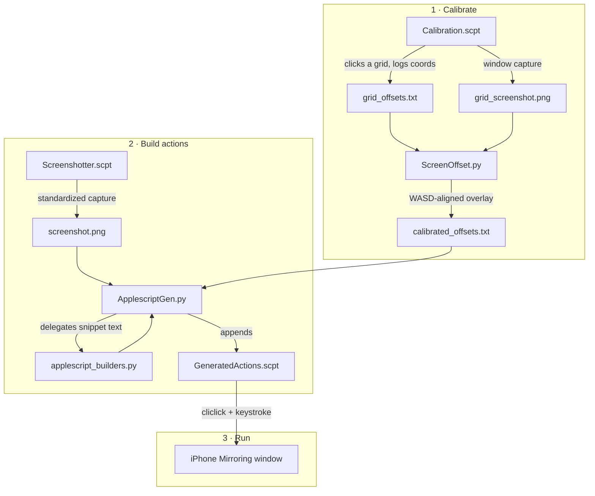

# Architecture

## System Diagram

## Component Descriptions

### Calibration script
- **Purpose**: Probe the live iPhone Mirroring window — click a 3×3 grid, record each point's relative and absolute coordinates, and capture a reference screenshot.
- **Location**: `Calibration.applescript` (source) → `Calibration.scpt` (compiled)
- **Key responsibilities**: Read the window's position/size via System Events; compute grid points within a configurable vertical band; click each point `clicksPerCell` times; write `grid_offsets.txt` and `grid_screenshot.png` to the Desktop.

### Overlay aligner
- **Purpose**: Reconcile the logged grid coordinates with the actual screenshot pixels, since the captured image and the window's logical size differ (Retina scaling, capture offsets).
- **Location**: `ScreenOffset.py`
- **Key responsibilities**: Render the grid as an OpenCV overlay on the screenshot; let the user nudge it with WASD until it lines up; write `calibrated_offsets.txt`.

### Screenshotter
- **Purpose**: Produce a repeatable, identically-framed capture of the window so generated coordinates stay valid across sessions.
- **Location**: `Screenshotter.applescript` → `Screenshotter.scpt`

### Action builder
- **Purpose**: Turn clicks on a screenshot into an executable AppleScript that replays clicks/typing against the real window.
- **Location**: `ApplescriptGen.py`
- **Key responsibilities**: Display the screenshot in OpenCV; on each click, convert screenshot pixels back to window-relative offsets and prompt for a click or type action; append the generated snippet to `GeneratedActions.scpt`.

### Snippet builders
- **Purpose**: Centralize the actual AppleScript-generation logic as small, pure, dependency-free functions.
- **Location**: `applescript_builders.py`
- **Key responsibilities**: Escape arbitrary text into valid AppleScript expressions; emit the header that resolves `cliclick` at runtime; emit click/type snippets with error handling and focus re-assertion.

## Data Flow

1. The user runs the calibration script, which clicks a grid on the mirrored window and writes coordinate logs plus a screenshot to the Desktop.
2. `ScreenOffset.py` overlays those coordinates on the screenshot; the user aligns them with WASD and commits, producing `calibrated_offsets.txt`.
3. The user captures a standardized screenshot and feeds it (with the calibrated offsets) to `ApplescriptGen.py`.
4. Each click on the screenshot is converted to a window-relative offset and emitted as an AppleScript snippet by `applescript_builders.py`, appended to `GeneratedActions.scpt`.
5. Running `GeneratedActions.scpt` replays the clicks/typing against the live iPhone Mirroring window via `cliclick` and `keystroke`.

## External Integrations

| Service | Purpose | Notes |
|---------|---------|-------|
| `cliclick` | Synthesize mouse clicks at absolute screen coordinates | Resolved at runtime via `command -v`; works on both Homebrew prefixes |
| macOS `screencapture` | Capture the window region | Requires Screen Recording permission |
| macOS System Events | Read window geometry, send keystrokes, set frontmost | Requires Accessibility permission |
| OpenCV | Display screenshots and interactive overlays | Python-side only |

## Key Architectural Decisions

### Coordinates are recomputed at run time, not baked in
- **Context**: The iPhone Mirroring window can move or be re-opened between building a script and running it.
- **Decision**: Generated snippets store only window-*relative* offsets and re-read the live window origin (`winX`, `winY`) at execution time.
- **Rationale**: Absolute coordinates would break the moment the window moved. Relative offsets survive repositioning; the only assumption is a consistent window size, which the screenshotter enforces.

### Snippet generation extracted into a pure module
- **Context**: The generation logic originally lived inside an OpenCV mouse-callback, which made it impossible to test without a GUI event loop.
- **Decision**: Move escaping and snippet assembly into `applescript_builders.py` with no third-party imports.
- **Rationale**: Pure functions that return strings can be unit-tested directly and compile-checked with `osacompile`, decoupling correctness of the *generated AppleScript* from the interactive tooling.

### Runtime binary resolution over a hardcoded path
- **Context**: Homebrew installs `cliclick` under `/opt/homebrew/bin` on Apple Silicon but `/usr/local/bin` on Intel.
- **Decision**: Resolve the binary once with `command -v cliclick` and abort with an install hint if it's absent.
- **Rationale**: A single artifact runs unchanged on both architectures, and a missing dependency produces a clear message instead of an opaque shell error.

### Text `.applescript` sources compiled to `.scpt`
- **Context**: Compiled `.scpt` files are binaries — they can't be diffed, reviewed, or syntax-tested in version control.
- **Decision**: Keep editable `.applescript` text as the source of truth and treat the `.scpt` as a build output recompiled with `osacompile`.
- **Rationale**: Reviewable diffs and automated compile checks, while still shipping the double-clickable compiled scripts users actually run.

### Generated text is escaped, every shell call is guarded
- **Context**: User-supplied "type" text and external commands are the two failure points — unescaped text produces uncompilable scripts, and a missing binary or denied permission aborts silently.
- **Decision**: Route all typed text through an escaping function (quotes, backslashes, newlines→`return`, tabs→`tab`) and wrap every `do shell script` in `try … on error` with an actionable dialog.
- **Rationale**: Generated scripts always compile, and runtime failures explain themselves rather than crashing mid-sequence.
