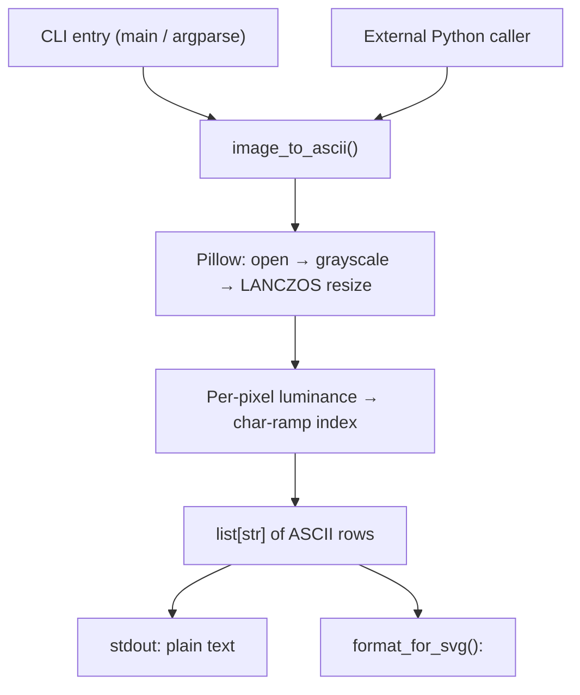

# Architecture

## System Diagram

## Component Descriptions

### CLI front-end
- **Purpose**: Parse arguments and route output to text or SVG.
- **Location**: `img2ascii.py` (`main()`)
- **Key responsibilities**: Argument parsing with `argparse`, error reporting to stderr with a non-zero exit code, and dispatch on `--format`.

### Conversion core
- **Purpose**: Turn an image into ASCII rows.
- **Location**: `img2ascii.py` (`image_to_ascii()`)
- **Key responsibilities**: Accept a path, a PIL `Image`, or a file-like object; convert to grayscale; resize to the requested character grid; map each pixel's brightness onto the character ramp.

### SVG formatter
- **Purpose**: Render ASCII rows as positioned vector text.
- **Location**: `img2ascii.py` (`format_for_svg()`)
- **Key responsibilities**: Emit one `<tspan>` per line with computed `y` offsets and XML-escaped content.

## Data Flow

1. The user runs the script with an image path (or another module calls `image_to_ascii`).
2. Pillow opens the image, converts it to grayscale (`L`), and resizes it to `width × height` using LANCZOS resampling.
3. Each pixel value (0–255) is scaled to an index into the character ramp; brighter pixels map to lighter characters.
4. Rows are joined into a `list[str]`.
5. Output is printed as plain text, or wrapped in SVG `<tspan>` elements when `--format svg` is set.

## External Integrations

| Service | Purpose | Notes |
|---------|---------|-------|
| Pillow | Image decoding, grayscale conversion, resizing | Only third-party dependency; no network access |

## Key Architectural Decisions

### Resize to the character grid instead of sampling
- **Context**: ASCII output needs a fixed character grid, but source images come in arbitrary resolutions.
- **Decision**: Resize the image directly to `(width, height)` with LANCZOS, then read one pixel per character.
- **Rationale**: Delegating downsampling to Pillow's high-quality resampling antialiases detail into each cell, which looks better than nearest-pixel sampling and keeps the mapping loop trivial. The caller controls aspect ratio explicitly via width/height — important because characters are taller than they are wide.

### Polymorphic input (path / PIL Image / file-like)
- **Context**: The same conversion logic is useful from a CLI, from another script, and from a server handling uploads.
- **Decision**: `image_to_ascii` type-checks its input and opens paths and file-like objects, while passing through an existing PIL `Image`.
- **Rationale**: One function serves all three call sites without forcing callers to write to a temp file first.

### Grayscale-only, single-file, minimal dependencies
- **Context**: This is the command-line counterpart to a richer browser-based converter that already handles color, edge detection, and live preview.
- **Decision**: Keep the CLI to one file with Pillow as the sole dependency and grayscale luminance mapping.
- **Rationale**: A CLI's value is portability and scriptability. Avoiding heavier dependencies (e.g. an SVG rasterizer or color pipeline) keeps `pip install` fast and the tool easy to vendor into other projects; color/interactive work belongs in the web app, not here.
