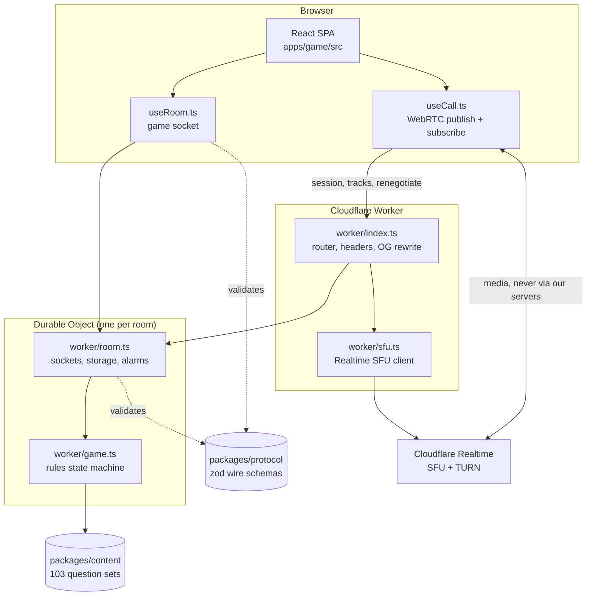

# Architecture

Odd One Out is a real-time multiplayer party game. Everyone in a room is asked the
same question except one player, who is asked a different one that lands on a
similar answer. Nobody is told who got the odd question, including the person who
got it. The whole system exists to keep that one secret until the moment the rules
say to reveal it.

## System Diagram

## Component Descriptions

### Room Durable Object
- **Purpose**: The authoritative server for a single game. Owns the imposter's
  identity, both questions, every answer and every vote.
- **Location**: `apps/game/worker/room.ts`
- **Key responsibilities**: hibernatable WebSocket lifecycle, per-phase alarms,
  state persistence, reconnection by signed token, six-hour inactivity sweep that
  deletes the room and frees its code.

### Rules engine
- **Purpose**: Every game rule, as a plain state machine.
- **Location**: `apps/game/worker/game.ts`
- **Key responsibilities**: dealing, imposter selection with an anti-repeat
  cooldown, answer and vote collection, plurality with tie handling, scoring, the
  skip vote, and the public projections that decide what may leave the object.
- **Note**: touches no Cloudflare API at all, so the rules are unit-testable
  without a runtime.

### Wire protocol
- **Purpose**: One definition of every frame, validated on both ends.
- **Location**: `packages/protocol/src/index.ts`
- **Key responsibilities**: zod schemas for all client and server messages, the
  public player projection, and the scoring constants.

### Question content
- **Purpose**: The questions, and the rules that decide which may be paired.
- **Location**: `packages/content/src/`
- **Key responsibilities**: 103 topic sets, two pairing models, the draw, and the
  same-topic decoy selection used by the steal phase.

### Client
- **Purpose**: Landing page, room screens, and the call.
- **Location**: `apps/game/src/`
- **Key responsibilities**: `useRoom.ts` owns the game socket with backoff and
  foreground reconnect; `useCall.ts` owns publish and subscribe against the SFU;
  `screens/phases.tsx` renders one component per phase.

## Data Flow

1. A host creates a room. The Worker generates a four-character code, retrying on
   collision, and the Durable Object for that code initialises itself.
2. Players connect a WebSocket. Each receives a signed token scoped to that room,
   which restores their seat after a dropped connection.
3. On start, the engine draws a topic set, picks two of its questions and one
   imposter, then sends **each socket only its own question**.
4. Answers are buffered in the object. Nothing is broadcast until everyone has
   locked in or the timer expires, then all answers are released at once.
5. Players argue, then vote. Votes are buffered the same way.
6. The result frame is the first and only message that discloses roles, both
   questions and the vote tally.

## External Integrations

| Service | Purpose | Notes |
|---|---|---|
| Cloudflare Workers | HTTP routing, static assets | `run_worker_first` so the Worker sees every request |
| Durable Objects | One authoritative instance per room | SQLite-backed, WebSocket hibernation |
| Cloudflare Realtime SFU | In-app voice and video | App secret stays server-side; clients get only session and track ids |
| Cloudflare Realtime TURN | Relay for networks that block UDP | Short-lived credentials minted per client |

## Key Architectural Decisions

### Server-authoritative secrets, with the projection as the only exit
- **Context**: The game is one secret. Any client that can discover the imposter
  breaks it, and browser devtools are always available.
- **Decision**: The imposter's identity and the paired question exist only inside
  the Durable Object. Each socket receives one question. Answers and votes are
  buffered server-side and released in a single broadcast.
- **Rationale**: The obvious alternative, assigning roles client-side and asking
  the UI not to show them, is defeated in seconds. Making disclosure a function of
  phase, in one place, means the guarantee is testable rather than aspirational.

### Rules as a runtime-free state machine
- **Context**: Durable Objects are awkward to test, and the rules are the part
  most likely to change.
- **Decision**: `game.ts` holds every rule and imports nothing from Cloudflare.
  `room.ts` is sockets, storage and alarms and contains no rules.
- **Rationale**: Scoring, tie handling and imposter selection are exercised as
  plain functions. Only the genuinely runtime-dependent behaviour needs workerd.

### An SFU rather than peer-to-peer for the call
- **Context**: Up to twelve players, mostly on phones.
- **Decision**: Every client publishes once to a selective forwarding unit and
  subscribes to the others.
- **Rationale**: In a full mesh, six players means each phone encoding and
  uploading five separate streams, which drains batteries and thermally throttles.
  With an SFU the upload is constant and additional players cost download
  bandwidth, which phones handle comfortably.

### Questions as topic sets with two pairing models
- **Context**: A round only works if both questions produce answers from the same
  space. Flat pairs made that a property of the author's judgement.
- **Decision**: Questions are grouped into topic sets. A *sentiment* set asks one
  subject from opposing angles and only pairs across different sentiment poles. A
  *subject* set asks about different things that return one declared unit, and any
  two of its variants may pair.
- **Rationale**: Encoding the constraint makes it enforceable. The pole rule rules
  out dead rounds like "favourite car" against "dream car", where both questions
  produce the same answer and the imposter is invisible.

### Same-topic decoys for the steal
- **Context**: A caught imposter is asked which question the room had, from three
  options.
- **Decision**: Decoys come from the same topic set, never from elsewhere.
- **Rationale**: With cross-topic decoys the accused simply picks the only option
  about holidays. Same-topic decoys make it a real inference.

### One origin for the app, the API and the socket
- **Context**: Static hosting and a stateful realtime server are usually separate.
- **Decision**: A single Worker serves the SPA, the JSON API and the WebSocket
  upgrade, with Durable Objects behind it.
- **Rationale**: Deep links, cookies, the socket and the request-time Open Graph
  rewrite all work without CORS, a second deploy or a second domain.
