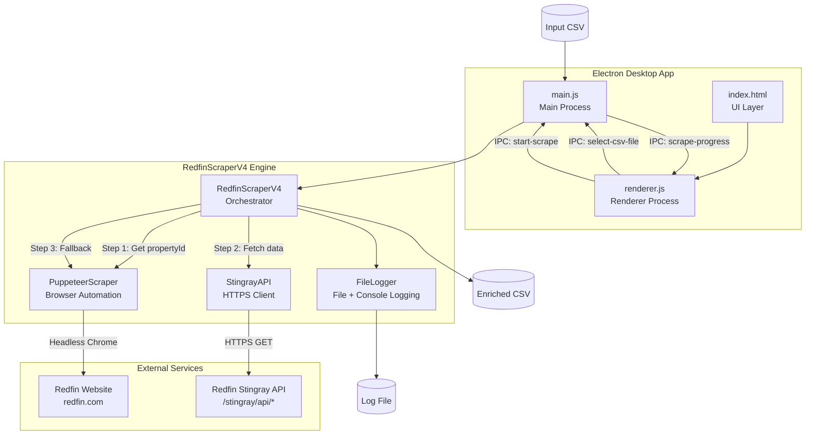

# Architecture Overview

## System Diagram

## Component Descriptions

### main.js - Electron Main Process
- **Purpose**: Application lifecycle, window management, IPC bridge between GUI and scraper
- **Location**: `Redfin-Gui/main.js`
- **Key responsibilities**: Creates BrowserWindow, handles file dialog, spawns scraper, relays progress events to renderer

### renderer.js - Electron Renderer Process
- **Purpose**: UI logic, user interaction handling, progress display
- **Location**: `Redfin-Gui/renderer.js`
- **Key responsibilities**: CSV file selection, scrape initiation, progress bar updates, results display with success/error states

### index.html - User Interface
- **Purpose**: Single-page HTML GUI with embedded CSS
- **Location**: `Redfin-Gui/index.html`
- **Key responsibilities**: Layout for file picker, progress bar, terminal-style log output, and results summary

### RedfinScraperV4 - Orchestrator
- **Purpose**: Coordinates the 3-step scraping pipeline for each address
- **Location**: `Redfin-Gui/scraper-v4.js` (class `RedfinScraperV4`)
- **Key responsibilities**: CSV parsing/validation, address iteration, API-first data extraction with browser fallback, crash recovery via checkpointing, output CSV generation

### StingrayAPI - API Client
- **Purpose**: Direct HTTPS client for Redfin's internal Stingray API
- **Location**: `Redfin-Gui/scraper-v4.js` (class `StingrayAPI`)
- **Key responsibilities**: Fetches property valuation (AVM), historical data, and parcel info via JSON endpoints with retry/backoff

### PuppeteerScraper - Browser Automation
- **Purpose**: Headless Chrome automation for address search and fallback scraping
- **Location**: `Redfin-Gui/scraper-v4.js` (class `PuppeteerScraper`)
- **Key responsibilities**: Address-to-propertyId resolution via search, full page scraping as fallback, stealth plugin for anti-bot evasion, user-agent rotation

### FileLogger - Logging System
- **Purpose**: Dual-output logging to both console and timestamped log files
- **Location**: `Redfin-Gui/scraper-v4.js` (class `FileLogger`)
- **Key responsibilities**: Level-based logging (debug/info/warn/error), log file creation alongside output CSV

## Data Flow

1. **User selects CSV** - Renderer process opens native file dialog via IPC to main process
2. **CSV validation** - Scraper validates required columns (Street, City, State, Zip Code) with flexible aliases
3. **Address iteration** - For each row, the 3-step pipeline runs:
   - **Step 1**: Puppeteer navigates to Redfin, types address, presses Enter, extracts `propertyId` from resulting URL
   - **Step 2**: StingrayAPI fetches AVM data and historical data in parallel via `Promise.all`
   - **Step 3**: If API didn't return an estimate, Puppeteer does full-page scraping with scroll-and-extract
4. **Progress reporting** - After each address, main process sends IPC event to renderer with current/total/status
5. **Crash recovery** - Each processed row is immediately written to a `.partial` file with a `.checkpoint` JSON file tracking progress
6. **Output** - Final enriched CSV written with 15 new columns appended to original data

## External Integrations

| Service | Purpose | Endpoint |
|---------|---------|----------|
| Redfin Stingray API | Property valuation (estimate, beds, baths, sqft, last sold) | `/stingray/api/home/details/avm` |
| Redfin Stingray API | Historical data (year built, sale history) | `/stingray/api/home/details/avmHistoricalData` |
| Redfin Stingray API | Parcel/location info | `/stingray/api/home/details/propertyParcelInfo` |
| Redfin Website | Address search to get propertyId | `redfin.com` (via Puppeteer) |

## Key Architectural Decisions

### API-First with Browser Fallback
- **Context**: Early versions relied entirely on Puppeteer browser scraping, which was slow (~30s/address) and fragile
- **Decision**: Use Redfin's internal Stingray API for data extraction, Puppeteer only for initial address resolution
- **Rationale**: API calls are 10x faster, more reliable, and return structured JSON. Browser fallback ensures resilience when API endpoints change or get blocked

### Parallel API Calls
- **Context**: Multiple API endpoints needed per property (AVM + historical data)
- **Decision**: Run AVM and historical data API calls concurrently via `Promise.all`
- **Rationale**: Tested safe at 5 concurrent requests with 0ms delay - cuts per-address time significantly

### Checkpoint-Based Crash Recovery
- **Context**: Long batch jobs (87+ addresses, ~19 minutes) could lose all progress on crash
- **Decision**: Write each row immediately to a `.partial` file and maintain a `.checkpoint` JSON file
- **Rationale**: On resume, scraper detects checkpoint, loads partial output, and continues from last completed index

### Stealth Plugin + User-Agent Rotation
- **Context**: Redfin's anti-bot detection blocks obvious automation
- **Decision**: Use `puppeteer-extra-plugin-stealth` and rotate user agents between addresses
- **Rationale**: Stealth plugin patches common automation fingerprints. Rotating UA and randomized delays create human-like browsing patterns
